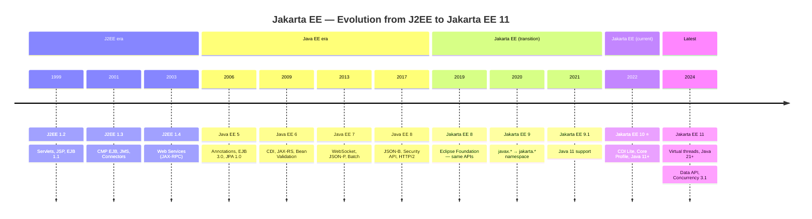
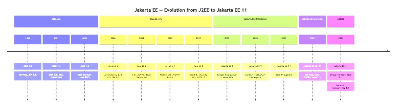
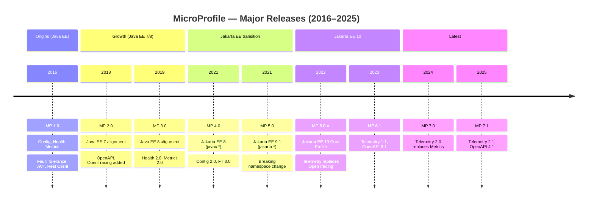
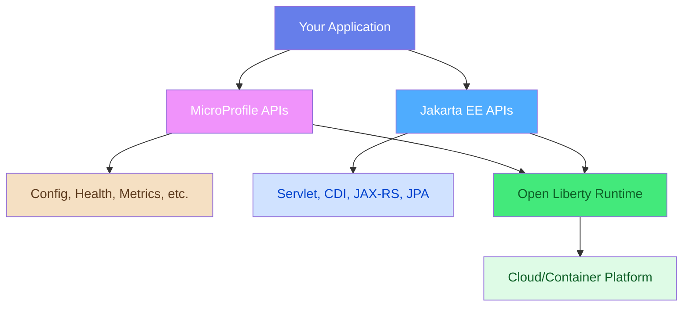
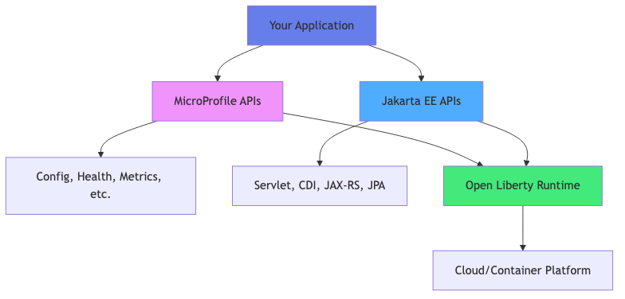
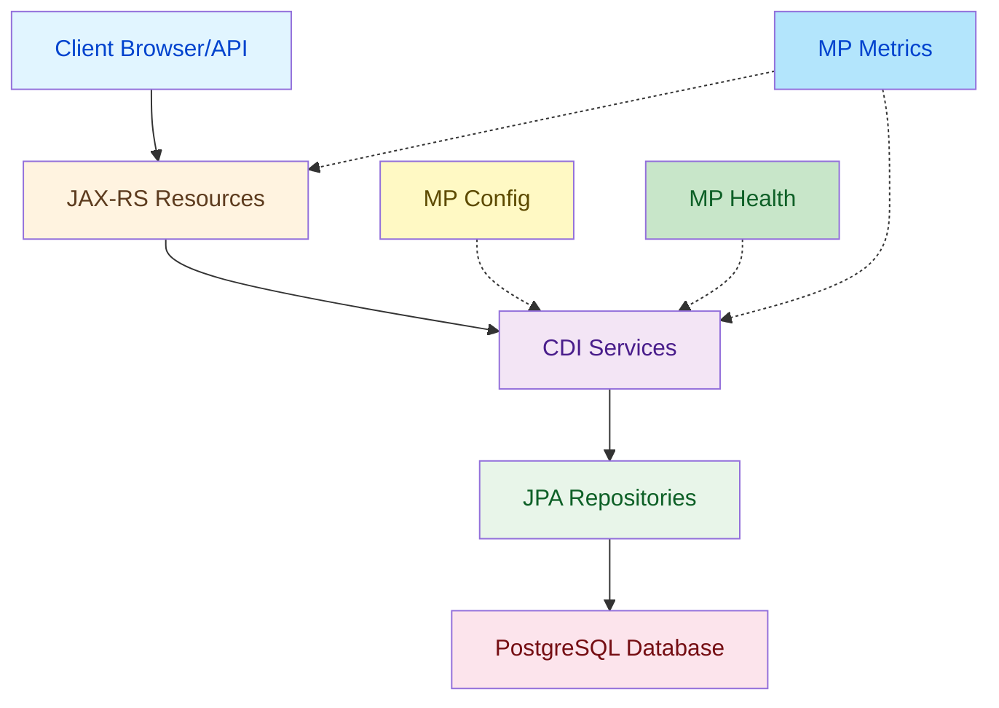
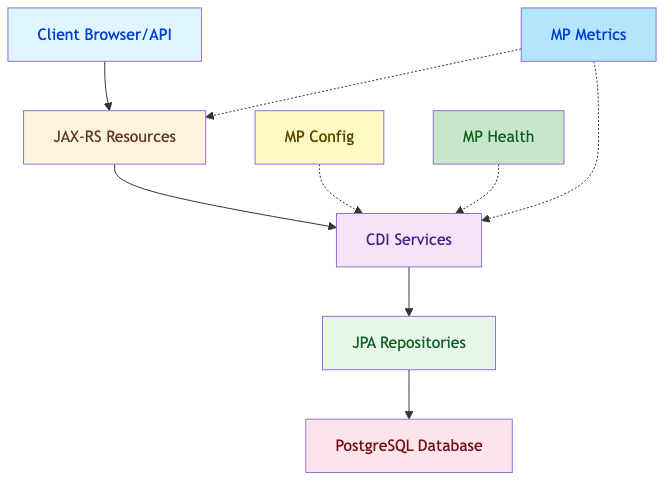

<!-- © Copyright 2026 Olivier Planson. All rights reserved. Reproduction prohibited. Made with IBM Bob. -->


# Introduction to Jakarta EE and MicroProfile
## Enterprise Java Development with Open Liberty

**Duration:** 2 hours  
**Instructor:** Olivier Planson  
**Date:** 2025-12
**Course:** Jakarta EE, MicroProfile and Microservices

---

## 📋 Learning Objectives

By the end of this lecture, you will be able to:

| | |
| --- | --- |
| ✅ | Understand Jakarta EE and MicroProfile ecosystems |
| ✅ | Differentiate between Jakarta EE and MicroProfile |
| ✅ | Identify core specifications and APIs |
| ✅ | Set up Open Liberty development environment |
| ✅ | Create and deploy your first application with Podman |
| ✅ | Understand the role of application servers |

---

## 🎯 What is Jakarta EE?

**Jakarta EE** (formerly Java EE) is a set of specifications for building enterprise applications in Java.

### Key Characteristics:
- **Standard-based:** Industry-wide specifications
- **Vendor-neutral:** Multiple implementations available
- **Enterprise-ready:** Built for scalability and reliability
- **Open-source:** Community-driven development under Eclipse Foundation

### Evolution Timeline:

> **⭐ This course targets Jakarta EE 10** — newer versions exist but are not yet widely adopted in production.

<details>
<summary>📝 Original Mermaid Code (click to expand)</summary>



</details>




---

## 🚀 What is MicroProfile?

**Eclipse MicroProfile** is a set of specifications optimized for microservices architecture.

### Key Characteristics:
- **Cloud-native:** Designed for cloud and containers
- **Microservices-focused:** Lightweight and modular
- **Complementary to Jakarta EE:** Extends Jakarta EE capabilities
- **Rapid innovation:** Faster release cycles than Jakarta EE

### Timeline:

> **⭐ This course targets MicroProfile 6.0** — the latest stable release aligned with Jakarta EE 10 Core Profile.

<details>
<summary>📝 Original Mermaid Code (click to expand)</summary>



</details>


---

## 🔄 Jakarta EE vs MicroProfile

### Comparison Table

| Aspect | Jakarta EE | MicroProfile |
|--------|-----------|--------------|
| **Focus** | Enterprise applications | Microservices |
| **Scope** | Comprehensive platform | Targeted specifications |
| **Release Cycle** | Slower, stable | Faster, innovative |
| **Size** | Full-featured | Lightweight |
| **Use Case** | Monoliths & Services | Cloud-native apps |
| **Governance** | Eclipse Foundation | Eclipse Foundation |

---

## 🤝 Jakarta EE + MicroProfile Together

<details>
<summary>📝 Original Mermaid Code (click to expand)</summary>



</details>




**Best Practice:** Use Jakarta EE for core enterprise features + MicroProfile for cloud-native capabilities

---

## 📦 Jakarta EE Core Specifications

### Web Technologies
- **Jakarta Servlet** - HTTP request/response handling
- **Jakarta Server Pages (JSP)** - Dynamic web pages
- **Jakarta Server Faces (JSF)** - Component-based UI framework

### Business Logic
- **Jakarta Contexts and Dependency Injection (CDI)** - Dependency injection
- **Jakarta Enterprise Beans (EJB)** - Business components

### Data Persistence
- **Jakarta Persistence (JPA)** - Object-relational mapping
- **Jakarta Transactions (JTA)** - Transaction management

---

## 🌐 Jakarta RESTful Web Services

### Jakarta RESTful Web Services (JAX-RS)
- Build REST APIs with annotations
- JSON/XML data binding
- HTTP method mapping

```java
@Path("/clients")
public class ClientResource {
    
    @GET
    @Produces(MediaType.APPLICATION_JSON)
    public List<Client> getAllClients() {
        return clientService.findAll();
    }
    
    @POST
    @Consumes(MediaType.APPLICATION_JSON)
    public Response createClient(Client client) {
        clientService.save(client);
        return Response.status(201).build();
    }
}
```

---

## ⚡ MicroProfile Core Specifications

### Configuration
- **MP Config** - Externalized configuration
- Environment-specific settings
- Dynamic configuration updates

### Observability
- **MP Health** - Health check endpoints
- **MP Metrics** - Application metrics
- **MP OpenTracing** - Distributed tracing

### Resilience
- **MP Fault Tolerance** - Circuit breakers, retries, timeouts
- **MP Rest Client** - Type-safe REST clients

---

## 🔧 MicroProfile Config Example

```java
@ApplicationScoped
public class BankingService {
    
    @Inject
    @ConfigProperty(name = "bank.api.url")
    private String apiUrl;
    
    @Inject
    @ConfigProperty(name = "bank.max.transfer", defaultValue = "10000")
    private BigDecimal maxTransfer;
    
    public void processTransfer(BigDecimal amount) {
        if (amount.compareTo(maxTransfer) > 0) {
            throw new IllegalArgumentException("Exceeds maximum");
        }
        // Process transfer
    }
}
```

**Configuration file (microprofile-config.properties):**
```properties
bank.api.url=https://api.bank.com
bank.max.transfer=50000
```

---

## 💊 MicroProfile Health Example

```java
@Health
@ApplicationScoped
public class DatabaseHealthCheck implements HealthCheck {
    
    @Inject
    private DataSource dataSource;
    
    @Override
    public HealthCheckResponse call() {
        try (Connection conn = dataSource.getConnection()) {
            boolean isHealthy = conn.isValid(5);
            return HealthCheckResponse
                .named("database-check")
                .status(isHealthy)
                .build();
        }
        catch (SQLException e) {
            return HealthCheckResponse
                .named("database-check")
                .down()
                .withData("error", e.getMessage())
                .build();
        }
    }
}
```

**Access:** `http://localhost:9080/health`

---

## 📊 MicroProfile Metrics Example

```java
@ApplicationScoped
public class TransferService {
    
    @Inject
    @Metric(name = "transfers_total", absolute = true)
    private Counter transferCounter;
    
    @Timed(name = "transfer_duration", 
           description = "Time to complete transfer")
    public void transfer(Account from, Account to, BigDecimal amount) {
        // Perform transfer
        transferCounter.inc();
    }
}
```

**Access metrics:** `http://localhost:9080/metrics`

---

## 🦅 Open Liberty: The Runtime

**Open Liberty** is IBM's open-source Jakarta EE and MicroProfile runtime.

<table style="border: none; width: 100%;">
<tr style="border: none;">
<td style="border: none; vertical-align: top; width: 50%;">

### Why Open Liberty? 

| | |
|---|---|
| ✅ | **Lightweight:** Fast startup, small footprint |
| ✅ | **Modular:** Load only what you need |
| ✅ | **Cloud-native:** Perfect for containers |
| ✅ | **Full compliance:** Jakarta EE 10 + MicroProfile 6 |
| ✅ | **Developer-friendly:** Hot reload, dev mode |
| ✅ | **Production-ready:** Used by IBM, Red Hat, and others |

</td>
<td style-"border: none; vertical-align: top; width: 50%;">

### Comparison with Other Runtimes

| Feature | Open Liberty | WildFly | Payara |
|---------|-------------|---------|--------|
| **Startup Time** | ⚡ Very Fast | Fast | Medium |
| **Memory** | 💚 Low | Medium | Medium |
| **MicroProfile** | ✅ Full | Partial | Full |
| **Container-ready** | ✅ Excellent | Good | Good |

</td>
</tr>
</table>

---

## 🏗️ Jakarta EE + MicroProfile Project Structure

```
banking-app/
├── pom.xml                          # Maven configuration
├── src/
│   ├── main/
│   │   ├── java/
│   │   │   └── com/bank/
│   │   │       ├── entity/          # JPA entities
│   │   │       ├── service/         # Business logic
│   │   │       ├── rest/            # JAX-RS endpoints
│   │   │       ├── health/          # MP Health checks
│   │   │       └── config/          # MP Config
│   │   ├── resources/
│   │   │   ├── META-INF/
│   │   │   │   ├── persistence.xml      # JPA config
│   │   │   │   └── microprofile-config.properties
│   │   │   └── application.properties
│   │   ├── liberty/
│   │   │   └── config/
│   │   │       └── server.xml       # Liberty config
│   │   └── webapp/
│   │       └── WEB-INF/
│   │           └── beans.xml        # CDI config
│   └── test/
└── Containerfile                    # Podman/Docker image
```

---

## 💻 Development Environment Setup

### Required Software:

1. **JDK 17+**
   ```bash
   java -version
   # Should show: openjdk version "17.0.x" or higher
   ```

2. **Maven 3.8+**
   ```bash
   mvn -version
   ```

3. **Open Liberty 23.0.0.12+**
   - Download from: https://openliberty.io/downloads/
   - Or use Maven/Gradle plugin

4. **Podman** (instead of Docker)
   ```bash
   podman --version
   ```

---

## 🐳 Why Podman Instead of Docker?

<table style="border: none; width: 100%;">
<tr style="border: none;">
<td style="border: none; vertical-align: top; width: 50%;">

### Podman Advantages:

| | |
|---|---|
| ✅ | **Daemonless:** No background daemon required |
| ✅ | **Rootless:** Run containers without root privileges |
| ✅ | **Docker-compatible:** Same CLI commands |
| ✅ | **Systemd integration:** Native systemd support |
| ✅ | **Security:** Better security model |
| ✅ | **Open-source:** Truly open-source (OCI compliant) |

</td>
<td style="border: none; vertical-align: top; width: 50%;">

### Podman vs Docker

| Feature | Podman | Docker |
|---------|--------|--------|
| **Daemon** | ❌ No | ✅ Yes |
| **Root Required** | ❌ No | ⚠️ Often |
| **CLI Compatibility** | ✅ Docker-compatible | N/A |
| **Systemd** | ✅ Native | ⚠️ Limited |
| **Security** | ✅ Better | Good |

</td>
</tr>
</table>

**Note:** `alias docker=podman` makes transition seamless!

---

## 🚀 Creating Your First Jakarta EE + MicroProfile Project

### Step 1: Maven Project Setup

```xml
<project xmlns="http://maven.apache.org/POM/4.0.0">
    <modelVersion>4.0.0</modelVersion>
    
    <groupId>com.bank</groupId>
    <artifactId>banking-app</artifactId>
    <version>1.0-SNAPSHOT</version>
    <packaging>war</packaging>
    
    <properties>
        <maven.compiler.source>17</maven.compiler.source>
        <maven.compiler.target>17</maven.compiler.target>
        <jakartaee.version>10.0.0</jakartaee.version>
        <microprofile.version>6.0</microprofile.version>
        <liberty.version>23.0.0.12</liberty.version>
    </properties>
    
    <dependencies>
        <!-- Jakarta EE API -->
        <dependency>
            <groupId>jakarta.platform</groupId>
            <artifactId>jakarta.jakartaee-api</artifactId>
            <version>${jakartaee.version}</version>
            <scope>provided</scope>
        </dependency>
        <!-- MicroProfile API -->
        <dependency>
            <groupId>org.eclipse.microprofile</groupId>
            <artifactId>microprofile</artifactId>
            <version>${microprofile.version}</version>
            <type>pom</type>
            <scope>provided</scope>
        </dependency>
    </dependencies>

    <build>
        <finalName>banking-app</finalName>
        <plugins>
            <!-- Liberty Maven Plugin — enables mvn liberty:dev -->
            <plugin>
                <groupId>io.openliberty.tools</groupId>
                <artifactId>liberty-maven-plugin</artifactId>
                <version>3.9</version>
                <configuration>
                    <serverName>bankingServer</serverName>
                    <runtimeArtifact>
                        <groupId>io.openliberty</groupId>
                        <artifactId>openliberty-runtime</artifactId>
                        <version>${liberty.version}</version>
                        <type>zip</type>
                    </runtimeArtifact>
                    <bootstrapProperties>
                        <default.http.port>9080</default.http.port>
                        <default.https.port>9443</default.https.port>
                        <app.context.root>/</app.context.root>
                    </bootstrapProperties>
                </configuration>
            </plugin>
            <!-- WAR plugin — no web.xml required -->
            <plugin>
                <groupId>org.apache.maven.plugins</groupId>
                <artifactId>maven-war-plugin</artifactId>
                <version>3.4.0</version>
                <configuration>
                    <failOnMissingWebXml>false</failOnMissingWebXml>
                </configuration>
            </plugin>
        </plugins>
    </build>
</project>
```

---

## 📝 First Servlet with Health Check

```java
package com.bank.web;

import jakarta.servlet.ServletException;
import jakarta.servlet.annotation.WebServlet;
import jakarta.servlet.http.HttpServlet;
import jakarta.servlet.http.HttpServletRequest;
import jakarta.servlet.http.HttpServletResponse;
import java.io.IOException;

@WebServlet("/hello")
public class HelloServlet extends HttpServlet {
    
    @Override
    protected void doGet(HttpServletRequest request,
                        HttpServletResponse response)
            throws ServletException, IOException {
        response.setContentType("text/html");
        response.getWriter().println("""
            <html><body>
            <h1>Welcome to Jakarta EE + MicroProfile!</h1>
            <p>Running on Open Liberty</p>
            <ul>
                <li><a href="/health">Health Check</a></li>
                <li><a href="/metrics">Metrics</a></li>
            </ul>
            </body></html>
            """);
    }
}
```

---

## ⚙️ Open Liberty Configuration (server.xml)

```xml
<server description="Banking Application Server">
    <featureManager>
        <!-- Jakarta EE Features -->
        <feature>servlet-6.0</feature>
        <feature>cdi-4.0</feature>
        <feature>jaxrs-3.1</feature>
        <feature>jsonb-3.0</feature>
        <feature>persistence-3.1</feature>
        
        <!-- MicroProfile Features -->
        <feature>mpConfig-3.0</feature>
        <feature>mpHealth-4.0</feature>
        <feature>mpMetrics-5.0</feature>
        <feature>mpOpenAPI-3.1</feature>
    </featureManager>

    <httpEndpoint id="defaultHttpEndpoint"
                  host="*"
                  httpPort="9080"
                  httpsPort="9443" />

    <webApplication location="banking-app.war" 
                    contextRoot="/" />
</server>
```

---

## 🔨 Building with Liberty Maven Plugin

Add to `pom.xml`:

```xml
<build>
    <plugins>
        <plugin>
            <groupId>io.openliberty.tools</groupId>
            <artifactId>liberty-maven-plugin</artifactId>
            <version>3.9</version>
            <configuration>
                <serverName>bankingServer</serverName>
            </configuration>
        </plugin>
    </plugins>
</build>
```

**Commands:**
```bash
# Start Liberty in dev mode (hot reload)
mvn liberty:dev

# Package application
mvn liberty:package

# Run tests
mvn liberty:test-start liberty:test-stop
```

---

## 🐳 Containerfile for Podman

```dockerfile
FROM icr.io/appcafe/open-liberty:full-java17-openj9-ubi

# Copy application
COPY --chown=1001:0 target/banking-app.war /config/dropins/

# Copy Liberty configuration
COPY --chown=1001:0 src/main/liberty/config/server.xml /config/

# Expose ports
EXPOSE 9080 9443

# Run Liberty
CMD ["/opt/ol/wlp/bin/server", "run", "defaultServer"]
```

**Build and run with Podman:**
```bash
# Build image
podman build -t banking-app:latest .

# Run container
podman run -d -p 9080:9080 -p 9443:9443 banking-app:latest

# View logs
podman logs -f <container-id>
```

---

## 🌍 Testing Your Application

### Start Liberty in Dev Mode:
```bash
mvn liberty:dev
```

### Access Endpoints:
```
Application:  http://localhost:9080/
Health:       http://localhost:9080/health
Metrics:      http://localhost:9080/metrics
OpenAPI:      http://localhost:9080/openapi
```

### Expected Health Response:
```json
{
  "status": "UP",
  "checks": [
    {
      "name": "database-check",
      "status": "UP"
    }
  ]
}
```

---

## 🏦 Banking Application Architecture

### Layered Architecture with MicroProfile:

<details>
<summary>📝 Original Mermaid Code (click to expand)</summary>



</details>




---

## 📊 Course Roadmap

### Week 1: Foundations
1. **Today:** Jakarta EE, MicroProfile & Open Liberty ✅
2. **Next:** Servlets and JSP (3h)
3. **Then:** JPA and Database Integration (4h)
4. **Finally:** CDI and Service Layer (3h)

### Week 2: Cloud-Native & Microservices
5. JAX-RS and REST APIs + MP Rest Client (3h)
6. Domain-Driven Design (3h)
7. Hexagonal Architecture + MP Config (2h)
8. Microservices with MP Health, Metrics, Fault Tolerance (4h)

---

## 🎓 Key Takeaways

<table style="border: none; width: 100%;">
<tr style="border: none;">
<td style="border: none; vertical-align: top; width: 50%;">

### What We Learned Today:

| | |
|---|---|
| ✅ | Jakarta EE provides enterprise Java standards |
| ✅ | MicroProfile adds cloud-native capabilities |
| ✅ | Open Liberty is lightweight and modular |
| ✅ | Podman offers better security than Docker |
| ✅ | Combine Jakarta EE + MicroProfile for modern apps |

</td>
<td style="border: none; vertical-align: top; horizontal-align: top; width: 50%;">

### Jakarta EE vs MicroProfile:
- **Jakarta EE:** Comprehensive enterprise platform
- **MicroProfile:** Cloud-native microservices extensions
- **Together:** Best of both worlds!
</td>
</tr>
</table>

### Next Steps:
- Complete Lab 1: First Application with Open Liberty
- Set up Podman environment
- Explore MicroProfile specifications

---

## 📚 Additional Resources

### Official Documentation:
- **Jakarta EE:** https://jakarta.ee/specifications/
- **MicroProfile:** https://microprofile.io/
- **Open Liberty:** https://openliberty.io/docs/
- **Podman:** https://podman.io/getting-started/

### Recommended Reading:
- "Jakarta EE Cookbook" by Elder Moraes
- "Practical Cloud-Native Java Development with MicroProfile" by Emily Jiang
- "Open Liberty Guide" - https://openliberty.io/guides/

### Community:
- Jakarta EE GitHub: https://github.com/eclipse-ee4j
- MicroProfile GitHub: https://github.com/eclipse/microprofile
- Open Liberty GitHub: https://github.com/OpenLiberty

---

## 💡 Best Practices

### Development Guidelines:
1. **Use MicroProfile Config** for all configuration
2. **Add Health Checks** for all critical dependencies
3. **Instrument with Metrics** for observability
4. **Leverage Liberty Dev Mode** for rapid development
5. **Containerize with Podman** for consistency

### Architecture Decisions:
- Use **Jakarta EE** for core business logic
- Use **MicroProfile** for cloud-native features
- Deploy on **Open Liberty** for performance
- Run in **Podman** containers for portability

---

## ❓ Common Questions

**Q: Should I use Jakarta EE or MicroProfile?**
A: Use both! Jakarta EE for enterprise features, MicroProfile for cloud-native capabilities.

**Q: Why Open Liberty over WildFly?**
A: Liberty is lighter, faster, and has better MicroProfile support. Perfect for containers and microservices.

**Q: Is Podman really better than Docker?**
A: Yes for security and rootless operation. CLI is compatible, so transition is easy.

**Q: Can I use MicroProfile without Jakarta EE?**
A: Yes, but they work best together. MicroProfile builds on Jakarta EE foundations.

---

## 🔍 Lab 1 Preview

### Objectives:
- Create Maven project with Jakarta EE + MicroProfile
- Implement servlets with health checks
- Configure Open Liberty server
- Build and run with Podman
- Test health and metrics endpoints

### What You'll Build:
A banking application with:
- Client management servlets
- MicroProfile health checks
- Configuration with MP Config
- Containerized with Podman

**Time:** 2 hours  
**Difficulty:** Beginner

---

## 📝 Homework

### Before Next Lecture:

| | |
|---|---|
| ✅ | Complete Lab 1: First Application |
| ✅ | Install Podman and test basic commands |
| ✅ | Read MicroProfile Config specification |
| ✅ | Explore Open Liberty guides |

### Optional:
- Set up PostgreSQL in Podman container
- Try Liberty dev mode features
- Read about MicroProfile Health patterns

---

## 🙋 Questions & Discussion

### Discussion Topics:
- When would you choose Jakarta EE over Spring Boot?
- How does MicroProfile help with microservices?
- What are the benefits of Podman in enterprise environments?

### Office Hours:
- **When:** [Your schedule]
- **Where:** [Your location/online]
- **Contact:** [Your email]

---

## 📅 Next Lecture

### Servlets and JSP with MicroProfile
**Date:** [Next session date]  
**Duration:** 3 hours  
**Topics:**
- Servlet lifecycle in detail
- JSP and JSTL
- MVC pattern
- MP Config in web applications
- Health checks for web tier

**Preparation:** Complete Lab 1 and review HTTP methods

---

# Thank You!

## Ready to Build Cloud-Native Enterprise Applications? 🚀

**Remember:**
- Jakarta EE + MicroProfile = Modern Enterprise Java
- Open Liberty = Fast, lightweight, cloud-ready
- Podman = Secure, rootless containers
- Complete Lab 1 before next session

**See you in the next lecture!**

---

## Appendix: Quick Reference

### Important Annotations:
```java
// Jakarta EE
@WebServlet("/path")           // Servlet mapping
@Path("/resource")             // JAX-RS resource
@Entity                        // JPA entity
@Inject                        // CDI injection

// MicroProfile
@ConfigProperty(name="key")    // MP Config
@Health                        // MP Health check
@Timed                         // MP Metrics
@Retry                         // MP Fault Tolerance
```

---

## Appendix: Commands Reference

### Maven Commands:
```bash
mvn liberty:dev               # Dev mode with hot reload
mvn liberty:run               # Run Liberty server
mvn liberty:stop              # Stop Liberty server
mvn package                   # Build WAR file
```

### Podman Commands:
```bash
podman build -t app:latest .  # Build image
podman run -p 9080:9080 app   # Run container
podman ps                     # List containers
podman logs <id>              # View logs
podman stop <id>              # Stop container
