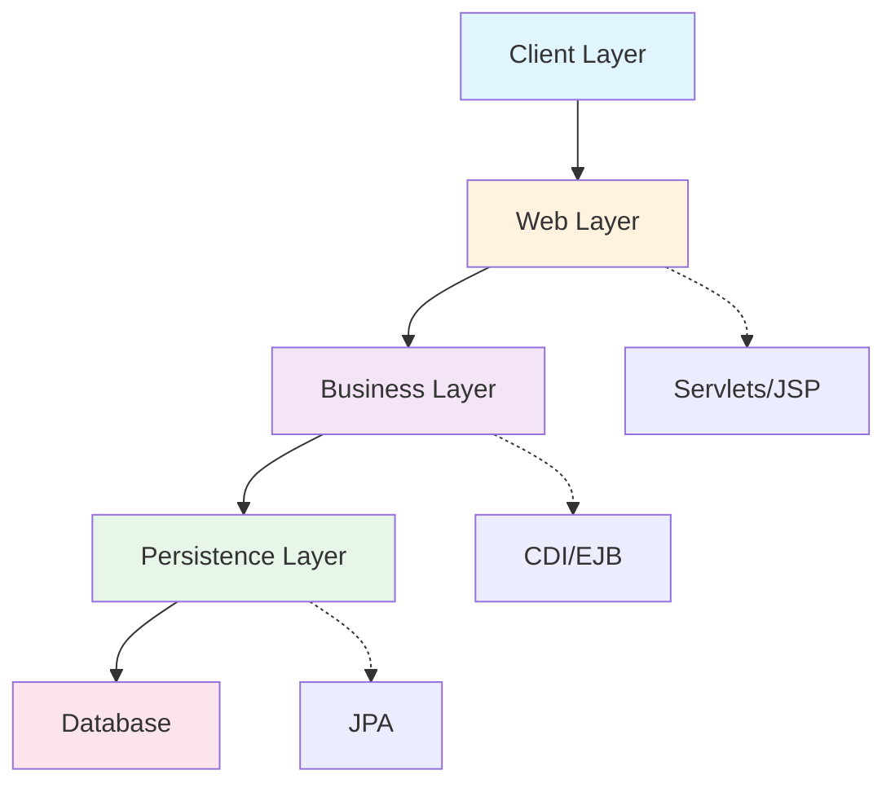
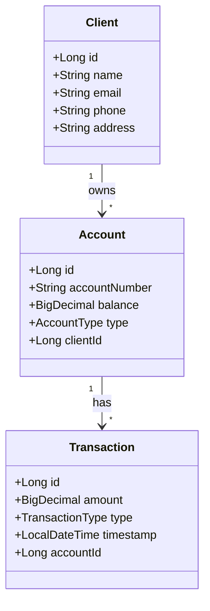

# Introduction to Jakarta EE
## Enterprise Java Development Fundamentals

**Duration:** 2 hours  
**Instructor:** [Your Name]  
**Course:** Jakarta EE and Microservices

---

## 📋 Learning Objectives

By the end of this lecture, you will be able to:

- ✅ Understand the Jakarta EE ecosystem and its evolution
- ✅ Identify core Jakarta EE specifications and APIs
- ✅ Set up a Jakarta EE development environment
- ✅ Create and deploy your first Jakarta EE application
- ✅ Understand the role of application servers

---

## 🎯 What is Jakarta EE?

**Jakarta EE** (formerly Java EE) is a set of specifications for building enterprise applications in Java.

### Key Characteristics:
- **Standard-based:** Industry-wide specifications
- **Vendor-neutral:** Multiple implementations available
- **Enterprise-ready:** Built for scalability and reliability
- **Open-source:** Community-driven development

### Evolution Timeline:
```
J2EE (1999) → Java EE (2006) → Jakarta EE (2019)
```

---

## 🏛️ Jakarta EE Architecture



---

## 📦 Core Jakarta EE Specifications

### Web Technologies
- **Jakarta Servlet** - HTTP request/response handling
- **Jakarta Server Pages (JSP)** - Dynamic web pages
- **Jakarta Server Faces (JSF)** - Component-based UI framework

### Business Logic
- **Jakarta Contexts and Dependency Injection (CDI)** - Dependency injection
- **Jakarta Enterprise Beans (EJB)** - Business components

### Data Persistence
- **Jakarta Persistence (JPA)** - Object-relational mapping
- **Jakarta Transactions (JTA)** - Transaction management

---

## 🌐 RESTful Web Services

### Jakarta RESTful Web Services (JAX-RS)
- Build REST APIs with annotations
- JSON/XML data binding
- HTTP method mapping

```java
@Path("/clients")
public class ClientResource {
    
    @GET
    @Produces(MediaType.APPLICATION_JSON)
    public List<Client> getAllClients() {
        return clientService.findAll();
    }
    
    @POST
    @Consumes(MediaType.APPLICATION_JSON)
    public Response createClient(Client client) {
        clientService.save(client);
        return Response.status(201).build();
    }
}
```

---

## 🔧 Jakarta EE Application Servers

### Popular Implementations:

| Server | Vendor | Profile |
|--------|--------|---------|
| **WildFly** | Red Hat | Full Platform |
| **Payara** | Payara Foundation | Full Platform |
| **Open Liberty** | IBM | Full/Web Profile |
| **TomEE** | Apache | Web Profile |
| **GlassFish** | Eclipse Foundation | Reference Implementation |

**For this course:** We'll use **WildFly 27+** or **Payara 6+**

---

## 🏗️ Jakarta EE Project Structure

```
banking-app/
├── pom.xml                          # Maven configuration
├── src/
│   ├── main/
│   │   ├── java/
│   │   │   └── com/bank/
│   │   │       ├── entity/          # JPA entities
│   │   │       ├── service/         # Business logic
│   │   │       ├── rest/            # REST endpoints
│   │   │       └── repository/      # Data access
│   │   ├── resources/
│   │   │   └── META-INF/
│   │   │       └── persistence.xml  # JPA configuration
│   │   └── webapp/
│   │       ├── WEB-INF/
│   │       │   ├── web.xml          # Web app config
│   │       │   └── beans.xml        # CDI config
│   │       └── index.html
│   └── test/
│       └── java/                    # Unit tests
└── target/                          # Build output
```

---

## 💻 Development Environment Setup

### Required Software:

1. **JDK 17+**
   ```bash
   java -version
   # Should show: openjdk version "17.0.x" or higher
   ```

2. **Maven 3.8+**
   ```bash
   mvn -version
   ```

3. **WildFly 27+**
   - Download from: https://www.wildfly.org/downloads/
   - Extract to: `/opt/wildfly` (Linux/Mac) or `C:\wildfly` (Windows)

4. **IDE:** IntelliJ IDEA, Eclipse, or VS Code

---

## 🚀 Creating Your First Jakarta EE Project

### Step 1: Maven Project Setup

```xml
<project xmlns="http://maven.apache.org/POM/4.0.0">
    <modelVersion>4.0.0</modelVersion>
    
    <groupId>com.bank</groupId>
    <artifactId>banking-app</artifactId>
    <version>1.0-SNAPSHOT</version>
    <packaging>war</packaging>
    
    <properties>
        <maven.compiler.source>17</maven.compiler.source>
        <maven.compiler.target>17</maven.compiler.target>
        <jakartaee.version>10.0.0</jakartaee.version>
    </properties>
    
    <dependencies>
        <dependency>
            <groupId>jakarta.platform</groupId>
            <artifactId>jakarta.jakartaee-api</artifactId>
            <version>${jakartaee.version}</version>
            <scope>provided</scope>
        </dependency>
    </dependencies>
</project>
```

---

## 📝 First Servlet Example

```java
package com.bank.web;

import jakarta.servlet.ServletException;
import jakarta.servlet.annotation.WebServlet;
import jakarta.servlet.http.HttpServlet;
import jakarta.servlet.http.HttpServletRequest;
import jakarta.servlet.http.HttpServletResponse;
import java.io.IOException;
import java.io.PrintWriter;

@WebServlet("/hello")
public class HelloServlet extends HttpServlet {
    
    @Override
    protected void doGet(HttpServletRequest request, 
                        HttpServletResponse response) 
            throws ServletException, IOException {
        
        response.setContentType("text/html");
        PrintWriter out = response.getWriter();
        
        out.println("<html><body>");
        out.println("<h1>Welcome to Jakarta EE Banking App!</h1>");
        out.println("<p>Your first servlet is running.</p>");
        out.println("</body></html>");
    }
}
```

---

## 🔨 Building and Deploying

### Build the Application:
```bash
mvn clean package
```

This creates: `target/banking-app.war`

### Deploy to WildFly:

**Option 1: Copy to deployments folder**
```bash
cp target/banking-app.war $WILDFLY_HOME/standalone/deployments/
```

**Option 2: Use Maven plugin**
```bash
mvn wildfly:deploy
```

**Option 3: Admin Console**
- Navigate to: http://localhost:9990
- Upload WAR file through GUI

---

## 🌍 Testing Your Application

### Start WildFly:
```bash
$WILDFLY_HOME/bin/standalone.sh  # Linux/Mac
$WILDFLY_HOME\bin\standalone.bat # Windows
```

### Access Your Servlet:
```
http://localhost:8080/banking-app/hello
```

### Expected Output:
```html
Welcome to Jakarta EE Banking App!
Your first servlet is running.
```

---

## 🏦 Banking Application Overview

### Domain Model (Preview):



---

## 📊 Course Roadmap

### Week 1: Foundations
1. ✅ **Today:** Introduction to Jakarta EE
2. **Next:** Servlets and JSP (3h)
3. **Then:** JPA and Database Integration (4h)
4. **Finally:** CDI and Service Layer (3h)

### Week 2: Advanced Topics
5. JAX-RS and REST APIs (3h)
6. Domain-Driven Design (3h)
7. Hexagonal Architecture (2h)
8. Microservices Architecture (4h)

---

## 🎓 Key Takeaways

### What We Learned Today:
1. ✅ Jakarta EE is a standard for enterprise Java development
2. ✅ Core specifications: Servlet, JPA, CDI, JAX-RS
3. ✅ Application servers provide runtime environment
4. ✅ Maven manages dependencies and builds
5. ✅ WAR files are deployed to application servers

### Next Steps:
- Complete Lab 1: First Servlet Application
- Set up your development environment
- Review Jakarta EE documentation

---

## 📚 Additional Resources

### Official Documentation:
- **Jakarta EE Specifications:** https://jakarta.ee/specifications/
- **Jakarta EE Tutorial:** https://eclipse-ee4j.github.io/jakartaee-tutorial/
- **WildFly Documentation:** https://docs.wildfly.org/

### Recommended Reading:
- "Beginning Jakarta EE" by Peter Späth
- "Pro Jakarta EE 10" by Luqman Saeed

### Community:
- Jakarta EE GitHub: https://github.com/eclipse-ee4j
- Stack Overflow: [jakarta-ee] tag

---

## 💡 Best Practices

### Development Guidelines:
1. **Follow naming conventions:** Use meaningful class and method names
2. **Separate concerns:** Keep presentation, business, and data layers distinct
3. **Use dependency injection:** Leverage CDI for loose coupling
4. **Handle exceptions properly:** Don't swallow exceptions
5. **Write tests:** Unit and integration tests are essential

### Code Quality:
- Use Java coding standards
- Document public APIs with Javadoc
- Keep methods small and focused
- Avoid premature optimization

---

## ❓ Common Questions

**Q: What's the difference between Jakarta EE and Spring?**
A: Jakarta EE is a specification; Spring is a framework. Both solve similar problems but with different approaches.

**Q: Do I need an application server?**
A: Yes, for full Jakarta EE features. Servlet containers like Tomcat support only web profile.

**Q: Can I use Jakarta EE with microservices?**
A: Absolutely! Jakarta EE is well-suited for microservices with proper architecture.

**Q: Is Jakarta EE still relevant?**
A: Yes! Many enterprises use Jakarta EE for mission-critical applications.

---

## 🔍 Lab 1 Preview

### Objectives:
- Create a Maven-based Jakarta EE project
- Implement a servlet that displays client information
- Deploy to WildFly
- Test the application

### What You'll Build:
A simple web application with:
- Welcome page (HTML)
- Client list servlet
- Basic styling with CSS

**Time:** 2 hours  
**Difficulty:** Beginner

---

## 📝 Homework

### Before Next Lecture:
1. ✅ Complete Lab 1: First Servlet Application
2. ✅ Read Jakarta Servlet specification overview
3. ✅ Explore WildFly admin console
4. ✅ Review HTTP protocol basics

### Optional:
- Set up PostgreSQL database
- Explore Maven lifecycle phases
- Read about MVC pattern

---

## 🙋 Questions & Discussion

### Discussion Topics:
- What enterprise applications have you worked with?
- What challenges do you expect in enterprise development?
- How do you think microservices fit with Jakarta EE?

### Office Hours:
- **When:** [Your schedule]
- **Where:** [Your location/online]
- **Contact:** [Your email]

---

## 📅 Next Lecture

### Servlets and JSP Deep Dive
**Date:** [Next session date]  
**Duration:** 3 hours  
**Topics:**
- Servlet lifecycle in detail
- Request/response handling
- Session management
- JSP syntax and JSTL
- MVC pattern implementation

**Preparation:** Complete Lab 1 and review HTTP methods

---

# Thank You!

## Ready to Build Enterprise Applications? 🚀

**Remember:**
- Complete Lab 1 before next session
- Set up your development environment
- Join the course discussion forum
- Ask questions early and often

**See you in the next lecture!**

---

## Appendix: Quick Reference

### Important Annotations:
```java
@WebServlet("/path")           // Define servlet mapping
@Path("/resource")             // JAX-RS resource path
@Entity                        // JPA entity
@Inject                        // CDI injection
@GET, @POST, @PUT, @DELETE    // HTTP methods
@Produces, @Consumes          // Media types
```

### Maven Commands:
```bash
mvn clean                      # Clean build directory
mvn compile                    # Compile source code
mvn package                    # Create WAR file
mvn wildfly:deploy            # Deploy to WildFly
mvn test                      # Run tests