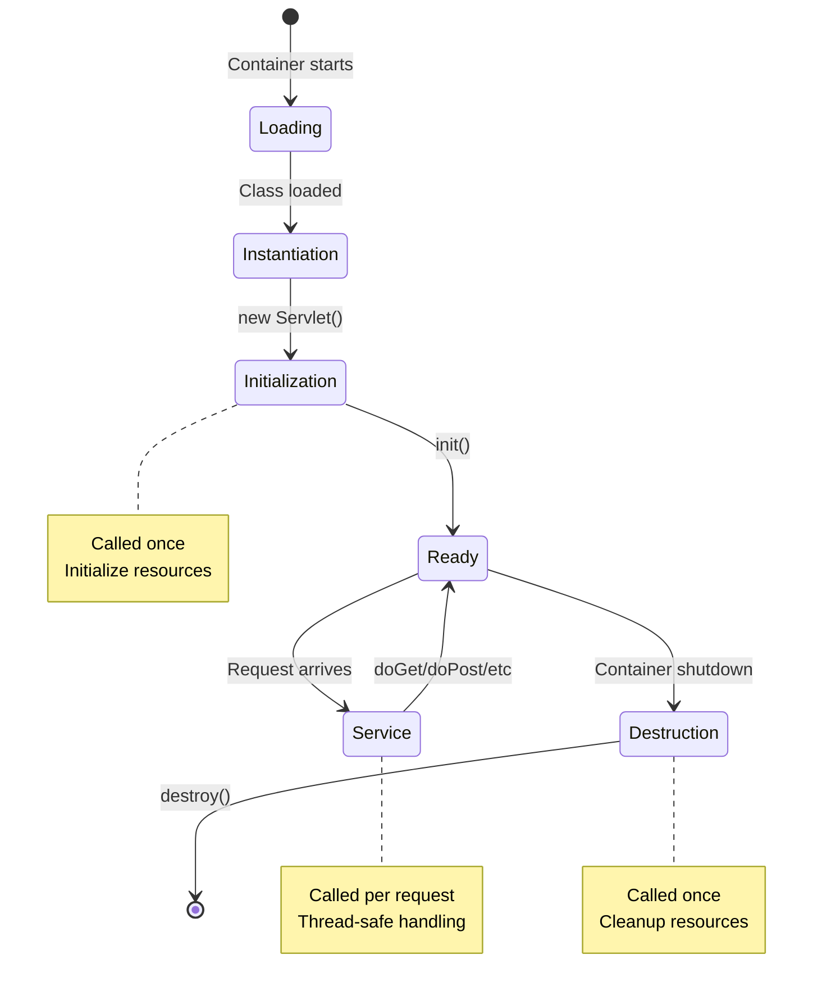
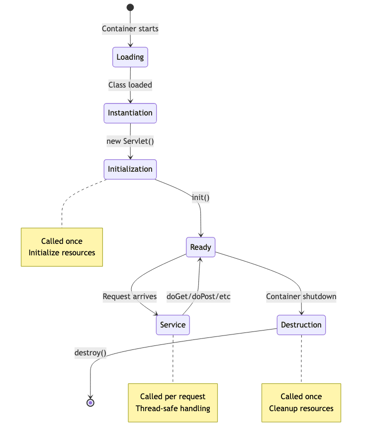
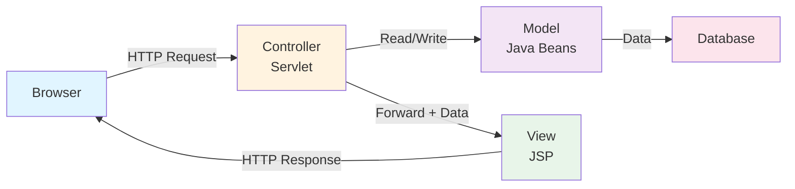
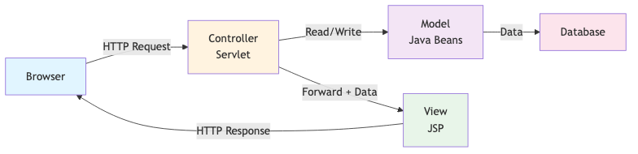
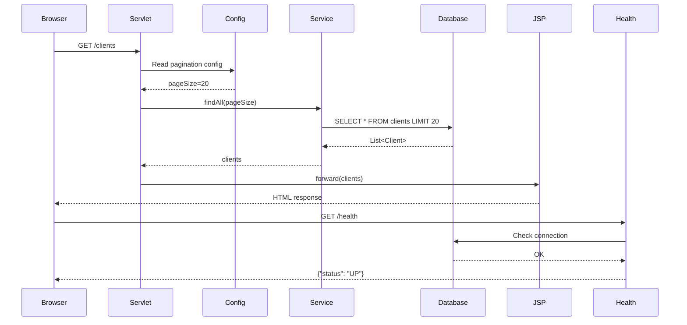
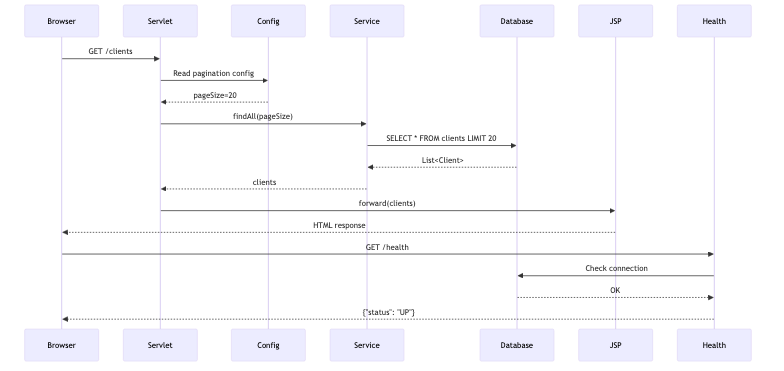

# Servlets, JSP & MicroProfile
## Building Dynamic Web Applications

**Duration:** 3 hours  
**Instructor:** Olivier Planson  
**Date:** 2025-12
**Course:** Jakarta EE, MicroProfile and Microservices

---

## 📋 Learning Objectives

By the end of this lecture, you will be able to:

| | |
|---|---|
| ✅ | Understand the complete servlet lifecycle |
| ✅ | Create dynamic web pages with JSP and JSTL |
| ✅ | Implement the MVC pattern in web applications |
| ✅ | Use MicroProfile Config in web tier |
| ✅ | Add health checks for web components |
| ✅ | Build a complete banking web interface |

---

## 🔄 Servlet Lifecycle Deep Dive

### What is a Servlet?

A **servlet** is a Java class that handles HTTP requests and generates dynamic responses.

### Key Characteristics:
- **Server-side:** Runs on the application server
- **Protocol-independent:** Can handle any request/response protocol
- **Thread-safe:** Multiple requests handled concurrently
- **Lifecycle-managed:** Container controls creation and destruction

### Servlet API Hierarchy:
```
GenericServlet (abstract)
    ↓
HttpServlet (abstract)
    ↓
Your Custom Servlet (concrete)
```

---

## 🔄 Servlet Lifecycle Phases

<details>
<summary>📝 Original Mermaid Code (click to expand)</summary>



</details>

    

---

## 🔄 Servlet Lifecycle Methods

### 1. init() - Initialization

```java
@WebServlet("/bank")
public class BankServlet extends HttpServlet {
    
    private DataSource dataSource;
    private BankService bankService;
    
    @Override
    public void init() throws ServletException {
        super.init();
        
        // Initialize resources (called once)
        try {
            Context ctx = new InitialContext();
            dataSource = (DataSource) ctx.lookup("java:comp/env/jdbc/bankDB");
            bankService = new BankService(dataSource);
            
            log("BankServlet initialized successfully");
        } catch (NamingException e) {
            throw new ServletException("Failed to initialize servlet", e);
        }
    }
}
```

**When called:** Once, when servlet is first loaded  
**Purpose:** Initialize resources, connections, configuration

---

## 🔄 Servlet Lifecycle Methods (cont.)

### 2. service() - Request Handling

```java
@Override
protected void service(HttpServletRequest req, HttpServletResponse resp)
        throws ServletException, IOException {
    
    // Called for every request
    String method = req.getMethod();
    
    if ("GET".equals(method)) {
        doGet(req, resp);
    } else if ("POST".equals(method)) {
        doPost(req, resp);
    } else if ("PUT".equals(method)) {
        doPut(req, resp);
    } else if ("DELETE".equals(method)) {
        doDelete(req, resp);
    }
}
```

**When called:** For every HTTP request  
**Purpose:** Dispatch to appropriate HTTP method handler  
**Note:** Usually you override doGet(), doPost(), etc. instead

---

## 🔄 HTTP Method Handlers

### doGet() - Retrieve Data

```java
@Override
protected void doGet(HttpServletRequest req, HttpServletResponse resp)
        throws ServletException, IOException {
    
    String clientId = req.getParameter("id");
    
    if (clientId != null) {
        // Get specific client
        Client client = bankService.findClientById(Long.parseLong(clientId));
        req.setAttribute("client", client);
        req.getRequestDispatcher("/WEB-INF/views/client-details.jsp")
           .forward(req, resp);
    } else {
        // List all clients
        List<Client> clients = bankService.findAllClients();
        req.setAttribute("clients", clients);
        req.getRequestDispatcher("/WEB-INF/views/client-list.jsp")
           .forward(req, resp);
    }
}
```

**Use case:** Display data, search, list resources

---

## 🔄 HTTP Method Handlers (cont.)

### doPost() - Create/Update Data

```java
@Override
protected void doPost(HttpServletRequest req, HttpServletResponse resp)
        throws ServletException, IOException {
    
    // Get form parameters
    String name = req.getParameter("name");
    String email = req.getParameter("email");
    
    // Validate input
    if (name == null || name.trim().isEmpty()) {
        req.setAttribute("error", "Name is required");
        req.getRequestDispatcher("/WEB-INF/views/client-form.jsp")
           .forward(req, resp);
        return;
    }
    
    // Create client
    Client client = new Client();
    client.setName(name);
    client.setEmail(email);
    
    bankService.createClient(client);
    
    // Redirect to list (PRG pattern)
    resp.sendRedirect(req.getContextPath() + "/clients");
}
```

**Use case:** Form submission, create resources

---

## 🔄 Servlet Lifecycle Methods (cont.)

### 3. destroy() - Cleanup

```java
@Override
public void destroy() {
    // Called once when servlet is unloaded
    try {
        if (bankService != null) {
            bankService.close();
        }
        
        log("BankServlet destroyed successfully");
    } catch (Exception e) {
        log("Error during servlet destruction", e);
    }
    
    super.destroy();
}
```

**When called:** Once, when servlet is unloaded or server shuts down  
**Purpose:** Release resources, close connections, cleanup

---

## 🔄 Servlet Lifecycle - Complete Example

```java
@WebServlet(
    name = "ClientServlet",
    urlPatterns = {"/clients", "/client"},
    loadOnStartup = 1  // Load at server startup
)
public class ClientServlet extends HttpServlet {
    
    private BankService bankService;
    private int requestCount = 0;
    
    @Override
    public void init() throws ServletException {
        log("=== INIT: ClientServlet initializing ===");
        bankService = new BankService();
    }
    
    @Override
    protected void doGet(HttpServletRequest req, HttpServletResponse resp)
            throws ServletException, IOException {
        requestCount++;
        log("=== SERVICE: Handling GET request #" + requestCount + " ===");
        
        List<Client> clients = bankService.findAllClients();
        req.setAttribute("clients", clients);
        req.getRequestDispatcher("/WEB-INF/views/clients.jsp").forward(req, resp);
    }
    
    @Override
    public void destroy() {
        log("=== DESTROY: ClientServlet destroyed after " + requestCount + " requests ===");
        bankService.close();
    }
}
```

---

## 📊 Servlet Configuration

### Annotation-based Configuration

```java
@WebServlet(
    name = "AccountServlet",
    urlPatterns = {"/accounts", "/account/*"},
    loadOnStartup = 1,
    initParams = {
        @WebInitParam(name = "maxResults", value = "100"),
        @WebInitParam(name = "cacheEnabled", value = "true")
    }
)
public class AccountServlet extends HttpServlet {
    
    private int maxResults;
    private boolean cacheEnabled;
    
    @Override
    public void init() throws ServletException {
        // Read init parameters
        maxResults = Integer.parseInt(getInitParameter("maxResults"));
        cacheEnabled = Boolean.parseBoolean(getInitParameter("cacheEnabled"));
    }
}
```

---

## 📊 Servlet Configuration (cont.)

### XML-based Configuration (web.xml)

```xml
<web-app xmlns="https://jakarta.ee/xml/ns/jakartaee"
         version="6.0">
    
    <servlet>
        <servlet-name>AccountServlet</servlet-name>
        <servlet-class>com.bank.web.AccountServlet</servlet-class>
        <init-param>
            <param-name>maxResults</param-name>
            <param-value>100</param-value>
        </init-param>
        <load-on-startup>1</load-on-startup>
    </servlet>
    
    <servlet-mapping>
        <servlet-name>AccountServlet</servlet-name>
        <url-pattern>/accounts</url-pattern>
        <url-pattern>/account/*</url-pattern>
    </servlet-mapping>
    
</web-app>
```

**Best Practice:** Use annotations for simple cases, XML for complex configurations

---

## 🌐 Request and Response Objects

### HttpServletRequest - Reading Request Data

```java
@Override
protected void doPost(HttpServletRequest req, HttpServletResponse resp)
        throws ServletException, IOException {
    
    // Request parameters (form data, query string)
    String name = req.getParameter("name");
    String[] hobbies = req.getParameterValues("hobbies");
    
    // Request headers
    String userAgent = req.getHeader("User-Agent");
    String contentType = req.getContentType();
    
    // Request attributes (set by filters, other servlets)
    User user = (User) req.getAttribute("currentUser");
    
    // Session data
    HttpSession session = req.getSession();
    String sessionId = session.getId();
    
    // Request metadata
    String method = req.getMethod();
    String contextPath = req.getContextPath();
    String servletPath = req.getServletPath();
    String queryString = req.getQueryString();
}
```

---

## 🌐 Request and Response Objects (cont.)

### HttpServletResponse - Sending Response

```java
@Override
protected void doGet(HttpServletRequest req, HttpServletResponse resp)
        throws ServletException, IOException {
    
    // Set response content type
    resp.setContentType("text/html; charset=UTF-8");
    
    // Set response headers
    resp.setHeader("Cache-Control", "no-cache");
    resp.setDateHeader("Expires", 0);
    
    // Set response status
    resp.setStatus(HttpServletResponse.SC_OK); // 200
    
    // Write response body
    PrintWriter out = resp.getWriter();
    out.println("<html><body>");
    out.println("<h1>Welcome to Banking App</h1>");
    out.println("</body></html>");
    
    // Or redirect
    // resp.sendRedirect("/login");
    
    // Or send error
    // resp.sendError(HttpServletResponse.SC_NOT_FOUND, "Client not found");
}
```

---

## 🎨 JavaServer Pages (JSP)

### What is JSP?

**JSP** (JavaServer Pages) is a technology for creating dynamic web pages using HTML with embedded Java code.

### Key Features:
- **HTML-centric:** Write mostly HTML with Java snippets
- **Compiled to servlets:** JSP pages are converted to servlets
- **Expression Language (EL):** Simplified syntax for accessing data
- **Tag libraries:** Reusable components (JSTL)

### JSP vs Servlet:

| Aspect | Servlet | JSP |
|--------|---------|-----|
| **Focus** | Java code | HTML markup |
| **Best for** | Business logic | Presentation |
| **Syntax** | Java | HTML + Java |
| **Compilation** | Explicit | Automatic |

---

## 🎨 JSP Syntax Elements

### 1. Directives - Page Configuration

```jsp
<%@ page contentType="text/html; charset=UTF-8" language="java" %>
<%@ page import="com.bank.model.Client, java.util.List" %>
<%@ page errorPage="/error.jsp" %>
<%@ page session="true" %>

<%@ taglib prefix="c" uri="jakarta.tags.core" %>
<%@ taglib prefix="fmt" uri="jakarta.tags.fmt" %>
```

### 2. Declarations - Define Variables/Methods

```jsp
<%!
    private int pageViewCount = 0;
    
    private String formatCurrency(double amount) {
        return String.format("$%.2f", amount);
    }
%>
```

---

## 🎨 JSP Syntax Elements (cont.)

### 3. Scriptlets - Java Code Blocks

```jsp
<%
    List<Client> clients = (List<Client>) request.getAttribute("clients");
    
    if (clients == null || clients.isEmpty()) {
        out.println("<p>No clients found</p>");
    } else {
        for (Client client : clients) {
            out.println("<div>" + client.getName() + "</div>");
        }
    }
%>
```

**⚠️ Warning:** Scriptlets mix logic with presentation. Use JSTL instead!

### 4. Expressions - Output Values

```jsp
<p>Client Name: <%= client.getName() %></p>
<p>Current Time: <%= new java.util.Date() %></p>
```

---

## 🎨 Expression Language (EL)

### Simplified Syntax for Data Access

```jsp
<!-- Instead of: <%= request.getAttribute("client") %> -->
${client}

<!-- Access properties -->
${client.name}
${client.email}
${client.accounts[0].balance}

<!-- Arithmetic -->
${account.balance + 100}
${account.balance * 1.05}

<!-- Comparison -->
${account.balance > 1000}
${client.name == 'John'}

<!-- Logical -->
${client.active && account.balance > 0}

<!-- Null-safe -->
${empty clients ? 'No clients' : 'Clients found'}
```

**Advantages:** Cleaner, null-safe, no Java imports needed

---

## 🎨 JSTL - JSP Standard Tag Library

### Core Tags

```jsp
<%@ taglib prefix="c" uri="jakarta.tags.core" %>

<!-- Variables -->
<c:set var="discount" value="0.10" />
<c:out value="${client.name}" default="Unknown" />

<!-- Conditionals -->
<c:if test="${account.balance > 1000}">
    <span class="premium">Premium Account</span>
</c:if>

<c:choose>
    <c:when test="${account.balance > 10000}">
        <span class="gold">Gold</span>
    </c:when>
    <c:when test="${account.balance > 5000}">
        <span class="silver">Silver</span>
    </c:when>
    <c:otherwise>
        <span class="standard">Standard</span>
    </c:otherwise>
</c:choose>
```

---

## 🎨 JSTL - Iteration

### Looping Through Collections

```jsp
<!-- Simple iteration -->
<c:forEach var="client" items="${clients}">
    <tr>
        <td>${client.id}</td>
        <td>${client.name}</td>
        <td>${client.email}</td>
    </tr>
</c:forEach>

<!-- With status -->
<c:forEach var="account" items="${accounts}" varStatus="status">
    <tr class="${status.index % 2 == 0 ? 'even' : 'odd'}">
        <td>${status.count}</td>
        <td>${account.number}</td>
        <td>${account.balance}</td>
    </tr>
</c:forEach>

<!-- Range iteration -->
<c:forEach var="i" begin="1" end="10" step="2">
    <option value="${i}">${i}</option>
</c:forEach>
```

---

## 🎨 JSTL - Formatting

### Format Tags

```jsp
<%@ taglib prefix="fmt" uri="jakarta.tags.fmt" %>

<!-- Number formatting -->
<fmt:formatNumber value="${account.balance}" type="currency" />
<fmt:formatNumber value="${interestRate}" type="percent" />
<fmt:formatNumber value="${account.balance}" pattern="#,##0.00" />

<!-- Date formatting -->
<fmt:formatDate value="${transaction.date}" pattern="yyyy-MM-dd HH:mm:ss" />
<fmt:formatDate value="${client.createdAt}" type="date" dateStyle="long" />

<!-- Internationalization -->
<fmt:setLocale value="en_US" />
<fmt:bundle basename="messages">
    <fmt:message key="welcome.message" />
    <fmt:message key="balance.label">
        <fmt:param value="${account.balance}" />
    </fmt:message>
</fmt:bundle>
```

---

## 🎨 Complete JSP Example - Client List

```jsp
<%@ page contentType="text/html; charset=UTF-8" %>
<%@ taglib prefix="c" uri="jakarta.tags.core" %>
<%@ taglib prefix="fmt" uri="jakarta.tags.fmt" %>

<!DOCTYPE html>
<html>
<head>
    <title>Banking App - Clients</title>
    <link rel="stylesheet" href="${pageContext.request.contextPath}/css/style.css">
</head>
<body>
    <h1>Client List</h1>
    
    <c:if test="${not empty message}">
        <div class="alert alert-success">${message}</div>
    </c:if>
    
    <table>
        <thead>
            <tr>
                <th>ID</th>
                <th>Name</th>
                <th>Email</th>
                <th>Accounts</th>
                <th>Actions</th>
            </tr>
        </thead>
        <tbody>
            <c:forEach var="client" items="${clients}">
                <tr>
                    <td>${client.id}</td>
                    <td><c:out value="${client.name}" /></td>
                    <td>${client.email}</td>
                    <td>${client.accounts.size()}</td>
                    <td>
                        <a href="client?id=${client.id}">View</a>
                        <a href="client/edit?id=${client.id}">Edit</a>
                    </td>
                </tr>
            </c:forEach>
        </tbody>
    </table>
    
    <a href="client/new" class="btn">Add New Client</a>
</body>
</html>
```

---

## 🏗️ MVC Pattern in Web Applications

### Model-View-Controller Architecture

<details>
<summary>📝 Original Mermaid Code (click to expand)</summary>



</details>



### Responsibilities:

- **Model:** Business logic, data access (Java classes, JPA entities)
- **View:** Presentation layer (JSP, HTML, CSS)
- **Controller:** Request handling, flow control (Servlets)

---

## 🏗️ MVC Pattern - Model Layer

### Entity (Model)

```java
package com.bank.model;

public class Client {
    private Long id;
    private String name;
    private String email;
    private List<Account> accounts;
    
    // Constructors
    public Client() {}
    
    public Client(String name, String email) {
        this.name = name;
        this.email = email;
        this.accounts = new ArrayList<>();
    }
    
    // Getters and setters
    public Long getId() { return id; }
    public void setId(Long id) { this.id = id; }
    
    public String getName() { return name; }
    public void setName(String name) { this.name = name; }
    
    public String getEmail() { return email; }
    public void setEmail(String email) { this.email = email; }
    
    public List<Account> getAccounts() { return accounts; }
    public void setAccounts(List<Account> accounts) { this.accounts = accounts; }
}
```

---

## 🏗️ MVC Pattern - Controller Layer

### Servlet (Controller)

```java
@WebServlet("/clients")
public class ClientController extends HttpServlet {
    
    private ClientService clientService = new ClientService();
    
    @Override
    protected void doGet(HttpServletRequest req, HttpServletResponse resp)
            throws ServletException, IOException {
        
        String action = req.getParameter("action");
        
        if ("view".equals(action)) {
            viewClient(req, resp);
        } else if ("edit".equals(action)) {
            editClient(req, resp);
        } else {
            listClients(req, resp);
        }
    }
    
    private void listClients(HttpServletRequest req, HttpServletResponse resp)
            throws ServletException, IOException {
        List<Client> clients = clientService.findAll();
        req.setAttribute("clients", clients);
        req.getRequestDispatcher("/WEB-INF/views/client-list.jsp").forward(req, resp);
    }
    
    private void viewClient(HttpServletRequest req, HttpServletResponse resp)
            throws ServletException, IOException {
        Long id = Long.parseLong(req.getParameter("id"));
        Client client = clientService.findById(id);
        req.setAttribute("client", client);
        req.getRequestDispatcher("/WEB-INF/views/client-view.jsp").forward(req, resp);
    }
}
```

---

## 🏗️ MVC Pattern - View Layer

### JSP (View)

```jsp
<%@ page contentType="text/html; charset=UTF-8" %>
<%@ taglib prefix="c" uri="jakarta.tags.core" %>

<!DOCTYPE html>
<html>
<head>
    <title>Client Details</title>
</head>
<body>
    <h1>Client Details</h1>
    
    <div class="client-info">
        <p><strong>ID:</strong> ${client.id}</p>
        <p><strong>Name:</strong> <c:out value="${client.name}" /></p>
        <p><strong>Email:</strong> ${client.email}</p>
    </div>
    
    <h2>Accounts</h2>
    <table>
        <thead>
            <tr>
                <th>Account Number</th>
                <th>Type</th>
                <th>Balance</th>
            </tr>
        </thead>
        <tbody>
            <c:forEach var="account" items="${client.accounts}">
                <tr>
                    <td>${account.number}</td>
                    <td>${account.type}</td>
                    <td><fmt:formatNumber value="${account.balance}" type="currency" /></td>
                </tr>
            </c:forEach>
        </tbody>
    </table>
    
    <a href="clients">Back to List</a>
</body>
</html>
```

---

## ⚙️ MicroProfile Config in Web Applications

### Why Use MP Config in Web Tier?

| | |
|---|---|
| ✅ | Externalize configuration (URLs, limits, features) |
| ✅ | Environment-specific settings (dev, test, prod) |
| ✅ | Dynamic configuration updates |
| ✅ | Consistent configuration across layers |

### Configuration Sources (Priority Order):
1. System properties (`-Dproperty=value`)
2. Environment variables
3. `microprofile-config.properties`
4. Custom ConfigSources

---

## ⚙️ MP Config - Configuration File

### microprofile-config.properties

```properties
# Application settings
app.name=Banking Application
app.version=1.0.0
app.environment=development

# Web tier configuration
web.max.upload.size=10485760
web.session.timeout=1800
web.pagination.default.size=20
web.pagination.max.size=100

# Feature flags
feature.client.registration.enabled=true
feature.account.transfer.enabled=true
feature.advanced.search.enabled=false

# External services
external.currency.api.url=https://api.exchangerate.com
external.currency.api.key=${CURRENCY_API_KEY}
external.currency.api.timeout=5000

# Security
security.password.min.length=8
security.session.secure=true
security.csrf.enabled=true
```

---

## ⚙️ Configuration in Servlets

### Using ServletContext Init Parameters

**Configuration in web.xml:**
```xml
<web-app>
    <context-param>
        <param-name>web.pagination.default.size</param-name>
        <param-value>20</param-value>
    </context-param>
    
    <context-param>
        <param-name>app.name</param-name>
        <param-value>Banking Application</param-value>
    </context-param>
</web-app>
```

**Reading in Servlet:**
```java
@WebServlet("/clients")
public class ClientController extends HttpServlet {
    
    private int defaultPageSize;
    private int maxPageSize;
    private boolean registrationEnabled;
    private String appName;
    
    @Override
    public void init() throws ServletException {
        super.init();
        
        // Read configuration from ServletContext
        String pageSizeParam = getServletContext()
            .getInitParameter("web.pagination.default.size");
        defaultPageSize = (pageSizeParam != null)
            ? Integer.parseInt(pageSizeParam) : 20;
        
        appName = getServletContext().getInitParameter("app.name");
        if (appName == null) {
            appName = "Default App";
        }
    }
    
    @Override
    protected void doGet(HttpServletRequest req, HttpServletResponse resp)
            throws ServletException, IOException {
        
        // Use configuration
        int pageSize = Math.min(
            Integer.parseInt(req.getParameter("size") != null ? 
                req.getParameter("size") : String.valueOf(defaultPageSize)),
            maxPageSize
        );
        
        List<Client> clients = clientService.findAll(pageSize);
        req.setAttribute("clients", clients);
        req.setAttribute("appName", appName);
        req.setAttribute("registrationEnabled", registrationEnabled);
        
        req.getRequestDispatcher("/WEB-INF/views/client-list.jsp").forward(req, resp);
    }
}
```

---

## ⚙️ MP Config - Programmatic Access

### Using Config API

```java
@WebServlet("/config-info")
public class ConfigInfoServlet extends HttpServlet {
    
    @Override
    protected void doGet(HttpServletRequest req, HttpServletResponse resp)
            throws ServletException, IOException {
        
        // Get Config instance
        Config config = ConfigProvider.getConfig();
        
        // Read configuration values
        String appName = config.getValue("app.name", String.class);
        String environment = config.getValue("app.environment", String.class);
        
        // Optional values
        Optional<String> apiKey = config.getOptionalValue("external.currency.api.key", String.class);
        
        // Get all property names
        Iterable<String> propertyNames = config.getPropertyNames();
        
        // Build response
        resp.setContentType("text/html");
        PrintWriter out = resp.getWriter();
        out.println("<h1>Configuration Info</h1>");
        out.println("<p>App Name: " + appName + "</p>");
        out.println("<p>Environment: " + environment + "</p>");
        out.println("<p>API Key configured: " + apiKey.isPresent() + "</p>");
        
        out.println("<h2>All Properties:</h2><ul>");
        propertyNames.forEach(name -> 
            out.println("<li>" + name + " = " + config.getValue(name, String.class) + "</li>")
        );
        out.println("</ul>");
    }
}
```

---

## 💊 Health Checks for Web Tier

### Why Health Checks in Web Applications?

| | |
|---|---|
| ✅ | Monitor application availability |
| ✅ | Detect issues early (database, external services) |
| ✅ | Enable automated recovery (Kubernetes, Docker) |
| ✅ | Provide operational insights |

### Health Check Types:

- **Liveness:** Is the application running?
- **Readiness:** Is the application ready to serve requests?
- **Startup:** Has the application started successfully?

---

## 💊 Health Check - Database Connectivity

```java
@Liveness
@ApplicationScoped
public class DatabaseHealthCheck implements HealthCheck {
    
    @Inject
    private DataSource dataSource;
    
    @Override
    public HealthCheckResponse call() {
        HealthCheckResponseBuilder builder = HealthCheckResponse
            .named("database-connection");
        
        try (Connection conn = dataSource.getConnection()) {
            boolean isValid = conn.isValid(5); // 5 seconds timeout
            
            if (isValid) {
                return builder
                    .up()
                    .withData("database", "connected")
                    .withData("timeout", "5s")
                    .build();
            } else {
                return builder
                    .down()
                    .withData("database", "connection invalid")
                    .build();
            }
        } catch (SQLException e) {
            return builder
                .down()
                .withData("error", e.getMessage())
                .build();
        }
    }
}
```

---

## 💊 Health Check - Web Application Readiness

```java
@Readiness
@ApplicationScoped
public class WebAppReadinessCheck implements HealthCheck {
    
    @Inject
    @ConfigProperty(name = "app.environment")
    private String environment;
    
    @Inject
    private ClientService clientService;
    
    @Override
    public HealthCheckResponse call() {
        HealthCheckResponseBuilder builder = HealthCheckResponse
            .named("web-application-readiness");
        
        try {
            // Check if services are initialized
            boolean servicesReady = clientService != null;
            
            // Check if configuration is loaded
            boolean configReady = environment != null && !environment.isEmpty();
            
            if (servicesReady && configReady) {
                return builder
                    .up()
                    .withData("services", "initialized")
                    .withData("configuration", "loaded")
                    .withData("environment", environment)
                    .build();
            } else {
                return builder
                    .down()
                    .withData("services", servicesReady ? "ready" : "not ready")
                    .withData("configuration", configReady ? "ready" : "not ready")
                    .build();
            }
        } catch (Exception e) {
            return builder
                .down()
                .withData("error", e.getMessage())
                .build();
        }
    }
}
```

---

## 💊 Health Check - External Service

```java
@Readiness
@ApplicationScoped
public class ExternalServiceHealthCheck implements HealthCheck {
    
    @Inject
    @ConfigProperty(name = "external.currency.api.url")
    private String apiUrl;
    
    @Inject
    @ConfigProperty(name = "external.currency.api.timeout", defaultValue = "5000")
    private int timeout;
    
    @Override
    public HealthCheckResponse call() {
        HealthCheckResponseBuilder builder = HealthCheckResponse
            .named("external-currency-api");
        
        try {
            URL url = new URL(apiUrl + "/health");
            HttpURLConnection conn = (HttpURLConnection) url.openConnection();
            conn.setRequestMethod("GET");
            conn.setConnectTimeout(timeout);
            conn.setReadTimeout(timeout);
            
            int responseCode = conn.getResponseCode();
            
            if (responseCode == 200) {
                return builder
                    .up()
                    .withData("api", "available")
                    .withData("response_code", responseCode)
                    .withData("url", apiUrl)
                    .build();
            } else {
                return builder
                    .down()
                    .withData("api", "unavailable")
                    .withData("response_code", responseCode)
                    .build();
            }
        } catch (Exception e) {
            return builder
                .down()
                .withData("error", e.getMessage())
                .withData("url", apiUrl)
                .build();
        }
    }
}
```

---

## 💊 Accessing Health Endpoints

### Health Check URLs

```bash
# All health checks
curl http://localhost:9080/health

# Liveness checks only
curl http://localhost:9080/health/live

# Readiness checks only
curl http://localhost:9080/health/ready

# Startup checks only
curl http://localhost:9080/health/started
```

### Example Response

```json
{
  "status": "UP",
  "checks": [
    {
      "name": "database-connection",
      "status": "UP",
      "data": {
        "database": "connected",
        "timeout": "5s"
      }
    },
    {
      "name": "web-application-readiness",
      "status": "UP",
      "data": {
        "services": "initialized",
        "configuration": "loaded",
        "environment": "development"
      }
    }
  ]
}
```

---

## 🏦 Banking Application - Complete Flow

### Request Flow with MVC + MP Config + Health

<details>
<summary>📝 Original Mermaid Code (click to expand)</summary>



</details>



---

## 🏦 Banking Application - Project Structure

```
banking-web-app/
├── src/
│   ├── main/
│   │   ├── java/
│   │   │   └── com/bank/
│   │   │       ├── model/
│   │   │       │   ├── Client.java
│   │   │       │   └── Account.java
│   │   │       ├── service/
│   │   │       │   ├── ClientService.java
│   │   │       │   └── AccountService.java
│   │   │       ├── web/
│   │   │       │   ├── ClientController.java
│   │   │       │   └── AccountController.java
│   │   │       └── health/
│   │   │           ├── DatabaseHealthCheck.java
│   │   │           └── WebAppReadinessCheck.java
│   │   ├── resources/
│   │   │   └── META-INF/
│   │   │       └── microprofile-config.properties
│   │   └── webapp/
│   │       ├── WEB-INF/
│   │       │   ├── web.xml
│   │       │   └── views/
│   │       │       ├── client-list.jsp
│   │       │       ├── client-form.jsp
│   │       │       └── account-list.jsp
│   │       ├── css/
│   │       │   └── style.css
│   │       └── index.html
│   └── test/
└── pom.xml
```

---

## 🎯 Best Practices

### Servlet Development

| | |
|---|---|
| ✅ | Use annotations for simple configurations |
| ✅ | Keep servlets thin - delegate to service layer |
| ✅ | Use PRG pattern (Post-Redirect-Get) for forms |
| ✅ | Handle exceptions gracefully |
| ✅ | Log important events and errors |
| ✅ | Use filters for cross-cutting concerns |

### JSP Development

| | |
|---|---|
| ✅ | Avoid scriptlets - use JSTL and EL |
| ✅ | Keep JSPs in WEB-INF for security |
| ✅ | Use tag libraries for reusable components |
| ✅ | Escape user input to prevent XSS |
| ✅ | Separate concerns - no business logic in JSP |

---

## 🎯 Best Practices (cont.)

### MVC Pattern

| | |
|---|---|
| ✅ | Clear separation of concerns |
| ✅ | Model: Pure Java, no web dependencies |
| ✅ | View: Presentation only, no business logic |
| ✅ | Controller: Thin, delegates to services |
| ✅ | Use request attributes for data passing |

### MicroProfile Config

| | |
|---|---|
| ✅ | Externalize all environment-specific settings |
| ✅ | Use meaningful property names |
| ✅ | Provide default values |
| ✅ | Document configuration properties |
| ✅ | Use environment variables for secrets |

---

## 🔒 Security Considerations

### Input Validation

```java
@WebServlet("/clients")
public class ClientController extends HttpServlet {
    
    @Override
    protected void doPost(HttpServletRequest req, HttpServletResponse resp)
            throws ServletException, IOException {
        
        String name = req.getParameter("name");
        String email = req.getParameter("email");
        
        // Validate input
        List<String> errors = new ArrayList<>();
        
        if (name == null || name.trim().isEmpty()) {
            errors.add("Name is required");
        } else if (name.length() > 100) {
            errors.add("Name is too long (max 100 characters)");
        }
        
        if (email == null || !email.matches("^[A-Za-z0-9+_.-]+@(.+)$")) {
            errors.add("Valid email is required");
        }
        
        if (!errors.isEmpty()) {
            req.setAttribute("errors", errors);
            req.setAttribute("name", name);
            req.setAttribute("email", email);
            req.getRequestDispatcher("/WEB-INF/views/client-form.jsp")
               .forward(req, resp);
            return;
        }
        
        // Process valid input
        Client client = new Client(name, email);
        clientService.create(client);
        resp.sendRedirect(req.getContextPath() + "/clients");
    }
}
```

---

## 🔒 Security Considerations (cont.)

### XSS Prevention in JSP

```jsp
<%@ taglib prefix="c" uri="jakarta.tags.core" %>

<!-- WRONG: Direct output (vulnerable to XSS) -->
<p>Welcome, <%= request.getParameter("name") %></p>

<!-- CORRECT: Use c:out to escape HTML -->
<p>Welcome, <c:out value="${param.name}" /></p>

<!-- CORRECT: EL with escaping (default in JSP 2.1+) -->
<p>Welcome, ${param.name}</p>

<!-- For HTML attributes -->
<input type="text" value="<c:out value='${param.search}' />" />

<!-- For JavaScript -->
<script>
    var userName = '<c:out value="${user.name}" escapeXml="true" />';
</script>
```

### CSRF Protection

```java
// Generate CSRF token in servlet
String csrfToken = UUID.randomUUID().toString();
req.getSession().setAttribute("csrfToken", csrfToken);
req.setAttribute("csrfToken", csrfToken);
```

```jsp
<!-- Include in forms -->
<form method="post" action="clients">
    <input type="hidden" name="csrfToken" value="${csrfToken}" />
    <!-- other fields -->
</form>
```

---

## 📊 Lab 2 Preview

### Objectives:
- Implement complete servlet lifecycle
- Create dynamic JSP pages with JSTL
- Build MVC-based client management
- Add MicroProfile Config for web settings
- Implement health checks for web tier

### What You'll Build:
A banking web interface with:
- Client CRUD operations (Create, Read, Update, Delete)
- Account listing and details
- Form validation and error handling
- Pagination with MP Config
- Health monitoring

**Time:** 3 hours  
**Difficulty:** Intermediate

---

## 🎓 Key Takeaways

### What We Learned Today:

| | |
|---|---|
| ✅ | Servlet lifecycle: init(), service(), destroy() |
| ✅ | JSP with JSTL for dynamic pages |
| ✅ | MVC pattern for web applications |
| ✅ | MicroProfile Config in web tier |
| ✅ | Health checks for monitoring |

### Next Steps:
- Complete Lab 2: Servlets and JSP
- Practice JSTL and EL syntax
- Implement MVC pattern
- Add health checks to your application

---

## 📚 Additional Resources

### Official Documentation:
- **Jakarta Servlet:** https://jakarta.ee/specifications/servlet/
- **Jakarta Server Pages:** https://jakarta.ee/specifications/pages/
- **JSTL:** https://jakarta.ee/specifications/tags/
- **MicroProfile Config:** https://microprofile.io/specifications/microprofile-config/

### Recommended Reading:
- "Head First Servlets and JSP" by Bryan Basham
- "Jakarta EE Cookbook" by Elder Moraes
- "Pro JSP 2" by Simon Brown

### Tutorials:
- Jakarta EE Tutorial: https://eclipse-ee4j.github.io/jakartaee-tutorial/
- Baeldung Servlet Guide: https://www.baeldung.com/intro-to-servlets

---

## 📝 Homework

### Before Next Lecture:

| | |
|---|---|
| ✅ | Complete Lab 2: Servlets and JSP |
| ✅ | Practice JSTL core and formatting tags |
| ✅ | Implement MVC pattern in your project |
| ✅ | Add MicroProfile Config properties |
| ✅ | Test health check endpoints |

### Optional:
- Explore JSP custom tags
- Implement file upload servlet
- Add internationalization (i18n) with JSTL

---

## 🙋 Questions & Discussion

### Discussion Topics:
- When to use servlets vs JAX-RS?
- How does JSP compare to modern frontend frameworks?
- What are the advantages of MVC pattern?
- How do health checks help in production?

### Office Hours:
- **When:** [Your schedule]
- **Where:** [Your location/online]
- **Contact:** [Your email]

---

## 📅 Next Lecture

### JPA and Database Integration
**Date:** [Next session date]  
**Duration:** 4 hours  
**Topics:**
- JPA entities and relationships
- JPQL and Criteria API
- Transaction management
- Database migrations
- MP Config for database settings

**Preparation:** Complete Lab 2 and review SQL basics

---

# Thank You!

## Ready to Build Dynamic Web Applications? 🚀

**Remember:**
- Servlets handle requests, JSP presents data
- MVC keeps code organized and maintainable
- JSTL makes JSP cleaner and more powerful
- MP Config externalizes configuration
- Health checks ensure application reliability

**See you in Lab 2!**

---

## Appendix: Quick Reference

### Servlet Annotations

```java
@WebServlet(
    name = "MyServlet",
    urlPatterns = {"/path", "/path/*"},
    loadOnStartup = 1,
    initParams = {
        @WebInitParam(name = "key", value = "value")
    }
)
```

### JSTL Core Tags

```jsp
<c:set var="name" value="value" />
<c:out value="${expression}" />
<c:if test="${condition}">...</c:if>
<c:choose>
    <c:when test="${condition}">...</c:when>
    <c:otherwise>...</c:otherwise>
</c:choose>
<c:forEach var="item" items="${list}">...</c:forEach>
```

---

## Appendix: Common Patterns

### Post-Redirect-Get (PRG) Pattern

```java
@Override
protected void doPost(HttpServletRequest req, HttpServletResponse resp)
        throws ServletException, IOException {
    
    // Process form data
    Client client = new Client();
    client.setName(req.getParameter("name"));
    clientService.create(client);
    
    // Redirect to prevent duplicate submission
    resp.sendRedirect(req.getContextPath() + "/clients?message=created");
}

@Override
protected void doGet(HttpServletRequest req, HttpServletResponse resp)
        throws ServletException, IOException {
    
    String message = req.getParameter("message");
    if (message != null) {
        req.setAttribute("message", "Client created successfully");
    }
    
    List<Client> clients = clientService.findAll();
    req.setAttribute("clients", clients);
    req.getRequestDispatcher("/WEB-INF/views/client-list.jsp").forward(req, resp);
}
```

---

## Appendix: Error Handling

### Custom Error Pages (web.xml)

```xml
<error-page>
    <error-code>404</error-code>
    <location>/WEB-INF/views/error-404.jsp</location>
</error-page>

<error-page>
    <error-code>500</error-code>
    <location>/WEB-INF/views/error-500.jsp</location>
</error-page>

<error-page>
    <exception-type>java.lang.Exception</exception-type>
    <location>/WEB-INF/views/error-general.jsp</location>
</error-page>
```

### Error Page JSP

```jsp
<%@ page isErrorPage="true" %>
<!DOCTYPE html>
<html>
<head>
    <title>Error</title>
</head>
<body>
    <h1>An Error Occurred</h1>
    <p>Error Code: ${pageContext.errorData.statusCode}</p>
    <p>Message: ${pageContext.exception.message}</p>
    <a href="${pageContext.request.contextPath}/">Go Home</a>
</body>
</html>