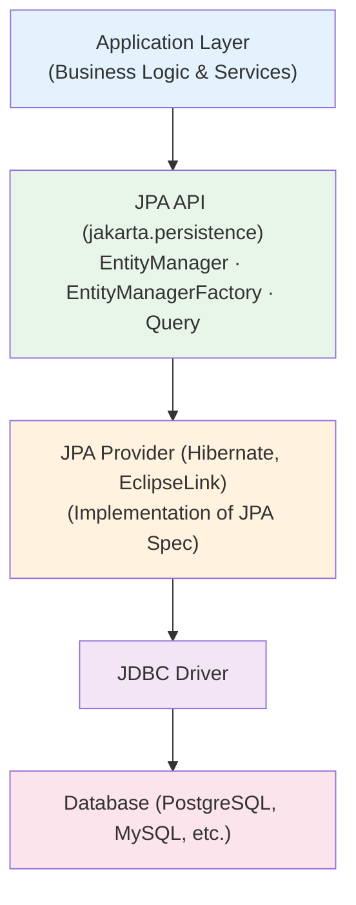
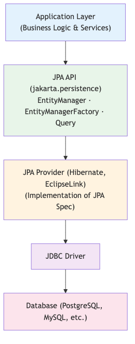
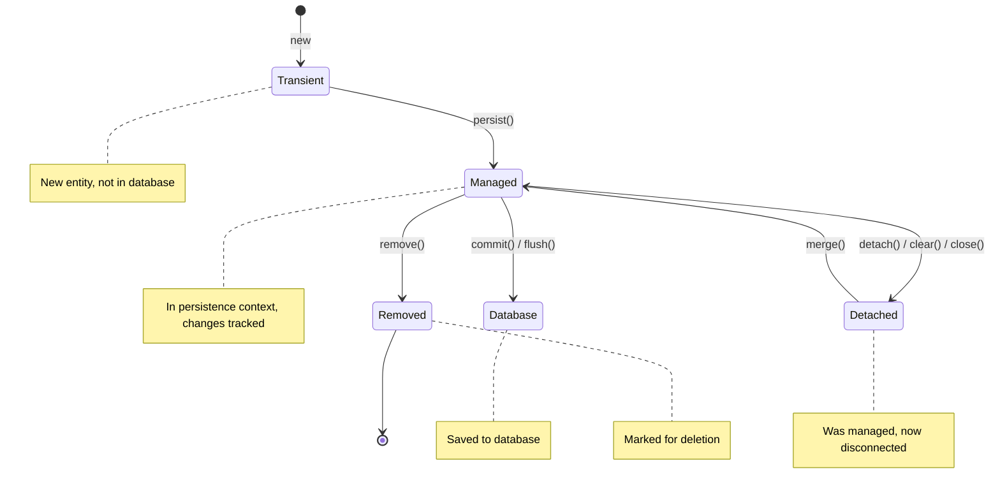
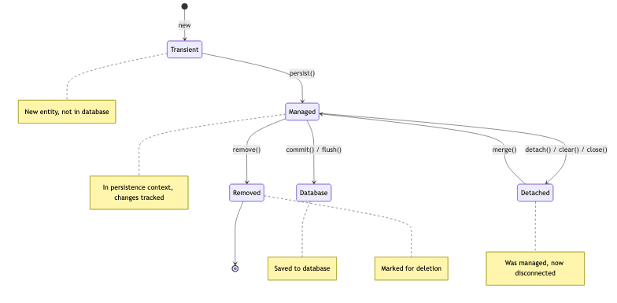
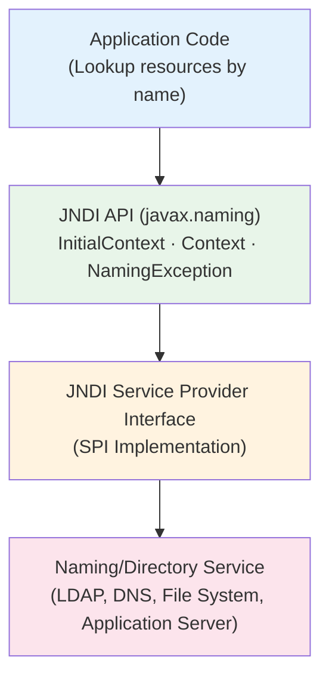
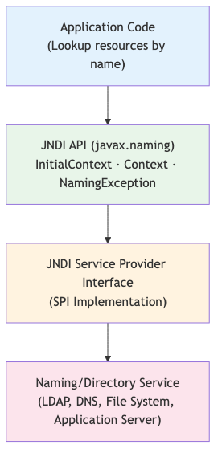

<!-- © Copyright 2026 Olivier Planson. All rights reserved. Reproduction prohibited. Made with IBM Bob. -->


# 🗄️ Lecture 3: JPA and Database Integration

**Jakarta Persistence API (JPA)**

---

## 📋 Lecture Objectives

By the end of this lecture, you will be able to:

- Understand Object-Relational Mapping (ORM) concepts
- Create and configure JPA entities with annotations
- Define entity relationships (One-to-One, One-to-Many, Many-to-Many)
- Write queries using JPQL and Criteria API
- Manage transactions effectively
- Handle database migrations and schema evolution
- Use JNDI to lookup resources (DataSources, EJBs, JMS)
- Configure and access environment entries

---

## 📚 Topics Covered

1. **Introduction to JPA and ORM**
2. **JPA Entities and Annotations**
3. **Entity Relationships**
4. **JPQL (Java Persistence Query Language)**
5. **Criteria API**
6. **Transaction Management**
7. **Database Migrations**
8. **JNDI (Java Naming and Directory Interface)**

---

# Part 1: Introduction to JPA and ORM

---

## What is ORM?

**Object-Relational Mapping (ORM)** bridges the gap between object-oriented programming and relational databases.

<div class="columns">
<div>

**Without ORM:**
```java
// Manual JDBC code
String sql = "SELECT * FROM client WHERE id = ?";
PreparedStatement ps = conn.prepareStatement(sql);
ps.setLong(1, clientId);
ResultSet rs = ps.executeQuery();
if (rs.next()) {
    Client client = new Client();
    client.setId(rs.getLong("id"));
    client.setName(rs.getString("name"));
    client.setEmail(rs.getString("email"));
}
```

</div>
<div>

**With ORM (JPA):**
```java
// Simple JPA code
Client client = entityManager.find(
    Client.class, 
    clientId
);
```

</div>
</div>

---

## Why Use JPA?

**Benefits:**
- ✅ **Productivity:** Less boilerplate code
- ✅ **Maintainability:** Object-oriented approach
- ✅ **Database Independence:** Switch databases easily
- ✅ **Caching:** Built-in first and second-level caching
- ✅ **Lazy Loading:** Load data only when needed
- ✅ **Transaction Management:** Automatic transaction handling

**Challenges:**
- ⚠️ Learning curve for complex mappings
- ⚠️ Performance tuning required for large datasets
- ⚠️ N+1 query problem if not careful

---

## JPA Architecture

<details>
<summary>📝 Original Mermaid Code (click to expand)</summary>



</details>




---

## Key JPA Concepts

| Concept | Description |
|---------|-------------|
| **Entity** | Java class mapped to database table |
| **EntityManager** | Interface to interact with persistence context |
| **Persistence Context** | Set of managed entity instances |
| **Persistence Unit** | Configuration defining database connection |
| **Transaction** | Unit of work that must be atomic |
| **JPQL** | Object-oriented query language |

---

# Part 2: JPA Entities and Annotations

---

## Creating a Basic Entity

```java
package com.bank.model;

import jakarta.persistence.*;

@Entity
@Table(name = "clients")
public class Client {
    
    @Id
    @GeneratedValue(strategy = GenerationType.IDENTITY)
    private Long id;
    
    @Column(name = "name", nullable = false, length = 100)
    private String name;
    
    @Column(name = "email", nullable = false, unique = true, length = 150)
    private String email;
    
    // Constructors, getters, setters
}
```

---

## Essential JPA Annotations

<div class="columns">
<div>

**Class-Level:**
- `@Entity` - Marks class as JPA entity
- `@Table` - Specifies table details
- `@NamedQuery` - Defines named queries

**Field-Level:**
- `@Id` - Primary key
- `@GeneratedValue` - Auto-generation strategy
- `@Column` - Column mapping
- `@Temporal` - Date/time mapping
- `@Enumerated` - Enum mapping

</div>
<div>

**Relationship:**
- `@OneToOne` - One-to-one relationship
- `@OneToMany` - One-to-many relationship
- `@ManyToOne` - Many-to-one relationship
- `@ManyToMany` - Many-to-many relationship
- `@JoinColumn` - Foreign key column
- `@JoinTable` - Join table for M:N

</div>
</div>

---

## ID Generation Strategies

```java
// IDENTITY - Database auto-increment
@Id
@GeneratedValue(strategy = GenerationType.IDENTITY)
private Long id;

// SEQUENCE - Database sequence
@Id
@GeneratedValue(strategy = GenerationType.SEQUENCE, generator = "client_seq")
@SequenceGenerator(name = "client_seq", sequenceName = "client_sequence", 
                   allocationSize = 1)
private Long id;

// TABLE - Separate table for ID generation
@Id
@GeneratedValue(strategy = GenerationType.TABLE, generator = "client_gen")
@TableGenerator(name = "client_gen", table = "id_generator", 
                pkColumnName = "gen_name", valueColumnName = "gen_value")
private Long id;

// UUID - Universally Unique Identifier
@Id
@GeneratedValue(strategy = GenerationType.UUID)
private UUID id;
```

---

## Complete Entity Example

```java
@Entity
@Table(name = "clients", 
       indexes = {@Index(name = "idx_email", columnList = "email")})
@NamedQuery(name = "Client.findAll", query = "SELECT c FROM Client c")
@NamedQuery(name = "Client.findByEmail", 
            query = "SELECT c FROM Client c WHERE c.email = :email")
public class Client {
    
    @Id
    @GeneratedValue(strategy = GenerationType.IDENTITY)
    private Long id;
    
    @Column(nullable = false, length = 100)
    private String name;
    
    @Column(nullable = false, unique = true, length = 150)
    private String email;
    
    @Column(name = "created_at", nullable = false, updatable = false)
    @Temporal(TemporalType.TIMESTAMP)
    private Date createdAt;
    
    @PrePersist
    protected void onCreate() {
        createdAt = new Date();
    }
}
```

---

## Entity Lifecycle Callbacks

```java
@Entity
public class Client {
    
    @PrePersist
    protected void onCreate() {
        // Called before entity is persisted
        this.createdAt = new Date();
    }
    
    @PostPersist
    protected void afterCreate() {
        // Called after entity is persisted
        System.out.println("Client created: " + this.id);
    }
    
    @PreUpdate
    protected void onUpdate() {
        // Called before entity is updated
        this.updatedAt = new Date();
    }
    
    @PostUpdate
    protected void afterUpdate() {
        // Called after entity is updated
    }
    
    @PreRemove
    protected void onDelete() {
        // Called before entity is removed
    }
    
    @PostLoad
    protected void afterLoad() {
        // Called after entity is loaded from database
    }
}
```

---

# Part 3: Entity Relationships

---

## One-to-Many Relationship

**Client has many Accounts**

```java
@Entity
@Table(name = "clients")
public class Client {
    @Id
    @GeneratedValue(strategy = GenerationType.IDENTITY)
    private Long id;
    
    private String name;
    private String email;
    
    @OneToMany(mappedBy = "client", cascade = CascadeType.ALL, 
               orphanRemoval = true, fetch = FetchType.LAZY)
    private List<Account> accounts = new ArrayList<>();
    
    // Helper methods
    public void addAccount(Account account) {
        accounts.add(account);
        account.setClient(this);
    }
    
    public void removeAccount(Account account) {
        accounts.remove(account);
        account.setClient(null);
    }
}
```

---

## Many-to-One Relationship

**Account belongs to one Client**

```java
@Entity
@Table(name = "accounts")
public class Account {
    @Id
    @GeneratedValue(strategy = GenerationType.IDENTITY)
    private Long id;
    
    @Column(nullable = false, unique = true, length = 34)
    private String number;
    
    @Column(nullable = false)
    private double balance;
    
    @Column(nullable = false, length = 20)
    private String type; // CHECKING or SAVINGS
    
    @ManyToOne(fetch = FetchType.LAZY)
    @JoinColumn(name = "client_id", nullable = false)
    private Client client;
    
    // Getters and setters
}
```

---

## Cascade Types

```java
public enum CascadeType {
    ALL,        // All operations cascade
    PERSIST,    // Persist operations cascade
    MERGE,      // Merge operations cascade
    REMOVE,     // Remove operations cascade
    REFRESH,    // Refresh operations cascade
    DETACH      // Detach operations cascade
}
```

**Example:**
```java
@OneToMany(mappedBy = "client", cascade = CascadeType.ALL)
private List<Account> accounts;

// When you persist a client, all accounts are also persisted
Client client = new Client("John Doe", "john@example.com");
client.addAccount(new Account("ACC001", 1000.0, "CHECKING"));
entityManager.persist(client); // Account is also persisted
```

---

## Fetch Types

<div class="columns">
<div>

**LAZY (Default for collections):**
```java
@OneToMany(fetch = FetchType.LAZY)
private List<Account> accounts;

// Accounts loaded only when accessed
Client client = em.find(Client.class, 1L);
// No query for accounts yet

List<Account> accounts = client.getAccounts();
// NOW accounts are loaded
```

</div>
<div>

**EAGER (Default for single entities):**
```java
@ManyToOne(fetch = FetchType.EAGER)
private Client client;

// Client loaded immediately
Account account = em.find(Account.class, 1L);
// Client is already loaded
String name = account.getClient().getName();
// No additional query
```

</div>
</div>

**Best Practice:** Use LAZY by default, EAGER only when necessary

---

## Many-to-Many Relationship

**Example: Client and Advisor relationship**

```java
@Entity
public class Client {
    @Id
    @GeneratedValue(strategy = GenerationType.IDENTITY)
    private Long id;
    
    @ManyToMany
    @JoinTable(
        name = "client_advisor",
        joinColumns = @JoinColumn(name = "client_id"),
        inverseJoinColumns = @JoinColumn(name = "advisor_id")
    )
    private Set<Advisor> advisors = new HashSet<>();
}

@Entity
public class Advisor {
    @Id
    @GeneratedValue(strategy = GenerationType.IDENTITY)
    private Long id;
    
    @ManyToMany(mappedBy = "advisors")
    private Set<Client> clients = new HashSet<>();
}
```

---

## Bidirectional Relationship Best Practices

```java
@Entity
public class Client {
    @OneToMany(mappedBy = "client", cascade = CascadeType.ALL, 
               orphanRemoval = true)
    private List<Account> accounts = new ArrayList<>();
    
    // Synchronization methods
    public void addAccount(Account account) {
        accounts.add(account);
        account.setClient(this);  // Maintain both sides
    }
    
    public void removeAccount(Account account) {
        accounts.remove(account);
        account.setClient(null);  // Maintain both sides
    }
}

@Entity
public class Account {
    @ManyToOne(fetch = FetchType.LAZY)
    @JoinColumn(name = "client_id")
    private Client client;
    
    // Don't provide setClient() publicly
    void setClient(Client client) {
        this.client = client;
    }
}
```

---

# Part 4: JPQL (Java Persistence Query Language)

---

## What is JPQL?

**JPQL** is an object-oriented query language similar to SQL but operates on entities rather than tables.

<div class="columns">
<div>

**SQL (Table-based):**
```sql
SELECT c.id, c.name, c.email
FROM clients c
WHERE c.email LIKE '%@example.com'
ORDER BY c.name
```

</div>
<div>

**JPQL (Entity-based):**
```java
SELECT c FROM Client c
WHERE c.email LIKE '%@example.com'
ORDER BY c.name
```

</div>
</div>

**Key Differences:**
- JPQL uses entity names, not table names
- JPQL uses entity properties, not column names
- JPQL is database-independent

---

## Basic JPQL Queries

```java
// Find all clients
String jpql = "SELECT c FROM Client c";
List<Client> clients = entityManager
    .createQuery(jpql, Client.class)
    .getResultList();

// Find client by ID
String jpql = "SELECT c FROM Client c WHERE c.id = :id";
Client client = entityManager
    .createQuery(jpql, Client.class)
    .setParameter("id", 1L)
    .getSingleResult();

// Find clients by email pattern
String jpql = "SELECT c FROM Client c WHERE c.email LIKE :pattern";
List<Client> clients = entityManager
    .createQuery(jpql, Client.class)
    .setParameter("pattern", "%@example.com")
    .getResultList();

// Count clients
String jpql = "SELECT COUNT(c) FROM Client c";
Long count = entityManager
    .createQuery(jpql, Long.class)
    .getSingleResult();
```

---

## JPQL with Joins

```java
// Fetch clients with their accounts (JOIN FETCH to avoid N+1)
String jpql = "SELECT c FROM Client c LEFT JOIN FETCH c.accounts WHERE c.id = :id";
Client client = entityManager
    .createQuery(jpql, Client.class)
    .setParameter("id", 1L)
    .getSingleResult();

// Find clients with accounts having balance > 1000
String jpql = """
    SELECT DISTINCT c FROM Client c
    JOIN c.accounts a
    WHERE a.balance > :minBalance
    """;
List<Client> clients = entityManager
    .createQuery(jpql, Client.class)
    .setParameter("minBalance", 1000.0)
    .getResultList();

// Find accounts with client information
String jpql = "SELECT a FROM Account a JOIN FETCH a.client WHERE a.type = :type";
List<Account> accounts = entityManager
    .createQuery(jpql, Account.class)
    .setParameter("type", "CHECKING")
    .getResultList();
```

---

## JPQL Aggregate Functions

```java
// Total balance across all accounts
String jpql = "SELECT SUM(a.balance) FROM Account a";
Double totalBalance = entityManager
    .createQuery(jpql, Double.class)
    .getSingleResult();

// Average balance by account type
String jpql = """
    SELECT a.type, AVG(a.balance), COUNT(a)
    FROM Account a
    GROUP BY a.type
    """;
List<Object[]> results = entityManager
    .createQuery(jpql, Object[].class)
    .getResultList();

for (Object[] row : results) {
    String type = (String) row[0];
    Double avgBalance = (Double) row[1];
    Long count = (Long) row[2];
    System.out.println(type + ": " + avgBalance + " (" + count + " accounts)");
}

// Find clients with more than 2 accounts
String jpql = """
    SELECT c FROM Client c
    WHERE SIZE(c.accounts) > :minAccounts
    """;
```

---

## Named Queries

**Define at entity level:**
```java
@Entity
@NamedQuery(
    name = "Client.findAll",
    query = "SELECT c FROM Client c ORDER BY c.name"
)
@NamedQuery(
    name = "Client.findByEmail",
    query = "SELECT c FROM Client c WHERE c.email = :email"
)
@NamedQuery(
    name = "Client.findWithAccounts",
    query = "SELECT DISTINCT c FROM Client c LEFT JOIN FETCH c.accounts"
)
public class Client {
    // Entity fields
}
```

**Use in code:**
```java
// Using named query
List<Client> clients = entityManager
    .createNamedQuery("Client.findAll", Client.class)
    .getResultList();

Client client = entityManager
    .createNamedQuery("Client.findByEmail", Client.class)
    .setParameter("email", "john@example.com")
    .getSingleResult();
```

---

## JPQL Update and Delete

```java
// Update query
String jpql = "UPDATE Account a SET a.balance = a.balance * 1.05 WHERE a.type = :type";
int updatedCount = entityManager
    .createQuery(jpql)
    .setParameter("type", "SAVINGS")
    .executeUpdate();

// Delete query
String jpql = "DELETE FROM Account a WHERE a.balance = 0";
int deletedCount = entityManager
    .createQuery(jpql)
    .executeUpdate();

// Bulk operations require transaction
entityManager.getTransaction().begin();
try {
    int count = entityManager.createQuery(jpql).executeUpdate();
    entityManager.getTransaction().commit();
    System.out.println("Updated " + count + " records");
} catch (Exception e) {
    entityManager.getTransaction().rollback();
    throw e;
}
```

---

# Part 5: Criteria API

---

## What is Criteria API?

**Criteria API** provides a type-safe, programmatic way to build queries.

**Benefits:**
- ✅ Type-safe (compile-time checking)
- ✅ Dynamic query building
- ✅ IDE auto-completion support
- ✅ Refactoring-friendly

**When to use:**
- Dynamic search forms
- Complex conditional queries
- When type safety is critical

---

## Basic Criteria Query

```java
// Get CriteriaBuilder
CriteriaBuilder cb = entityManager.getCriteriaBuilder();

// Create query
CriteriaQuery<Client> cq = cb.createQuery(Client.class);

// Define root (FROM clause)
Root<Client> client = cq.from(Client.class);

// Build query (SELECT clause)
cq.select(client);

// Execute query
List<Client> clients = entityManager
    .createQuery(cq)
    .getResultList();
```

**Equivalent JPQL:** `SELECT c FROM Client c`

---

## Criteria Query with Conditions

```java
CriteriaBuilder cb = entityManager.getCriteriaBuilder();
CriteriaQuery<Client> cq = cb.createQuery(Client.class);
Root<Client> client = cq.from(Client.class);

// WHERE clause
Predicate emailCondition = cb.like(client.get("email"), "%@example.com");
cq.select(client).where(emailCondition);

// ORDER BY clause
cq.orderBy(cb.asc(client.get("name")));

List<Client> clients = entityManager
    .createQuery(cq)
    .getResultList();
```

**Equivalent JPQL:**
```sql
SELECT c FROM Client c 
WHERE c.email LIKE '%@example.com' 
ORDER BY c.name ASC
```

---

## Dynamic Query Building

```java
public List<Client> searchClients(String name, String email, Integer minAccounts) {
    CriteriaBuilder cb = entityManager.getCriteriaBuilder();
    CriteriaQuery<Client> cq = cb.createQuery(Client.class);
    Root<Client> client = cq.from(Client.class);
    
    List<Predicate> predicates = new ArrayList<>();
    
    // Add conditions dynamically
    if (name != null && !name.isEmpty()) {
        predicates.add(cb.like(cb.lower(client.get("name")), 
                               "%" + name.toLowerCase() + "%"));
    }
    
    if (email != null && !email.isEmpty()) {
        predicates.add(cb.equal(client.get("email"), email));
    }
    
    if (minAccounts != null) {
        predicates.add(cb.greaterThanOrEqualTo(
            cb.size(client.get("accounts")), minAccounts));
    }
    
    // Combine predicates with AND
    cq.select(client).where(cb.and(predicates.toArray(new Predicate[0])));
    
    return entityManager.createQuery(cq).getResultList();
}
```

---

## Criteria Query with Joins

```java
CriteriaBuilder cb = entityManager.getCriteriaBuilder();
CriteriaQuery<Client> cq = cb.createQuery(Client.class);
Root<Client> client = cq.from(Client.class);

// Join with accounts
Join<Client, Account> accounts = client.join("accounts", JoinType.LEFT);

// Fetch to avoid N+1
client.fetch("accounts", JoinType.LEFT);

// WHERE clause on joined entity
Predicate balanceCondition = cb.greaterThan(accounts.get("balance"), 1000.0);

cq.select(client)
  .distinct(true)
  .where(balanceCondition);

List<Client> clients = entityManager.createQuery(cq).getResultList();
```

**Equivalent JPQL:**
```sql
SELECT DISTINCT c FROM Client c 
LEFT JOIN FETCH c.accounts a 
WHERE a.balance > 1000.0
```

---

## Criteria Query Aggregate Functions

```java
// Count clients
CriteriaBuilder cb = entityManager.getCriteriaBuilder();
CriteriaQuery<Long> cq = cb.createQuery(Long.class);
Root<Client> client = cq.from(Client.class);

cq.select(cb.count(client));

Long count = entityManager.createQuery(cq).getSingleResult();

// Sum of all account balances
CriteriaQuery<Double> cq2 = cb.createQuery(Double.class);
Root<Account> account = cq2.from(Account.class);

cq2.select(cb.sum(account.get("balance")));

Double totalBalance = entityManager.createQuery(cq2).getSingleResult();

// Group by with aggregate
CriteriaQuery<Object[]> cq3 = cb.createQuery(Object[].class);
Root<Account> acc = cq3.from(Account.class);

cq3.multiselect(
    acc.get("type"),
    cb.avg(acc.get("balance")),
    cb.count(acc)
).groupBy(acc.get("type"));

List<Object[]> results = entityManager.createQuery(cq3).getResultList();
```

---

# Part 6: Transaction Management

---

## What is a Transaction?

**Transaction** is a unit of work that must be:
- **Atomic:** All or nothing
- **Consistent:** Database remains in valid state
- **Isolated:** Concurrent transactions don't interfere
- **Durable:** Committed changes persist

```java
// Without transaction - WRONG!
Client client = new Client("John", "john@example.com");
entityManager.persist(client);  // May not be saved!

// With transaction - CORRECT!
entityManager.getTransaction().begin();
try {
    Client client = new Client("John", "john@example.com");
    entityManager.persist(client);
    entityManager.getTransaction().commit();
} catch (Exception e) {
    entityManager.getTransaction().rollback();
    throw e;
}
```

---

## Manual Transaction Management

**In this course, we use manual transaction management with EntityManager:**

```java
import jakarta.persistence.EntityManager;
import jakarta.persistence.EntityManagerFactory;
import jakarta.persistence.EntityTransaction;
import jakarta.persistence.Persistence;

public class ClientService {
    
    private static ClientService instance;
    private EntityManagerFactory emf;
    
    private ClientService() {
        emf = Persistence.createEntityManagerFactory("bankingPU");
    }
    
    public static synchronized ClientService getInstance() {
        if (instance == null) {
            instance = new ClientService();
        }
        return instance;
    }
    
    private EntityManager createEntityManager() {
        return emf.createEntityManager();
    }
    
    public Client createClient(String name, String email) {
        EntityManager em = createEntityManager();
        EntityTransaction tx = em.getTransaction();
        try {
            tx.begin();
            Client client = new Client(name, email);
            em.persist(client);
            tx.commit();  // Explicit commit
            return client;
        } catch (Exception e) {
            if (tx.isActive()) {
                tx.rollback();  // Explicit rollback on error
            }
            throw e;
        } finally {
            em.close();  // Always close EntityManager
        }
    }
    
    public void updateClient(Long id, String name) {
        EntityManager em = createEntityManager();
        EntityTransaction tx = em.getTransaction();
        try {
            tx.begin();
            Client client = em.find(Client.class, id);
            if (client != null) {
                client.setName(name);
            }
            tx.commit();
        } catch (Exception e) {
            if (tx.isActive()) {
                tx.rollback();
            }
            throw e;
        } finally {
            em.close();
        }
    }
}
```

**Note:** CDI and `@Transactional` will be covered in Course 4.

---

## Transaction Patterns

**With manual transaction management, you control transaction boundaries explicitly:**

```java
import jakarta.persistence.EntityManager;
import jakarta.persistence.EntityTransaction;

public class BankingService {
    
    private static BankingService instance;
    private EntityManagerFactory emf;
    
    private BankingService() {
        emf = Persistence.createEntityManagerFactory("bankingPU");
    }
    
    public static synchronized BankingService getInstance() {
        if (instance == null) {
            instance = new BankingService();
        }
        return instance;
    }
    
    // Standard transaction pattern
    public void transfer(Long fromId, Long toId, Double amount) {
        EntityManager em = emf.createEntityManager();
        EntityTransaction tx = em.getTransaction();
        try {
            tx.begin();
            // Business logic here
            tx.commit();
        } catch (Exception e) {
            if (tx.isActive()) {
                tx.rollback();
            }
            throw e;
        } finally {
            em.close();
        }
    }
    
    // Read-only operation (no transaction needed)
    public Client findClient(Long id) {
        EntityManager em = emf.createEntityManager();
        try {
            return em.find(Client.class, id);
        } finally {
            em.close();
        }
    }
    
    // Non-transactional operation
    public void sendEmail(String to, String message) {
        // No database access, no transaction needed
        // Email sending logic here
    }
}
```

**Note:** Transaction propagation with `@Transactional` will be covered in Course 4 with CDI.

---

## Rollback Strategies

**With manual transaction management, you explicitly control rollback:**

```java
public void transferMoney(Long fromId, Long toId, Double amount)
        throws InsufficientFundsException {
    
    EntityManager em = emf.createEntityManager();
    EntityTransaction tx = em.getTransaction();
    
    try {
        tx.begin();
        
        Account from = em.find(Account.class, fromId);
        Account to = em.find(Account.class, toId);
        
        if (from.getBalance() < amount) {
            // Throw exception - will trigger rollback in catch block
            throw new InsufficientFundsException("Insufficient funds");
        }
        
        from.withdraw(amount);
        to.deposit(amount);
        
        tx.commit();  // Explicit commit if no exception
        
    } catch (InsufficientFundsException e) {
        // Rollback on business exception
        if (tx.isActive()) {
            tx.rollback();
        }
        throw e;  // Re-throw to caller
    } catch (Exception e) {
        // Rollback on any other exception
        if (tx.isActive()) {
            tx.rollback();
        }
        throw new RuntimeException("Transfer failed", e);
    } finally {
        em.close();
    }
}

// Selective rollback handling
public void processWithValidation(Client client) throws ValidationException {
    EntityManager em = emf.createEntityManager();
    EntityTransaction tx = em.getTransaction();
    
    try {
        tx.begin();
        
        // Validation logic
        if (!isValid(client)) {
            throw new ValidationException("Invalid client");
        }
        
        em.persist(client);
        tx.commit();  // Commit even if validation fails later
        
    } catch (ValidationException e) {
        // Don't rollback for validation errors
        if (tx.isActive()) {
            tx.commit();  // Still commit
        }
        throw e;
    } catch (Exception e) {
        // Rollback for other errors
        if (tx.isActive()) {
            tx.rollback();
        }
        throw e;
    } finally {
        em.close();
    }
}
```

**Note:** Declarative rollback control with `@Transactional` will be covered in Course 4.

---

## EntityManager Operations

**With manual transaction management:**

```java
public class ClientService {
    
    private static ClientService instance;
    private EntityManagerFactory emf;
    
    private ClientService() {
        emf = Persistence.createEntityManagerFactory("bankingPU");
    }
    
    public static synchronized ClientService getInstance() {
        if (instance == null) {
            instance = new ClientService();
        }
        return instance;
    }
    
    public Client create(Client client) {
        EntityManager em = emf.createEntityManager();
        EntityTransaction tx = em.getTransaction();
        try {
            tx.begin();
            em.persist(client);  // Make transient entity persistent
            tx.commit();
            return client;       // Entity now has ID
        } catch (Exception e) {
            if (tx.isActive()) tx.rollback();
            throw e;
        } finally {
            em.close();
        }
    }
    
    public Client findById(Long id) {
        EntityManager em = emf.createEntityManager();
        try {
            return em.find(Client.class, id);  // Find by primary key
        } finally {
            em.close();
        }
    }
    
    public Client update(Client client) {
        EntityManager em = emf.createEntityManager();
        EntityTransaction tx = em.getTransaction();
        try {
            tx.begin();
            Client updated = em.merge(client);  // Merge detached entity
            tx.commit();
            return updated;
        } catch (Exception e) {
            if (tx.isActive()) tx.rollback();
            throw e;
        } finally {
            em.close();
        }
    }
    
    public void delete(Long id) {
        EntityManager em = emf.createEntityManager();
        EntityTransaction tx = em.getTransaction();
        try {
            tx.begin();
            Client client = em.find(Client.class, id);
            if (client != null) {
                em.remove(client);  // Remove managed entity
            }
            tx.commit();
        } catch (Exception e) {
            if (tx.isActive()) tx.rollback();
            throw e;
        } finally {
            em.close();
        }
    }
    
    public void refresh(Client client) {
        EntityManager em = emf.createEntityManager();
        EntityTransaction tx = em.getTransaction();
        try {
            tx.begin();
            em.refresh(client);  // Reload from database
            tx.commit();
        } catch (Exception e) {
            if (tx.isActive()) tx.rollback();
            throw e;
        } finally {
            em.close();
        }
    }
}
```

---

## Entity States

<details>
<summary>📝 Original Mermaid Code (click to expand)</summary>



</details>




---

# Part 7: Database Migrations

---

## Why Database Migrations?

**Challenges without migrations:**
- ❌ Manual SQL scripts error-prone
- ❌ Difficult to track schema changes
- ❌ Hard to rollback changes
- ❌ Inconsistent across environments

**Benefits with migrations:**
- ✅ Version-controlled schema changes
- ✅ Automated deployment
- ✅ Rollback capability
- ✅ Consistent across environments
- ✅ Team collaboration

---

## Migration Tools

| Tool | Description | Best For |
|------|-------------|----------|
| **Flyway** | Simple, SQL-based migrations | Teams preferring SQL |
| **Liquibase** | XML/YAML/JSON/SQL formats | Complex scenarios |
| **JPA Schema Generation** | Auto-generate from entities | Development only |

**We'll focus on Flyway** (most popular in Jakarta EE)

---

## Flyway Setup

**Add dependency to `pom.xml`:**
```xml
<dependency>
    <groupId>org.flywaydb</groupId>
    <artifactId>flyway-core</artifactId>
    <version>9.22.0</version>
</dependency>

<dependency>
    <groupId>org.flywaydb</groupId>
    <artifactId>flyway-database-postgresql</artifactId>
    <version>9.22.0</version>
</dependency>
```

**Configure in `microprofile-config.properties`:**
```properties
# Database configuration
jakarta.persistence.jdbc.url=jdbc:postgresql://localhost:5432/bankdb
jakarta.persistence.jdbc.user=bankuser
jakarta.persistence.jdbc.password=bankpass

# Flyway configuration
flyway.url=${jakarta.persistence.jdbc.url}
flyway.user=${jakarta.persistence.jdbc.user}
flyway.password=${jakarta.persistence.jdbc.password}
flyway.locations=classpath:db/migration
```

---

## Migration File Structure

```
src/main/resources/
└── db/
    └── migration/
        ├── V1__create_clients_table.sql
        ├── V2__create_accounts_table.sql
        ├── V3__add_client_email_index.sql
        └── V4__add_account_type_column.sql
```

**Naming Convention:**
- `V` = Versioned migration
- `1` = Version number (sequential)
- `__` = Double underscore separator
- `create_clients_table` = Description (underscores)
- `.sql` = File extension

---

## Example Migration Files

**V1__create_clients_table.sql:**
```sql
CREATE TABLE clients (
    id BIGSERIAL PRIMARY KEY,
    name VARCHAR(100) NOT NULL,
    email VARCHAR(150) NOT NULL UNIQUE,
    created_at TIMESTAMP NOT NULL DEFAULT CURRENT_TIMESTAMP,
    updated_at TIMESTAMP
);

CREATE INDEX idx_clients_email ON clients(email);

COMMENT ON TABLE clients IS 'Bank clients table';
COMMENT ON COLUMN clients.email IS 'Unique email address';
```

**V2__create_accounts_table.sql:**
```sql
CREATE TABLE accounts (
    id BIGSERIAL PRIMARY KEY,
    number VARCHAR(20) NOT NULL UNIQUE,
    balance DECIMAL(15, 2) NOT NULL DEFAULT 0.00,
    type VARCHAR(20) NOT NULL CHECK (type IN ('CHECKING', 'SAVINGS')),
    client_id BIGINT NOT NULL,
    created_at TIMESTAMP NOT NULL DEFAULT CURRENT_TIMESTAMP,
    CONSTRAINT fk_accounts_client FOREIGN KEY (client_id) 
        REFERENCES clients(id) ON DELETE CASCADE
);

CREATE INDEX idx_accounts_client_id ON accounts(client_id);
CREATE INDEX idx_accounts_number ON accounts(number);
```

---

## Running Migrations

**Programmatic approach with ServletContextListener:**
```java
import org.flywaydb.core.Flyway;
import jakarta.servlet.ServletContextEvent;
import jakarta.servlet.ServletContextListener;
import jakarta.servlet.annotation.WebListener;
import javax.naming.InitialContext;
import javax.sql.DataSource;

@WebListener
public class DatabaseMigrationStartup implements ServletContextListener {
    
    @Override
    public void contextInitialized(ServletContextEvent sce) {
        try {
            // Get DataSource from JNDI
            InitialContext ctx = new InitialContext();
            DataSource dataSource = (DataSource) ctx.lookup("jdbc/flywayDS");
            
            // Configure and run Flyway
            Flyway flyway = Flyway.configure()
                .dataSource(dataSource)
                .locations("classpath:db/migration")
                .load();
            
            flyway.migrate();
            
            System.out.println("Database migration completed successfully");
        } catch (Exception e) {
            throw new RuntimeException("Failed to run database migrations", e);
        }
    }
    
    @Override
    public void contextDestroyed(ServletContextEvent sce) {
        // Cleanup if needed
    }
}
```

**Note:** CDI-based initialization with `@PostConstruct` will be covered in Course 4.

---

## Migration Best Practices

**DO:**
- ✅ Never modify existing migrations
- ✅ Use sequential version numbers
- ✅ Test migrations on copy of production data
- ✅ Keep migrations small and focused
- ✅ Add comments to complex SQL
- ✅ Use transactions (default in Flyway)
- ✅ Version control migration files

**DON'T:**
- ❌ Don't delete old migrations
- ❌ Don't change migration checksums
- ❌ Don't use database-specific features without reason
- ❌ Don't mix DDL and DML in same migration
- ❌ Don't forget to test rollback scenarios

---

## Rollback Strategies

**Flyway doesn't support automatic rollback, but you can:**

1. **Create undo migrations:**
```
V5__add_column.sql
U5__remove_column.sql  (manual rollback)
```

2. **Use database backups:**
```bash
# Before migration
pg_dump bankdb > backup_before_v5.sql

# If needed, restore
psql bankdb < backup_before_v5.sql
```

3. **Write reversible migrations:**
```sql
-- V5__add_status_column.sql
ALTER TABLE clients ADD COLUMN status VARCHAR(20) DEFAULT 'ACTIVE';

-- To rollback manually:
-- ALTER TABLE clients DROP COLUMN status;
```

---

## JPA Configuration

**persistence.xml:**
```xml
<?xml version="1.0" encoding="UTF-8"?>
<persistence xmlns="https://jakarta.ee/xml/ns/persistence"
             xmlns:xsi="http://www.w3.org/2001/XMLSchema-instance"
             xsi:schemaLocation="https://jakarta.ee/xml/ns/persistence
             https://jakarta.ee/xml/ns/persistence/persistence_3_0.xsd"
             version="3.0">
    
    <persistence-unit name="bankingPU" transaction-type="RESOURCE_LOCAL">
        <provider>org.eclipse.persistence.jpa.PersistenceProvider</provider>
        <non-jta-data-source>jdbc/bankingDS</non-jta-data-source>
        
        <class>com.bank.model.Client</class>
        <class>com.bank.model.Account</class>
        
        <properties>
            <!-- EclipseLink properties -->
            <property name="eclipselink.target-database" value="PostgreSQL"/>
            <property name="eclipselink.logging.level" value="FINE"/>
            <property name="eclipselink.logging.parameters" value="true"/>
            
            <!-- Schema generation: NONE (use Flyway instead) -->
            <property name="eclipselink.ddl-generation" value="none"/>
            
            <!-- Weaving -->
            <property name="eclipselink.weaving" value="static"/>
        </properties>
    </persistence-unit>
</persistence>
```


---

# Part 8: JNDI (Java Naming and Directory Interface)

---

## What is JNDI?

**JNDI** provides a unified interface to access naming and directory services in Java applications.

**Key Concepts:**
- 🔍 **Naming Service:** Maps names to objects (like a phone book)
- 📁 **Directory Service:** Naming service with additional attributes
- 🌐 **Unified API:** Access different naming systems (LDAP, DNS, RMI, etc.)

**In Jakarta EE:**
- Access DataSources, EJBs, JMS resources
- Environment entries and configuration
- Decouples resource location from code

---

## JNDI Architecture

<details>
<summary>📝 Original Mermaid Code (click to expand)</summary>



</details>




---

## JNDI Naming Contexts

**Jakarta EE defines standard naming contexts:**

| Context | Description | Example |
|---------|-------------|---------|
| `java:comp/env` | Component environment | `java:comp/env/jdbc/myDS` |
| `java:module` | Module scope | `java:module/MyBean` |
| `java:app` | Application scope | `java:app/SharedResource` |
| `java:global` | Global scope | `java:global/myapp/MyEJB` |

**Portable Names:**
```java
// Portable across servers
java:comp/env/jdbc/bankDS

// Server-specific (avoid in portable code)
jdbc/bankDS  // WildFly
java:jboss/datasources/BankDS  // JBoss
```

---

## Looking Up DataSources

<div class="columns">
<div>

**Using JNDI Lookup:**
```java
import javax.naming.InitialContext;
import javax.naming.NamingException;
import javax.sql.DataSource;
import java.sql.Connection;

public class DataSourceLookup {
    
    public Connection getConnection() 
            throws NamingException, SQLException {
        // Create initial context
        InitialContext ctx = new InitialContext();
        
        // Lookup DataSource
        DataSource ds = (DataSource) ctx.lookup(
            "java:comp/env/jdbc/bankDS"
        );
        
        // Get connection
        return ds.getConnection();
    }
}
```

</div>
<div>

**Using Resource Injection:**
```java
import jakarta.annotation.Resource;
import javax.sql.DataSource;
import java.sql.Connection;

public class DataSourceInjection {
    
    @Resource(lookup = "java:comp/env/jdbc/bankDS")
    private DataSource dataSource;
    
    public Connection getConnection() 
            throws SQLException {
        return dataSource.getConnection();
    }
}
```

**Injection is preferred** (less code, container-managed)

</div>
</div>

---

## Configuring DataSource in web.xml

**Define resource reference:**
```xml
<?xml version="1.0" encoding="UTF-8"?>
<web-app xmlns="https://jakarta.ee/xml/ns/jakartaee"
         version="6.0">
    
    <!-- DataSource resource reference -->
    <resource-ref>
        <description>Banking Database</description>
        <res-ref-name>jdbc/bankDS</res-ref-name>
        <res-type>javax.sql.DataSource</res-type>
        <res-auth>Container</res-auth>
        <res-sharing-scope>Shareable</res-sharing-scope>
    </resource-ref>
    
    <!-- Environment entries -->
    <env-entry>
        <env-entry-name>app/maxTransactionAmount</env-entry-name>
        <env-entry-type>java.lang.Double</env-entry-type>
        <env-entry-value>10000.00</env-entry-value>
    </env-entry>
    
</web-app>
```

---

## Looking Up EJB References

**EJB Lookup Example:**
```java
import javax.naming.InitialContext;
import javax.naming.NamingException;

public class EJBLookupExample {
    
    public void lookupEJB() throws NamingException {
        InitialContext ctx = new InitialContext();
        
        // Lookup local EJB
        AccountService accountService = (AccountService) ctx.lookup(
            "java:module/AccountServiceBean"
        );
        
        // Lookup remote EJB
        AccountService remoteService = (AccountService) ctx.lookup(
            "java:global/banking-app/AccountServiceBean!com.bank.ejb.AccountService"
        );
        
        // Use the EJB
        accountService.createAccount(new Account());
    }
}
```

**Prefer @EJB injection:**
```java
@EJB
private AccountService accountService;
```

---

## Environment Entries

**Define in web.xml:**
```xml
<env-entry>
    <env-entry-name>app/maxLoginAttempts</env-entry-name>
    <env-entry-type>java.lang.Integer</env-entry-type>
    <env-entry-value>3</env-entry-value>
</env-entry>

<env-entry>
    <env-entry-name>app/supportEmail</env-entry-name>
    <env-entry-type>java.lang.String</env-entry-type>
    <env-entry-value>support@bank.com</env-entry-value>
</env-entry>
```

**Lookup in code:**
```java
import javax.naming.InitialContext;

public class ConfigService {
    
    public int getMaxLoginAttempts() throws NamingException {
        InitialContext ctx = new InitialContext();
        return (Integer) ctx.lookup("java:comp/env/app/maxLoginAttempts");
    }
    
    public String getSupportEmail() throws NamingException {
        InitialContext ctx = new InitialContext();
        return (String) ctx.lookup("java:comp/env/app/supportEmail");
    }
}
```

---

## JNDI Lookup Patterns

**Pattern 1: Try-with-resources (Java 7+)**
```java
public DataSource getDataSource() throws NamingException {
    try (InitialContext ctx = new InitialContext()) {
        return (DataSource) ctx.lookup("java:comp/env/jdbc/bankDS");
    }
}
```

**Pattern 2: Singleton with caching**
```java
public class JNDICache {
    private static final Map<String, Object> cache = new ConcurrentHashMap<>();
    
    @SuppressWarnings("unchecked")
    public static <T> T lookup(String jndiName) throws NamingException {
        return (T) cache.computeIfAbsent(jndiName, name -> {
            try {
                InitialContext ctx = new InitialContext();
                return ctx.lookup(name);
            } catch (NamingException e) {
                throw new RuntimeException("JNDI lookup failed: " + name, e);
            }
        });
    }
}
```

---

## JNDI vs Resource Injection

<div class="columns">
<div>

**JNDI Lookup:**

**Pros:**
- ✅ Dynamic resource lookup
- ✅ Runtime flexibility
- ✅ Works in any Java class
- ✅ Conditional resource access

**Cons:**
- ❌ More boilerplate code
- ❌ Exception handling required
- ❌ Type casting needed
- ❌ Not container-managed

**Use when:**
- Dynamic resource selection
- Non-managed classes
- Conditional lookups

</div>
<div>

**Resource Injection:**

**Pros:**
- ✅ Less code
- ✅ Type-safe
- ✅ Container-managed
- ✅ No exception handling
- ✅ Cleaner code

**Cons:**
- ❌ Static binding
- ❌ Only in managed beans
- ❌ Less flexible

**Use when:**
- Fixed resource references
- Managed beans (Servlets, EJBs, CDI)
- Standard use cases

</div>
</div>

---

## Looking Up JMS Resources

**Queue Connection Factory:**
```java
import javax.naming.InitialContext;
import jakarta.jms.ConnectionFactory;
import jakarta.jms.Queue;

public class JMSLookup {
    
    public void sendMessage(String message) throws Exception {
        InitialContext ctx = new InitialContext();
        
        // Lookup connection factory
        ConnectionFactory cf = (ConnectionFactory) ctx.lookup(
            "java:comp/env/jms/ConnectionFactory"
        );
        
        // Lookup queue
        Queue queue = (Queue) ctx.lookup(
            "java:comp/env/jms/NotificationQueue"
        );
        
        // Use JMS resources
        try (var connection = cf.createConnection();
             var session = connection.createSession()) {
            var producer = session.createProducer(queue);
            producer.send(session.createTextMessage(message));
        }
    }
}
```

---

## JNDI Naming Conventions

**Best Practices:**

| Resource Type | Naming Pattern | Example |
|---------------|----------------|---------|
| DataSource | `jdbc/<name>DS` | `jdbc/bankDS` |
| JMS Queue | `jms/<name>Queue` | `jms/notificationQueue` |
| JMS Topic | `jms/<name>Topic` | `jms/eventTopic` |
| EJB | `ejb/<name>` | `ejb/AccountService` |
| Environment | `app/<name>` | `app/maxRetries` |

**Portable JNDI Names:**
```java
// Always use java:comp/env for portability
String portableName = "java:comp/env/jdbc/bankDS";

// Avoid server-specific names
String nonPortable = "jdbc/bankDS";  // May not work on all servers
```

---

## Complete JNDI Example

```java
package com.bank.service;

import javax.naming.InitialContext;
import javax.naming.NamingException;
import javax.sql.DataSource;
import java.sql.Connection;
import java.sql.SQLException;
import java.util.logging.Logger;

public class DatabaseService {
    private static final Logger logger = Logger.getLogger(DatabaseService.class.getName());
    private static DataSource dataSource;
    
    // Initialize DataSource once
    static {
        try {
            InitialContext ctx = new InitialContext();
            dataSource = (DataSource) ctx.lookup("java:comp/env/jdbc/bankDS");
            logger.info("DataSource initialized successfully");
        } catch (NamingException e) {
            logger.severe("Failed to lookup DataSource: " + e.getMessage());
            throw new RuntimeException("DataSource initialization failed", e);
        }
    }
    
    public Connection getConnection() throws SQLException {
        if (dataSource == null) {
            throw new IllegalStateException("DataSource not initialized");
        }
        return dataSource.getConnection();
    }
    
    public void executeQuery(String sql) {
        try (Connection conn = getConnection();
             var stmt = conn.createStatement();
             var rs = stmt.executeQuery(sql)) {
            
            while (rs.next()) {
                // Process results
            }
        } catch (SQLException e) {
            logger.severe("Query execution failed: " + e.getMessage());
            throw new RuntimeException("Database error", e);
        }
    }
}
```

---

## JNDI Configuration in Liberty

**server.xml:**
```xml
<server>
    <!-- DataSource definition -->
    <dataSource id="bankDS" jndiName="jdbc/bankDS">
        <jdbcDriver libraryRef="postgresql-lib"/>
        <properties.postgresql 
            serverName="localhost"
            portNumber="5432"
            databaseName="bankdb"
            user="bankuser"
            password="bankpass"/>
    </dataSource>
    
    <!-- JMS Queue -->
    <jmsQueue id="notificationQueue" jndiName="jms/notificationQueue">
        <properties.wasJms queueName="NOTIFICATION_QUEUE"/>
    </jmsQueue>
    
    <!-- Environment entries -->
    <application location="banking-app.war">
        <application-bnd>
            <env-entry name="app/maxRetries" value="3"/>
            <env-entry name="app/timeout" value="30000"/>
        </application-bnd>
    </application>
</server>
```

---

## JNDI Best Practices

**DO:**
- ✅ Use `java:comp/env` for portable names
- ✅ Cache JNDI lookups when possible
- ✅ Close InitialContext in finally block
- ✅ Use resource injection when available
- ✅ Handle NamingException properly
- ✅ Document JNDI names in configuration
- ✅ Use meaningful resource names

**DON'T:**
- ❌ Don't hardcode server-specific names
- ❌ Don't lookup resources repeatedly
- ❌ Don't ignore NamingException
- ❌ Don't use JNDI for simple configuration
- ❌ Don't forget to configure resource references

---

## Common JNDI Errors

**Error 1: Name not found**
```
javax.naming.NameNotFoundException: jdbc/bankDS not bound
```
**Solution:** Check server.xml configuration and JNDI name spelling

**Error 2: Class cast exception**
```
java.lang.ClassCastException: Cannot cast to DataSource
```
**Solution:** Verify resource type matches lookup

**Error 3: Context not initialized**
```
javax.naming.NoInitialContextException
```
**Solution:** Ensure application server is running and JNDI is configured

---

## JNDI Troubleshooting

**Debug JNDI lookups:**
```java
import javax.naming.InitialContext;
import javax.naming.NameClassPair;
import javax.naming.NamingEnumeration;

public class JNDIDebug {
    
    public static void listBindings(String contextName) {
        try {
            InitialContext ctx = new InitialContext();
            NamingEnumeration<NameClassPair> list = ctx.list(contextName);
            
            System.out.println("Bindings in " + contextName + ":");
            while (list.hasMore()) {
                NameClassPair nc = list.next();
                System.out.println("  " + nc.getName() + " : " + nc.getClassName());
            }
        } catch (Exception e) {
            System.err.println("Error listing bindings: " + e.getMessage());
        }
    }
    
    public static void main(String[] args) {
        listBindings("java:comp/env");
        listBindings("java:comp/env/jdbc");
    }
}
```

---

## JNDI Summary

**Key Points:**

1. **JNDI provides unified access** to naming and directory services
2. **Use `java:comp/env`** for portable resource references
3. **Prefer resource injection** over manual lookups when possible
4. **Cache lookups** to improve performance
5. **Configure resources** in web.xml and server.xml
6. **Handle exceptions** properly with try-catch or try-with-resources

**When to use JNDI:**
- Looking up DataSources, EJBs, JMS resources
- Accessing environment configuration
- Dynamic resource selection
- Working with non-managed classes

**When to use injection:**
- Fixed resource references in managed beans
- Cleaner, more maintainable code
- Type-safe resource access

---

## 📊 Summary

**What we learned:**

1. **JPA Basics:** ORM concepts, entity mapping, annotations
2. **Relationships:** One-to-Many, Many-to-One, Many-to-Many
3. **Querying:** JPQL for object-oriented queries
4. **Criteria API:** Type-safe, dynamic query building
5. **Transactions:** Manual transaction management with EntityManager
6. **Migrations:** Flyway for version-controlled schema changes

**Key Takeaways:**
- Use JPA for database abstraction
- Prefer LAZY loading for collections
- Manage transactions explicitly with EntityTransaction
- Always close EntityManager in finally blocks
- Manage schema with migration tools
- Test queries and transactions thoroughly

**Note:** CDI and declarative transaction management (`@Transactional`) will be covered in Course 4.

---

## 🎯 Lab 3 Preview

**In the next lab, you will:**

1. Convert Client and Account to JPA entities
2. Configure persistence.xml and data source
3. Create service classes with manual EntityManager management
4. Write JPQL queries for CRUD operations
5. Implement Criteria API for dynamic search
6. Manage transactions manually with EntityTransaction
7. Set up Flyway migrations for database schema
8. Use ServletContextListener for application initialization
9. **NEW:** Use JNDI to lookup DataSource programmatically
10. **NEW:** Configure environment entries in web.xml
11. **NEW:** Implement configuration service using JNDI
12. Test the complete persistence layer

**Get ready to make your banking app database-backed!**

---

## 📚 Additional Resources

**Official Documentation:**
- Jakarta Persistence Specification: https://jakarta.ee/specifications/persistence/
- Hibernate Documentation: https://hibernate.org/orm/documentation/
- Flyway Documentation: https://flywaydb.org/documentation/

**Tutorials:**
- Jakarta EE Tutorial (JPA Chapter): https://jakarta.ee/learn/docs/jakartaee-tutorial/
- Baeldung JPA Guide: https://www.baeldung.com/jpa-hibernate-guide

**Books:**
- "Pro JPA 2" by Mike Keith and Merrick Schincariol
- "Java Persistence with Hibernate" by Christian Bauer

---

## 📝 Homework

**Before Next Lecture:**

| | |
|---|---|
| ✅ | Complete Lab 3: JPA Database Integration |
| ✅ | Practice writing JPQL queries |
| ✅ | Experiment with Criteria API |
| ✅ | Set up Flyway migrations |

**Optional:**
- Read about CDI and dependency injection
- Explore transaction management patterns
- Review JPA best practices

---

## 🙋 Questions & Discussion

**Discussion Topics:**
- When to use JPQL vs Criteria API?
- How to handle complex entity relationships?
- What are the trade-offs of manual vs automatic transaction management?

**Office Hours:**
- **When:** [Your schedule]
- **Where:** [Your location/online]
- **Contact:** [Your email]

---

## 📅 Next Lecture

### CDI and Dependency Injection
**Date:** [Next session date]
**Duration:** 3 hours
**Topics:**
- CDI fundamentals and bean scopes
- Dependency injection patterns
- Qualifiers and alternatives
- Producer methods
- Declarative transaction management with @Transactional

**Preparation:** Complete Lab 3 and review dependency injection concepts

---

## ❓ Questions?

**Common Questions:**

Q: When should I use JPQL vs Criteria API?
A: Use JPQL for static queries, Criteria API for dynamic queries.

Q: What's the difference between `persist()` and `merge()`?
A: `persist()` for new entities, `merge()` for detached entities.

Q: Should I use bidirectional relationships?
A: Only when you need to navigate from both sides.

Q: How do I avoid N+1 query problem?
A: Use JOIN FETCH in JPQL or fetch joins in Criteria API.

---

# 🚀 Ready for Lab 3!

**Next Steps:**
1. Review this lecture
2. Complete Lab 3: JPA Database Integration
3. Practice writing JPQL queries
4. Experiment with Criteria API
5. Set up Flyway migrations

**See you in the lab!**

---

**End of Lecture 3**

© 2025 - Jakarta EE & MicroProfile Course
