<!-- © Copyright 2026 Olivier Planson. All rights reserved. Reproduction prohibited. Made with IBM Bob. -->


<!--
_class: lead
_paginate: false
_header: ''
-->

# Enterprise Java Beans (EJB)
## Jakarta EE 10

**ESIPE - Advanced Java EE & Microservices**
Lecture 4B - 3 Hours

---

<!-- 
Copyright (c) 2026 ESIPE - Université Gustave Eiffel
Licensed under CC BY-NC-SA 4.0
-->

# Learning Objectives

By the end of this lecture, you will be able to:

- ✅ Understand EJB architecture and container services
- ✅ Implement Stateless, Stateful, and Singleton Session Beans
- ✅ Create Message-Driven Beans for asynchronous processing
- ✅ Manage transactions with CMT and BMT
- ✅ Implement declarative and programmatic security
- ✅ Use Timer Service for scheduled tasks
- ✅ Create asynchronous methods
- ✅ Compare EJB vs CDI and choose appropriately

---

# Table of Contents

1. **Introduction to EJB** (15 min)
2. **Session Beans** (45 min)
3. **Message-Driven Beans** (30 min)
4. **EJB Lifecycle** (20 min)
5. **Transaction Management** (30 min)
6. **Security with EJB** (20 min)
7. **Timer Service** (20 min)
8. **Asynchronous Methods** (15 min)
9. **EJB vs CDI** (15 min)
10. **Best Practices** (10 min)

---

<!-- _class: section -->

# 1. Introduction to EJB
## History, Architecture, and Container Services

---

# What are Enterprise Java Beans?

**EJB** is a server-side component architecture for building:
- **Transactional** business logic
- **Scalable** enterprise applications
- **Distributed** systems
- **Secure** components

```java
@Stateless
public class AccountService {
    
    @PersistenceContext
    private EntityManager em;
    
    public Account findAccount(Long id) {
        return em.find(Account.class, id);
    }
}
```

---

# History and Evolution

| Version | Year | Key Features |
|---------|------|--------------|
| EJB 1.0 | 1998 | Initial release, complex |
| EJB 2.0 | 2001 | Local interfaces, MDB |
| EJB 3.0 | 2006 | **Annotations**, simplified |
| EJB 3.1 | 2009 | No-interface view, Singleton |
| EJB 3.2 | 2013 | Async methods, improvements |
| Jakarta EE 8 | 2019 | Namespace change |
| **Jakarta EE 10** | 2022 | **Current version** |

---

# EJB in Jakarta EE 10

**Key Changes:**
- Namespace: `javax.ejb.*` → `jakarta.ejb.*`
- Simplified deployment
- Better CDI integration
- Modern Java features support

**Status:**
- ✅ Still actively maintained
- ✅ Production-ready
- ✅ Enterprise-grade features
- ⚠️ Some features deprecated (Entity Beans, Remote EJB)

---

# EJB Architecture

<details>
<summary>📝 Original Mermaid Code (click to expand)</summary>

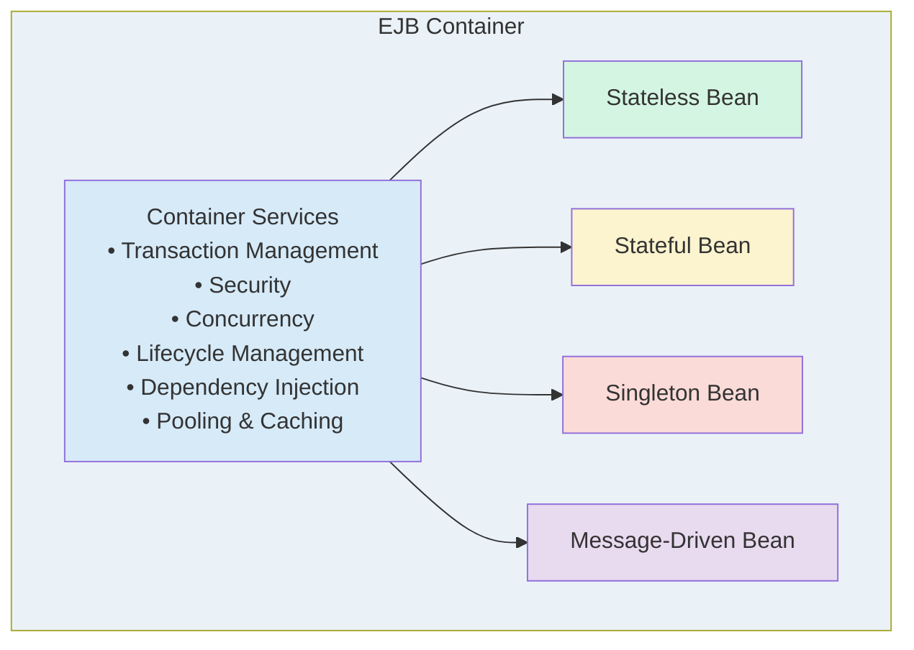

</details>

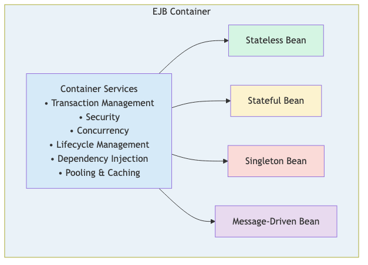


---

# Container Services

**What the EJB Container provides:**

1. **Transaction Management** - Automatic ACID transactions
2. **Security** - Declarative authorization
3. **Concurrency** - Thread-safe bean access
4. **Lifecycle** - Creation, pooling, destruction
5. **Dependency Injection** - Resource and bean injection
6. **Persistence** - EntityManager integration
7. **Messaging** - JMS integration
8. **Timers** - Scheduled execution

---

# Types of EJB

**Session Beans** (Business Logic)
- **Stateless** - No conversational state
- **Stateful** - Maintains client state
- **Singleton** - Single instance per application

**Message-Driven Beans** (Asynchronous Processing)
- JMS message consumers
- Event-driven architecture

**~~Entity Beans~~** (Deprecated)
- Replaced by JPA entities

---

# When to Use EJB

**Use EJB when you need:**
- ✅ Distributed transactions
- ✅ Container-managed security
- ✅ Message-driven processing
- ✅ Scheduled tasks (timers)
- ✅ Asynchronous methods
- ✅ Remote access (if required)

**Consider CDI when:**
- ❌ Simple dependency injection
- ❌ Web-tier components
- ❌ No transaction requirements
- ❌ Lightweight services

---

# EJB vs CDI Quick Comparison

| Feature | EJB | CDI |
|---------|-----|-----|
| Transactions | ✅ CMT/BMT | ⚠️ Manual |
| Security | ✅ Declarative | ⚠️ Manual |
| Messaging | ✅ MDB | ❌ No |
| Timers | ✅ Built-in | ❌ No |
| Async | ✅ @Asynchronous | ⚠️ Limited |
| Pooling | ✅ Automatic | ❌ No |
| Complexity | ⚠️ Higher | ✅ Lower |

---

<!-- _class: section -->

# 2. Session Beans
## Stateless, Stateful, and Singleton

---

# Session Beans Overview

**Session Beans** encapsulate business logic:

```java
// Business Interface (optional)
public interface AccountService {
    Account findAccount(Long id);
    void deposit(Long accountId, BigDecimal amount);
}

// Bean Implementation
@Stateless
public class AccountServiceBean implements AccountService {
    
    @PersistenceContext
    private EntityManager em;
    
    @Override
    public Account findAccount(Long id) {
        return em.find(Account.class, id);
    }
}
```

---

# Stateless Session Beans

**Characteristics:**
- ✅ No conversational state
- ✅ Pooled by container
- ✅ Highly scalable
- ✅ Thread-safe
- ✅ Best for stateless operations

**Use Cases:**
- Service layer operations
- Data access
- Calculations
- Validations

---

# Stateless Bean Example

```java
/**
 * Account service for banking operations.
 * Stateless bean - no client state maintained.
 * 
 * @author ESIPE
 */
@Stateless
public class AccountService {
    
    @PersistenceContext
    private EntityManager em;
    
    @Inject
    private Logger logger;
    
    /**
     * Find account by ID.
     * @param id Account identifier
     * @return Account or null
     */
    public Account findAccount(Long id) {
        logger.info("Finding account: " + id);
        return em.find(Account.class, id);
    }
}
```

---

# Stateless Bean - Deposit Operation

```java
@Stateless
public class AccountService {
    
    @PersistenceContext
    private EntityManager em;
    
    /**
     * Deposit money into account.
     * Transaction managed by container.
     * 
     * @param accountId Account identifier
     * @param amount Amount to deposit
     * @throws IllegalArgumentException if amount is negative
     */
    @TransactionAttribute(TransactionAttributeType.REQUIRED)
    public void deposit(Long accountId, BigDecimal amount) {
        if (amount.compareTo(BigDecimal.ZERO) <= 0) {
            throw new IllegalArgumentException("Amount must be positive");
        }
        
        Account account = em.find(Account.class, accountId);
        if (account == null) {
            throw new EntityNotFoundException("Account not found");
        }
        
        account.setBalance(account.getBalance().add(amount));
        // Container commits transaction automatically
    }
}
```

---

# Stateless Bean Pooling

<details>
<summary>📝 Original Mermaid Code (click to expand)</summary>

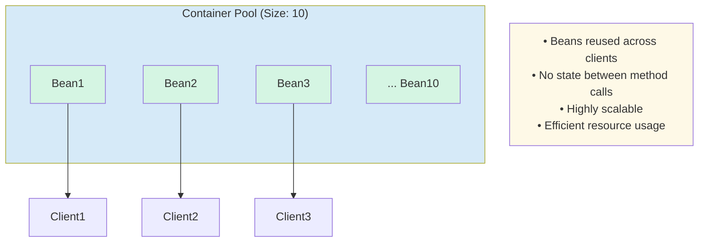

</details>

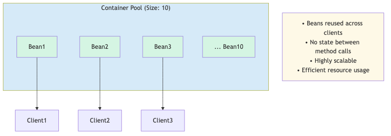


**Configuration:**
```xml
<!-- In server.xml or ejb-jar.xml -->
<stateless-session-bean>
    <pool-size>10</pool-size>
    <max-pool-size>50</max-pool-size>
</stateless-session-bean>
```

---

# Stateful Session Beans

**Characteristics:**
- ✅ Maintains conversational state
- ✅ One instance per client
- ✅ State preserved between calls
- ⚠️ Less scalable than stateless
- ⚠️ Requires passivation/activation

**Use Cases:**
- Shopping carts
- Multi-step wizards
- User sessions
- Conversational workflows

---

# Stateful Bean Example - Shopping Cart

```java
/**
 * Shopping cart for online banking products.
 * Maintains state for a single client session.
 * 
 * @author ESIPE
 */
@Stateful
public class ShoppingCart implements Serializable {
    
    private static final long serialVersionUID = 1L;
    
    private List<Product> items = new ArrayList<>();
    private String customerId;
    
    @Inject
    private Logger logger;
    
    /**
     * Initialize cart for customer.
     */
    @PostConstruct
    public void init() {
        logger.info("Shopping cart created");
    }
    
    /**
     * Add product to cart.
     */
    public void addItem(Product product) {
        items.add(product);
        logger.info("Added item: " + product.getName());
    }
}
```

---

# Stateful Bean - Complete Shopping Cart

```java
@Stateful
public class ShoppingCart implements Serializable {
    
    private List<Product> items = new ArrayList<>();
    private BigDecimal total = BigDecimal.ZERO;
    
    public void addItem(Product product) {
        items.add(product);
        total = total.add(product.getPrice());
    }
    
    public void removeItem(Product product) {
        items.remove(product);
        total = total.subtract(product.getPrice());
    }
    
    public BigDecimal getTotal() {
        return total;
    }
    
    public List<Product> getItems() {
        return new ArrayList<>(items);
    }
    
    @Remove
    public void checkout() {
        // Process order
        items.clear();
        total = BigDecimal.ZERO;
    }
}
```

---

# Stateful Bean Lifecycle

<details>
<summary>📝 Original Mermaid Code (click to expand)</summary>

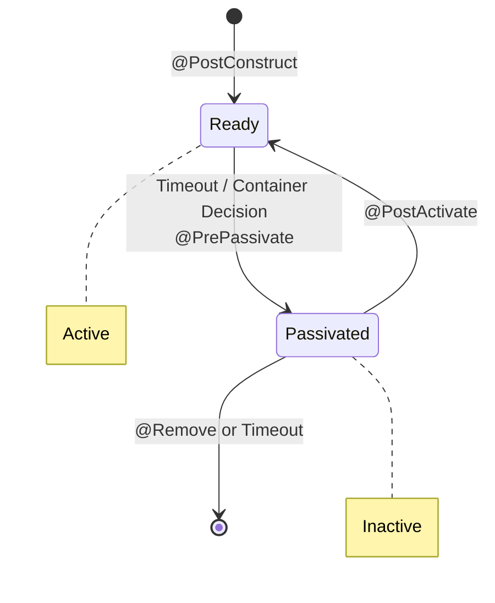

</details>

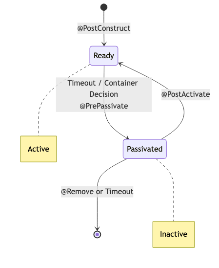


---

# Stateful Bean - Lifecycle Callbacks

```java
@Stateful
public class ShoppingCart implements Serializable {
    
    private List<Product> items = new ArrayList<>();
    
    @PostConstruct
    public void init() {
        System.out.println("Cart created");
    }
    
    @PrePassivate
    public void aboutToPassivate() {
        System.out.println("Cart being passivated");
        // Clean up non-serializable resources
    }
    
    @PostActivate
    public void justActivated() {
        System.out.println("Cart activated");
        // Restore resources
    }
    
    @PreDestroy
    public void cleanup() {
        System.out.println("Cart destroyed");
    }
    
    @Remove
    public void checkout() {
        // Triggers @PreDestroy
    }
}
```

---

# Singleton Session Beans

**Characteristics:**
- ✅ Single instance per application
- ✅ Shared state across all clients
- ✅ Concurrency management
- ✅ Startup initialization
- ✅ Application-wide cache

**Use Cases:**
- Configuration management
- Application cache
- Counters/statistics
- Shared resources

---

# Singleton Bean Example

```java
/**
 * Configuration manager for banking application.
 * Single instance shared across all clients.
 * 
 * @author ESIPE
 */
@Singleton
@Startup  // Initialize at application startup
public class ConfigurationManager {
    
    private Map<String, String> config = new ConcurrentHashMap<>();
    
    @Inject
    private Logger logger;
    
    /**
     * Load configuration at startup.
     */
    @PostConstruct
    public void loadConfiguration() {
        logger.info("Loading application configuration");
        config.put("max.transfer.amount", "10000.00");
        config.put("daily.withdrawal.limit", "5000.00");
        config.put("interest.rate", "0.025");
    }
    
    @Lock(LockType.READ)
    public String getProperty(String key) {
        return config.get(key);
    }
}
```

---

# Singleton Bean - Concurrency Management

```java
@Singleton
public class ConfigurationManager {
    
    private Map<String, String> config = new ConcurrentHashMap<>();
    
    /**
     * Read operation - multiple threads allowed.
     */
    @Lock(LockType.READ)
    public String getProperty(String key) {
        return config.get(key);
    }
    
    /**
     * Write operation - exclusive access.
     */
    @Lock(LockType.WRITE)
    public void setProperty(String key, String value) {
        config.put(key, value);
    }
    
    /**
     * Bean-managed concurrency.
     */
    @ConcurrencyManagement(ConcurrencyManagementType.BEAN)
    public synchronized void updateConfig(Map<String, String> newConfig) {
        config.putAll(newConfig);
    }
}
```

---

# Singleton Bean - Startup Order

```java
/**
 * Database initialization - runs first.
 */
@Singleton
@Startup
@DependsOn({})  // No dependencies
public class DatabaseInitializer {
    
    @PostConstruct
    public void init() {
        System.out.println("1. Database initialized");
    }
}

/**
 * Configuration loader - runs after database.
 */
@Singleton
@Startup
@DependsOn("DatabaseInitializer")
public class ConfigurationLoader {
    
    @PostConstruct
    public void init() {
        System.out.println("2. Configuration loaded");
    }
}
```

---

# Singleton Bean - Application Cache

```java
/**
 * Cache for frequently accessed data.
 */
@Singleton
@ConcurrencyManagement(ConcurrencyManagementType.CONTAINER)
public class AccountCache {
    
    private Map<Long, Account> cache = new ConcurrentHashMap<>();
    
    @PersistenceContext
    private EntityManager em;
    
    @Lock(LockType.READ)
    public Account getAccount(Long id) {
        return cache.computeIfAbsent(id, 
            key -> em.find(Account.class, key));
    }
    
    @Lock(LockType.WRITE)
    public void invalidate(Long id) {
        cache.remove(id);
    }
    
    @Lock(LockType.WRITE)
    public void clear() {
        cache.clear();
    }
}
```

---

# Session Beans Comparison

| Feature | Stateless | Stateful | Singleton |
|---------|-----------|----------|-----------|
| **State** | None | Per-client | Shared |
| **Instances** | Pool | One per client | One total |
| **Scalability** | ✅ High | ⚠️ Medium | ⚠️ Low |
| **Concurrency** | ✅ Automatic | ✅ Automatic | ⚠️ Manual |
| **Use Case** | Services | Sessions | Config |
| **Passivation** | ❌ No | ✅ Yes | ❌ No |

---

<!-- _class: section -->

# 3. Message-Driven Beans
## Asynchronous Processing with JMS

---

# Message-Driven Beans (MDB)

**Characteristics:**
- ✅ Asynchronous message processing
- ✅ JMS integration
- ✅ No client interface
- ✅ Container-managed lifecycle
- ✅ Transaction support

**Use Cases:**
- Event processing
- Background tasks
- System integration
- Decoupled communication

---

# MDB Architecture

<details>
<summary>📝 Original Mermaid Code (click to expand)</summary>

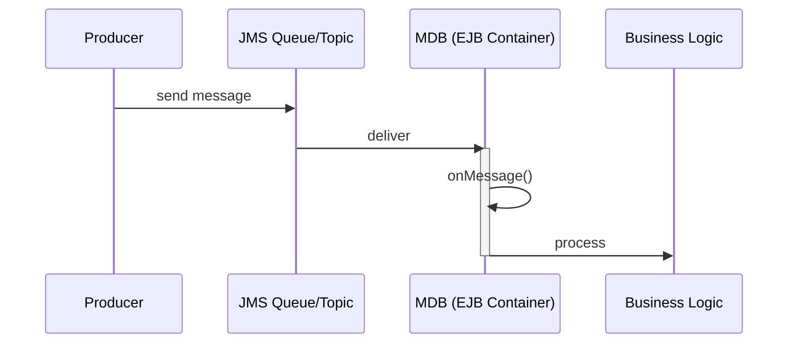

</details>

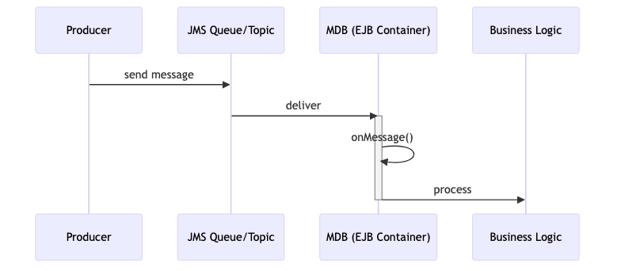


---

# MDB Example - Transaction Processor

```java
/**
 * Processes banking transactions asynchronously.
 * Listens to transaction queue.
 * 
 * @author ESIPE
 */
@MessageDriven(
    activationConfig = {
        @ActivationConfigProperty(
            propertyName = "destinationType",
            propertyValue = "jakarta.jms.Queue"
        ),
        @ActivationConfigProperty(
            propertyName = "destination",
            propertyValue = "java:/jms/queue/TransactionQueue"
        ),
        @ActivationConfigProperty(
            propertyName = "acknowledgeMode",
            propertyValue = "Auto-acknowledge"
        )
    }
)
public class TransactionProcessor implements MessageListener {
    
    @Inject
    private Logger logger;
}
```

---

# MDB - Message Processing

```java
@MessageDriven(activationConfig = {
    @ActivationConfigProperty(
        propertyName = "destination",
        propertyValue = "java:/jms/queue/TransactionQueue"
    )
})
public class TransactionProcessor implements MessageListener {
    
    @PersistenceContext
    private EntityManager em;
    
    @Inject
    private Logger logger;
    
    @Override
    public void onMessage(Message message) {
        try {
            if (message instanceof TextMessage) {
                TextMessage textMessage = (TextMessage) message;
                String transactionData = textMessage.getText();
                
                logger.info("Processing transaction: " + transactionData);
                processTransaction(transactionData);
            }
        } catch (JMSException e) {
            logger.error("Error processing message", e);
            throw new EJBException(e);
        }
    }
}
```

---

# MDB - Complete Implementation

```java
@MessageDriven(activationConfig = {
    @ActivationConfigProperty(
        propertyName = "destination",
        propertyValue = "java:/jms/queue/TransactionQueue"
    ),
    @ActivationConfigProperty(
        propertyName = "maxSessions",
        propertyValue = "10"  // Concurrent consumers
    )
})
public class TransactionProcessor implements MessageListener {
    
    @PersistenceContext
    private EntityManager em;
    
    @Override
    @TransactionAttribute(TransactionAttributeType.REQUIRED)
    public void onMessage(Message message) {
        try {
            ObjectMessage objMsg = (ObjectMessage) message;
            TransactionDTO dto = (TransactionDTO) objMsg.getObject();
            
            // Process transaction
            Transaction tx = new Transaction();
            tx.setAmount(dto.getAmount());
            tx.setAccountId(dto.getAccountId());
            tx.setTimestamp(LocalDateTime.now());
            
            em.persist(tx);
            
        } catch (JMSException e) {
            throw new EJBException("Transaction processing failed", e);
        }
    }
}
```

---

# MDB - Sending Messages

```java
@Stateless
public class TransactionService {
    
    @Resource(lookup = "java:/jms/queue/TransactionQueue")
    private Queue transactionQueue;
    
    @Inject
    private JMSContext jmsContext;
    
    /**
     * Submit transaction for async processing.
     */
    public void submitTransaction(TransactionDTO transaction) {
        try {
            ObjectMessage message = jmsContext.createObjectMessage();
            message.setObject(transaction);
            
            // Set message properties
            message.setStringProperty("type", "TRANSFER");
            message.setLongProperty("accountId", transaction.getAccountId());
            
            // Send message
            jmsContext.createProducer()
                     .send(transactionQueue, message);
                     
        } catch (JMSException e) {
            throw new RuntimeException("Failed to send message", e);
        }
    }
}
```

---

# MDB - Error Handling

```java
@MessageDriven(activationConfig = {
    @ActivationConfigProperty(
        propertyName = "destination",
        propertyValue = "java:/jms/queue/TransactionQueue"
    )
})
public class TransactionProcessor implements MessageListener {
    
    @Resource
    private MessageDrivenContext mdc;
    
    @Override
    public void onMessage(Message message) {
        try {
            processMessage(message);
        } catch (BusinessException e) {
            // Rollback transaction - message returns to queue
            mdc.setRollbackOnly();
            logger.error("Business error, message will be redelivered", e);
        } catch (Exception e) {
            // Fatal error - send to dead letter queue
            logger.error("Fatal error processing message", e);
            throw new EJBException(e);
        }
    }
    
    private void processMessage(Message message) throws BusinessException {
        // Processing logic
    }
}
```

---

# MDB - Topic Subscription

```java
/**
 * Listens to account events topic.
 * Multiple subscribers can receive same message.
 */
@MessageDriven(activationConfig = {
    @ActivationConfigProperty(
        propertyName = "destinationType",
        propertyValue = "jakarta.jms.Topic"
    ),
    @ActivationConfigProperty(
        propertyName = "destination",
        propertyValue = "java:/jms/topic/AccountEvents"
    ),
    @ActivationConfigProperty(
        propertyName = "subscriptionDurability",
        propertyValue = "Durable"
    ),
    @ActivationConfigProperty(
        propertyName = "clientId",
        propertyValue = "NotificationService"
    ),
    @ActivationConfigProperty(
        propertyName = "subscriptionName",
        propertyValue = "NotificationSubscription"
    )
})
public class AccountEventListener implements MessageListener {
    // Implementation
}
```

---

<!-- _class: section -->

# 4. EJB Lifecycle
## Callbacks and Resource Management

---

# EJB Lifecycle Overview

**Lifecycle Callbacks:**
- `@PostConstruct` - After dependency injection
- `@PreDestroy` - Before bean removal
- `@PrePassivate` - Before passivation (Stateful)
- `@PostActivate` - After activation (Stateful)

**Purpose:**
- Initialize resources
- Clean up resources
- Prepare for passivation
- Restore after activation

---

# Stateless Bean Lifecycle

<details>
<summary>📝 Original Mermaid Code (click to expand)</summary>

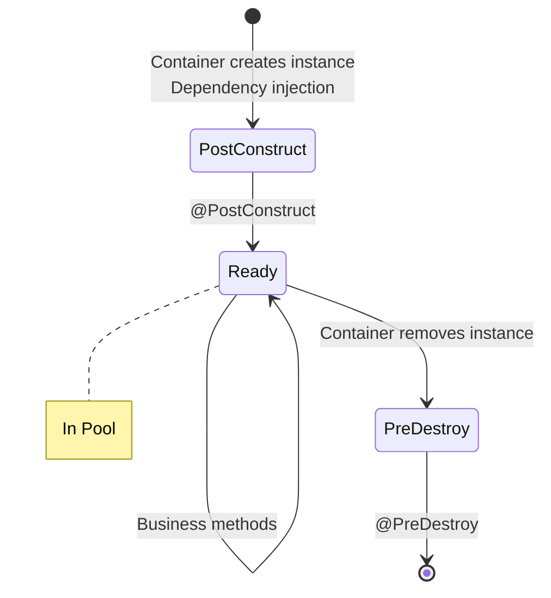

</details>

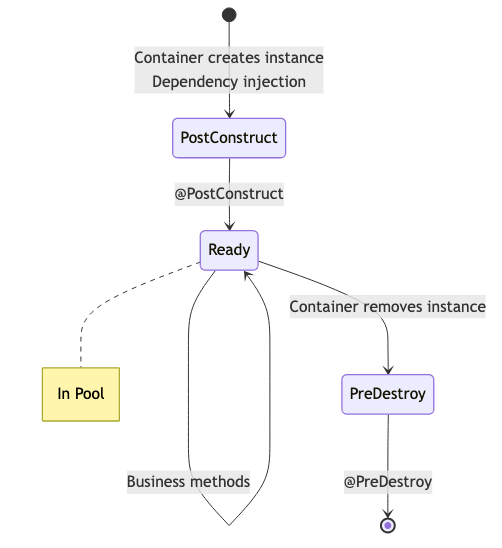


---

# Lifecycle Callbacks - Stateless

```java
@Stateless
public class AccountService {
    
    @PersistenceContext
    private EntityManager em;
    
    @Resource
    private DataSource dataSource;
    
    private Connection connection;
    
    /**
     * Initialize resources after dependency injection.
     */
    @PostConstruct
    public void init() {
        System.out.println("AccountService initialized");
        try {
            connection = dataSource.getConnection();
        } catch (SQLException e) {
            throw new EJBException("Failed to get connection", e);
        }
    }
    
    /**
     * Clean up resources before destruction.
     */
    @PreDestroy
    public void cleanup() {
        System.out.println("AccountService destroyed");
        try {
            if (connection != null) {
                connection.close();
            }
        } catch (SQLException e) {
            // Log error
        }
    }
}
```

---

# Lifecycle Callbacks - Stateful

```java
@Stateful
public class ShoppingCart implements Serializable {
    
    private List<Product> items = new ArrayList<>();
    
    @Inject
    private transient Logger logger;  // Non-serializable
    
    @PostConstruct
    public void init() {
        logger.info("Shopping cart created");
    }
    
    @PrePassivate
    public void aboutToPassivate() {
        logger.info("Cart being passivated");
        // Clean up non-serializable resources
        // logger will be null after passivation
    }
    
    @PostActivate
    public void justActivated() {
        // logger is re-injected
        logger.info("Cart activated from passivation");
        // Restore transient state if needed
    }
    
    @PreDestroy
    public void cleanup() {
        logger.info("Cart destroyed");
    }
}
```

---

# Dependency Injection in EJB

```java
@Stateless
public class BankingService {
    
    // EntityManager injection
    @PersistenceContext(unitName = "bankingPU")
    private EntityManager em;
    
    // Resource injection
    @Resource(lookup = "java:/jms/queue/TransactionQueue")
    private Queue transactionQueue;
    
    // EJB injection
    @EJB
    private AccountService accountService;
    
    // CDI injection
    @Inject
    private Logger logger;
    
    // Environment entry
    @Resource(name = "maxTransferAmount")
    private BigDecimal maxTransferAmount;
    
    // EJBContext injection
    @Resource
    private SessionContext context;
}
```

---

# Resource Management Best Practices

```java
@Stateless
public class ReportService {
    
    @Resource
    private DataSource dataSource;
    
    /**
     * Proper resource management with try-with-resources.
     */
    public List<Transaction> generateReport(LocalDate date) {
        // Connection auto-closed
        try (Connection conn = dataSource.getConnection();
             PreparedStatement stmt = conn.prepareStatement(
                 "SELECT * FROM transactions WHERE date = ?")) {
            
            stmt.setDate(1, Date.valueOf(date));
            
            try (ResultSet rs = stmt.executeQuery()) {
                List<Transaction> transactions = new ArrayList<>();
                while (rs.next()) {
                    transactions.add(mapTransaction(rs));
                }
                return transactions;
            }
        } catch (SQLException e) {
            throw new EJBException("Report generation failed", e);
        }
    }
}
```

---

<!-- _class: section -->

# 5. Transaction Management
## CMT and BMT

---

# Transaction Management Overview

**Two Approaches:**

1. **Container-Managed Transactions (CMT)**
   - Declarative with annotations
   - Container handles begin/commit/rollback
   - Recommended approach

2. **Bean-Managed Transactions (BMT)**
   - Programmatic control
   - Developer handles transactions
   - More flexibility, more complexity

---

# Container-Managed Transactions (CMT)

**Transaction Attributes:**

| Attribute | Description |
|-----------|-------------|
| `REQUIRED` | Join existing or create new (default) |
| `REQUIRES_NEW` | Always create new transaction |
| `MANDATORY` | Must have existing transaction |
| `NOT_SUPPORTED` | Suspend transaction |
| `SUPPORTS` | Join if exists, else no transaction |
| `NEVER` | Fail if transaction exists |

---

# CMT - REQUIRED Example

```java
@Stateless
public class TransferService {
    
    @PersistenceContext
    private EntityManager em;
    
    /**
     * Transfer money between accounts.
     * REQUIRED: Join existing transaction or create new one.
     */
    @TransactionAttribute(TransactionAttributeType.REQUIRED)
    public void transfer(Long fromId, Long toId, BigDecimal amount) {
        
        Account fromAccount = em.find(Account.class, fromId);
        Account toAccount = em.find(Account.class, toId);
        
        if (fromAccount.getBalance().compareTo(amount) < 0) {
            throw new InsufficientFundsException();
        }
        
        // Both operations in same transaction
        fromAccount.setBalance(fromAccount.getBalance().subtract(amount));
        toAccount.setBalance(toAccount.getBalance().add(amount));
        
        // Container commits automatically
        // If exception thrown, container rolls back
    }
}
```

---

# CMT - REQUIRES_NEW Example

```java
@Stateless
public class AuditService {
    
    @PersistenceContext
    private EntityManager em;
    
    /**
     * Log audit entry in separate transaction.
     * REQUIRES_NEW: Always create new transaction.
     * Commits even if calling transaction rolls back.
     */
    @TransactionAttribute(TransactionAttributeType.REQUIRES_NEW)
    public void logAudit(String action, String details) {
        AuditLog log = new AuditLog();
        log.setAction(action);
        log.setDetails(details);
        log.setTimestamp(LocalDateTime.now());
        
        em.persist(log);
        // This transaction commits independently
    }
}

@Stateless
public class AccountService {
    
    @EJB
    private AuditService auditService;
    
    public void updateAccount(Account account) {
        // Main transaction
        em.merge(account);
        
        // Audit in separate transaction
        auditService.logAudit("UPDATE", "Account " + account.getId());
        
        // If this fails, audit is still committed
    }
}
```

---

# CMT - Transaction Propagation

<details>
<summary>📝 Original Mermaid Code (click to expand)</summary>

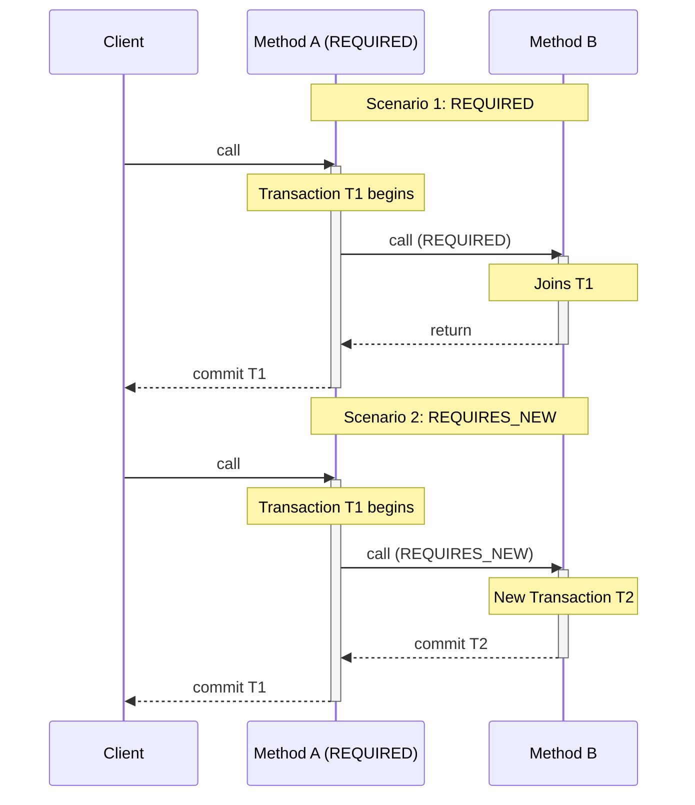

</details>

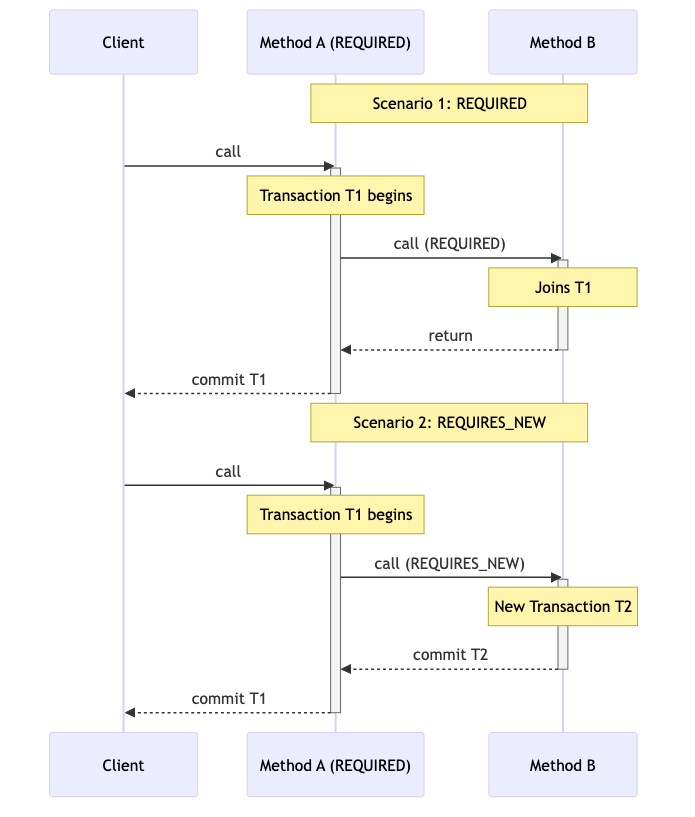


---

# CMT - Rollback Strategies

```java
@Stateless
public class TransferService {
    
    @Resource
    private SessionContext context;
    
    /**
     * Automatic rollback on RuntimeException.
     */
    @TransactionAttribute(TransactionAttributeType.REQUIRED)
    public void transfer(Long fromId, Long toId, BigDecimal amount) {
        // ... transfer logic ...
        
        if (fraudDetected) {
            // RuntimeException triggers automatic rollback
            throw new FraudException("Suspicious transaction");
        }
    }
    
    /**
     * Manual rollback decision.
     */
    public void processTransaction(Transaction tx) {
        try {
            // ... processing ...
        } catch (BusinessException e) {
            // Mark transaction for rollback
            context.setRollbackOnly();
            throw e;
        }
    }
}
```

---

# Bean-Managed Transactions (BMT)

```java
/**
 * Bean-managed transaction example.
 * Developer controls transaction boundaries.
 */
@Stateless
@TransactionManagement(TransactionManagementType.BEAN)
public class ComplexTransferService {
    
    @Resource
    private UserTransaction userTransaction;
    
    @PersistenceContext
    private EntityManager em;
    
    /**
     * Manual transaction management.
     */
    public void complexTransfer(Long fromId, Long toId, BigDecimal amount) {
        try {
            // Begin transaction
            userTransaction.begin();
            
            // Business logic
            Account from = em.find(Account.class, fromId);
            Account to = em.find(Account.class, toId);
            
            from.setBalance(from.getBalance().subtract(amount));
            to.setBalance(to.getBalance().add(amount));
            
            // Commit transaction
            userTransaction.commit();
            
        } catch (Exception e) {
            try {
                // Rollback on error
                userTransaction.rollback();
            } catch (SystemException se) {
                throw new EJBException(se);
            }
            throw new EJBException(e);
        }
    }
}
```

---

# BMT - Multiple Transactions

```java
@Stateless
@TransactionManagement(TransactionManagementType.BEAN)
public class BatchProcessor {
    
    @Resource
    private UserTransaction userTransaction;
    
    /**
     * Process items in separate transactions.
     * Allows partial success.
     */
    public void processBatch(List<Transaction> transactions) {
        int successCount = 0;
        int failureCount = 0;
        
        for (Transaction tx : transactions) {
            try {
                userTransaction.begin();
                
                // Process single transaction
                processTransaction(tx);
                
                userTransaction.commit();
                successCount++;
                
            } catch (Exception e) {
                try {
                    userTransaction.rollback();
                } catch (SystemException se) {
                    // Log error
                }
                failureCount++;
            }
        }
        
        System.out.println("Success: " + successCount + 
                         ", Failures: " + failureCount);
    }
}
```

---

# Transaction Best Practices

**DO:**
- ✅ Use CMT by default
- ✅ Keep transactions short
- ✅ Use REQUIRED for most operations
- ✅ Use REQUIRES_NEW for audit logs
- ✅ Handle exceptions properly

**DON'T:**
- ❌ Don't hold transactions during user interaction
- ❌ Don't mix CMT and BMT in same bean
- ❌ Don't catch RuntimeException without rollback
- ❌ Don't perform long-running operations in transactions
- ❌ Don't access remote resources in transactions

---

<!-- _class: section -->

# 6. Security with EJB
## Declarative and Programmatic Security

---

# EJB Security Overview

**Two Approaches:**

1. **Declarative Security**
   - Annotations on methods/classes
   - Container enforces security
   - Recommended approach

2. **Programmatic Security**
   - Code-based security checks
   - More flexibility
   - Use when declarative insufficient

---

# Declarative Security Annotations

```java
/**
 * Secure account service with role-based access.
 */
@Stateless
@DeclareRoles({"ADMIN", "MANAGER", "CUSTOMER"})
public class SecureAccountService {
    
    /**
     * Only customers and managers can view accounts.
     */
    @RolesAllowed({"CUSTOMER", "MANAGER"})
    public Account findAccount(Long id) {
        return em.find(Account.class, id);
    }
    
    /**
     * Only managers can create accounts.
     */
    @RolesAllowed("MANAGER")
    public void createAccount(Account account) {
        em.persist(account);
    }
    
    /**
     * Only admins can delete accounts.
     */
    @RolesAllowed("ADMIN")
    public void deleteAccount(Long id) {
        Account account = em.find(Account.class, id);
        em.remove(account);
    }
}
```

---

# Security Annotations

```java
@Stateless
public class AccountService {
    
    /**
     * Allow all authenticated users.
     */
    @PermitAll
    public List<Account> listAccounts() {
        return em.createQuery("SELECT a FROM Account a", Account.class)
                 .getResultList();
    }
    
    /**
     * Deny all access - administrative method.
     */
    @DenyAll
    public void resetDatabase() {
        // This method cannot be called
    }
    
    /**
     * Multiple roles allowed.
     */
    @RolesAllowed({"ADMIN", "MANAGER"})
    public void approveTransaction(Long txId) {
        // Approve logic
    }
}
```

---

# Class-Level Security

```java
/**
 * All methods require MANAGER role by default.
 */
@Stateless
@RolesAllowed("MANAGER")
public class ManagementService {
    
    /**
     * Inherits @RolesAllowed("MANAGER") from class.
     */
    public void generateReport() {
        // Only managers can call
    }
    
    /**
     * Override class-level security.
     * Now admins and managers can call.
     */
    @RolesAllowed({"ADMIN", "MANAGER"})
    public void deleteReport(Long id) {
        // Admins and managers can call
    }
    
    /**
     * Override to allow all.
     */
    @PermitAll
    public void viewPublicReport() {
        // Anyone can call
    }
}
```

---

# Programmatic Security

```java
@Stateless
public class AccountService {
    
    @Resource
    private SessionContext context;
    
    /**
     * Check caller's role programmatically.
     */
    public void updateAccount(Account account) {
        // Check if caller is in role
        if (context.isCallerInRole("MANAGER")) {
            // Managers can update any account
            em.merge(account);
        } else if (context.isCallerInRole("CUSTOMER")) {
            // Customers can only update their own account
            String username = context.getCallerPrincipal().getName();
            if (account.getOwner().equals(username)) {
                em.merge(account);
            } else {
                throw new SecurityException("Not authorized");
            }
        } else {
            throw new SecurityException("Not authorized");
        }
    }
}
```

---

# Getting Caller Information

```java
@Stateless
public class AuditService {
    
    @Resource
    private SessionContext context;
    
    @PersistenceContext
    private EntityManager em;
    
    /**
     * Log action with caller information.
     */
    public void logAction(String action) {
        // Get caller's principal
        Principal caller = context.getCallerPrincipal();
        String username = caller.getName();
        
        // Create audit log
        AuditLog log = new AuditLog();
        log.setUsername(username);
        log.setAction(action);
        log.setTimestamp(LocalDateTime.now());
        
        // Check roles
        if (context.isCallerInRole("ADMIN")) {
            log.setRole("ADMIN");
        } else if (context.isCallerInRole("MANAGER")) {
            log.setRole("MANAGER");
        } else {
            log.setRole("CUSTOMER");
        }
        
        em.persist(log);
    }
}
```

---

# @RunAs Annotation

```java
/**
 * Service runs with elevated privileges.
 */
@Stateless
@RunAs("SYSTEM")
public class SystemService {
    
    @EJB
    private SecureAccountService accountService;
    
    /**
     * This method runs as SYSTEM role,
     * even if caller doesn't have required permissions.
     */
    public void performSystemMaintenance() {
        // Can call methods requiring ADMIN role
        accountService.deleteAccount(123L);
        
        // System operations
        cleanupOldData();
    }
}

@Stateless
public class SecureAccountService {
    
    @RolesAllowed("ADMIN")
    public void deleteAccount(Long id) {
        // Only ADMIN can call directly
        // But SystemService can call via @RunAs
    }
}
```

---

# Security Best Practices

**DO:**
- ✅ Use declarative security by default
- ✅ Define roles at class level when possible
- ✅ Use @DeclareRoles for documentation
- ✅ Log security events
- ✅ Validate input even with security

**DON'T:**
- ❌ Don't rely on security alone for validation
- ❌ Don't hardcode credentials
- ❌ Don't expose sensitive data in exceptions
- ❌ Don't use @PermitAll carelessly
- ❌ Don't forget to test security

---

<!-- _class: section -->

# 7. Timer Service
## Scheduled Tasks and Automatic Timers

---

# EJB Timer Service

**Two Types of Timers:**

1. **Programmatic Timers**
   - Created via TimerService API
   - Dynamic scheduling
   - Flexible configuration

2. **Automatic Timers**
   - Declared with @Schedule
   - Calendar-based expressions
   - Simpler to use

---

# Automatic Timer - @Schedule

```java
/**
 * Daily report generator using automatic timer.
 */
@Singleton
public class DailyReportGenerator {
    
    @Inject
    private Logger logger;
    
    @EJB
    private ReportService reportService;
    
    /**
     * Generate daily report at 2 AM.
     * Runs every day at 02:00:00.
     */
    @Schedule(
        hour = "2",
        minute = "0",
        second = "0",
        persistent = true
    )
    public void generateDailyReport() {
        logger.info("Generating daily report");
        
        LocalDate yesterday = LocalDate.now().minusDays(1);
        Report report = reportService.generateReport(yesterday);
        
        logger.info("Daily report generated: " + report.getId());
    }
}
```

---

# @Schedule - Calendar Expressions

```java
@Singleton
public class ScheduledTasks {
    
    /**
     * Every hour at minute 0.
     */
    @Schedule(hour = "*", minute = "0")
    public void hourlyTask() {
        System.out.println("Hourly task");
    }
    
    /**
     * Every 15 minutes.
     */
    @Schedule(hour = "*", minute = "*/15")
    public void quarterHourlyTask() {
        System.out.println("Every 15 minutes");
    }
    
    /**
     * Weekdays at 9 AM.
     */
    @Schedule(
        dayOfWeek = "Mon-Fri",
        hour = "9",
        minute = "0"
    )
    public void weekdayMorningTask() {
        System.out.println("Weekday morning task");
    }
}
```

---

# @Schedule - Advanced Examples

```java
@Singleton
public class AdvancedScheduledTasks {
    
    /**
     * First day of month at midnight.
     */
    @Schedule(
        dayOfMonth = "1",
        hour = "0",
        minute = "0"
    )
    public void monthlyTask() {
        System.out.println("Monthly task");
    }
    
    /**
     * Last day of month at 11:59 PM.
     */
    @Schedule(
        dayOfMonth = "Last",
        hour = "23",
        minute = "59"
    )
    public void endOfMonthTask() {
        System.out.println("End of month task");
    }
    
    /**
     * Every Monday at 8 AM.
     */
    @Schedule(
        dayOfWeek = "Mon",
        hour = "8",
        minute = "0",
        timezone = "Europe/Paris"
    )
    public void mondayMorningTask() {
        System.out.println("Monday morning task");
    }
}
```

---

# Multiple Schedules

```java
@Singleton
public class BackupService {
    
    /**
     * Multiple schedules for same method.
     */
    @Schedules({
        @Schedule(
            hour = "2",
            minute = "0",
            info = "Daily backup"
        ),
        @Schedule(
            dayOfWeek = "Sun",
            hour = "3",
            minute = "0",
            info = "Weekly full backup"
        )
    })
    public void performBackup(Timer timer) {
        String info = timer.getInfo().toString();
        System.out.println("Performing backup: " + info);
        
        if (info.contains("full")) {
            performFullBackup();
        } else {
            performIncrementalBackup();
        }
    }
}
```

---

# Programmatic Timers

```java
@Stateless
public class NotificationService {
    
    @Resource
    private TimerService timerService;
    
    /**
     * Create single-action timer.
     */
    public void scheduleNotification(Long userId, long delayMillis) {
        // Create timer that fires once after delay
        TimerConfig config = new TimerConfig();
        config.setInfo("Notification for user: " + userId);
        config.setPersistent(false);
        
        timerService.createSingleActionTimer(delayMillis, config);
    }
    
    /**
     * Create interval timer.
     */
    public void schedulePeriodicCheck(long intervalMillis) {
        TimerConfig config = new TimerConfig();
        config.setInfo("Periodic check");
        
        timerService.createIntervalTimer(
            0,              // Initial delay
            intervalMillis, // Interval
            config
        );
    }
}
```

---

# Timer Callback Method

```java
@Singleton
public class TimerBean {
    
    @Resource
    private TimerService timerService;
    
    @Inject
    private Logger logger;
    
    /**
     * Create programmatic timer.
     */
    @PostConstruct
    public void init() {
        TimerConfig config = new TimerConfig();
        config.setInfo("Cleanup timer");
        
        // Every 5 minutes
        timerService.createIntervalTimer(0, 5 * 60 * 1000, config);
    }
    
    /**
     * Timeout callback method.
     */
    @Timeout
    public void handleTimeout(Timer timer) {
        String info = (String) timer.getInfo();
        logger.info("Timer fired: " + info);
        
        // Perform cleanup
        performCleanup();
        
        // Cancel timer if needed
        if (shouldStop()) {
            timer.cancel();
        }
    }
}
```

---

# Timer Persistence

```java
@Singleton
public class PersistentTimerService {
    
    @Resource
    private TimerService timerService;
    
    /**
     * Persistent timer survives server restart.
     */
    @Schedule(
        hour = "*/6",  // Every 6 hours
        minute = "0",
        persistent = true  // Survives restart
    )
    public void persistentTask() {
        System.out.println("Persistent task");
    }
    
    /**
     * Non-persistent timer lost on restart.
     */
    public void createNonPersistentTimer() {
        TimerConfig config = new TimerConfig();
        config.setPersistent(false);  // Lost on restart
        
        timerService.createIntervalTimer(0, 60000, config);
    }
    
    /**
     * Get all active timers.
     */
    public void listTimers() {
        Collection<Timer> timers = timerService.getTimers();
        for (Timer timer : timers) {
            System.out.println("Timer: " + timer.getInfo());
        }
    }
}
```

---

# Timer Best Practices

**DO:**
- ✅ Use @Schedule for simple recurring tasks
- ✅ Use programmatic timers for dynamic scheduling
- ✅ Set persistent=true for critical timers
- ✅ Handle exceptions in timer methods
- ✅ Cancel timers when no longer needed

**DON'T:**
- ❌ Don't create too many timers
- ❌ Don't perform long-running operations
- ❌ Don't forget timezone considerations
- ❌ Don't rely on exact timing
- ❌ Don't create duplicate timers

---

<!-- _class: section -->

# 8. Asynchronous Methods
## Non-Blocking Operations

---

# Asynchronous Methods

**Benefits:**
- ✅ Non-blocking execution
- ✅ Improved responsiveness
- ✅ Better resource utilization
- ✅ Parallel processing

**Use Cases:**
- Email notifications
- Report generation
- Background processing
- Long-running operations

---

# @Asynchronous - Fire and Forget

```java
/**
 * Email notification service with async methods.
 */
@Stateless
public class EmailNotificationService {
    
    @Inject
    private Logger logger;
    
    @Resource(lookup = "java:/mail/BankingMailSession")
    private Session mailSession;
    
    /**
     * Send email asynchronously.
     * Fire-and-forget pattern - no return value.
     */
    @Asynchronous
    public void sendWelcomeEmail(String email, String name) {
        logger.info("Sending welcome email to: " + email);
        
        try {
            Message message = new MimeMessage(mailSession);
            message.setRecipients(
                Message.RecipientType.TO,
                InternetAddress.parse(email)
            );
            message.setSubject("Welcome to Banking App");
            message.setText("Hello " + name + ",\n\nWelcome!");
            
            Transport.send(message);
            
            logger.info("Welcome email sent to: " + email);
        } catch (MessagingException e) {
            logger.error("Failed to send email", e);
        }
    }
}
```

---

# @Asynchronous - With Future

```java
@Stateless
public class ReportService {
    
    @PersistenceContext
    private EntityManager em;
    
    /**
     * Generate report asynchronously.
     * Returns Future for result retrieval.
     */
    @Asynchronous
    public Future<Report> generateMonthlyReport(int year, int month) {
        try {
            // Long-running operation
            Report report = new Report();
            report.setYear(year);
            report.setMonth(month);
            
            // Fetch data
            List<Transaction> transactions = fetchTransactions(year, month);
            
            // Calculate statistics
            BigDecimal total = calculateTotal(transactions);
            report.setTotal(total);
            
            // Save report
            em.persist(report);
            
            // Return result wrapped in AsyncResult
            return new AsyncResult<>(report);
            
        } catch (Exception e) {
            // Return exception
            return new AsyncResult<>(e);
        }
    }
}
```

---

# Using Asynchronous Methods

```java
@Stateless
public class AccountService {
    
    @EJB
    private EmailNotificationService emailService;
    
    @EJB
    private ReportService reportService;
    
    /**
     * Create account and send notification.
     */
    public Account createAccount(Account account) {
        // Synchronous operation
        em.persist(account);
        
        // Asynchronous notification - doesn't block
        emailService.sendWelcomeEmail(
            account.getEmail(),
            account.getOwnerName()
        );
        
        return account;
    }
    
    /**
     * Generate report and wait for result.
     */
    public Report generateAndRetrieveReport(int year, int month) {
        // Start async operation
        Future<Report> futureReport = 
            reportService.generateMonthlyReport(year, month);
        
        try {
            // Wait for result (with timeout)
            Report report = futureReport.get(30, TimeUnit.SECONDS);
            return report;
        } catch (TimeoutException e) {
            futureReport.cancel(true);
            throw new RuntimeException("Report generation timeout");
        } catch (Exception e) {
            throw new RuntimeException("Report generation failed", e);
        }
    }
}
```

---

# Parallel Async Operations

```java
@Stateless
public class BatchReportService {
    
    @EJB
    private ReportService reportService;
    
    /**
     * Generate multiple reports in parallel.
     */
    public List<Report> generateQuarterlyReports(int year, int quarter) {
        // Start all reports in parallel
        List<Future<Report>> futures = new ArrayList<>();
        
        int startMonth = (quarter - 1) * 3 + 1;
        for (int i = 0; i < 3; i++) {
            int month = startMonth + i;
            Future<Report> future = 
                reportService.generateMonthlyReport(year, month);
            futures.add(future);
        }
        
        // Collect results
        List<Report> reports = new ArrayList<>();
        for (Future<Report> future : futures) {
            try {
                Report report = future.get(60, TimeUnit.SECONDS);
                reports.add(report);
            } catch (Exception e) {
                // Handle error
            }
        }
        
        return reports;
    }
}
```

---

# Async Best Practices

**DO:**
- ✅ Use for long-running operations
- ✅ Use fire-and-forget for notifications
- ✅ Use Future<T> when result needed
- ✅ Set appropriate timeouts
- ✅ Handle exceptions properly

**DON'T:**
- ❌ Don't use for short operations
- ❌ Don't block on Future.get() unnecessarily
- ❌ Don't forget timeout handling
- ❌ Don't create too many async calls
- ❌ Don't use for transactional operations

---

<!-- _class: section -->

# 9. EJB vs CDI
## Choosing the Right Technology

---

# EJB vs CDI Comparison

| Feature | EJB | CDI |
|---------|-----|-----|
| **Purpose** | Business components | Dependency injection |
| **Transactions** | ✅ Built-in CMT/BMT | ⚠️ Manual with JTA |
| **Security** | ✅ Declarative | ⚠️ Manual |
| **Messaging** | ✅ MDB support | ❌ No |
| **Timers** | ✅ @Schedule | ❌ No |
| **Async** | ✅ @Asynchronous | ⚠️ Limited |
| **Pooling** | ✅ Automatic | ❌ No |
| **Remoting** | ✅ Yes | ❌ No |
| **Complexity** | ⚠️ Higher | ✅ Lower |
| **Flexibility** | ⚠️ Lower | ✅ Higher |

---

# When to Use EJB

**Use EJB when you need:**

1. **Distributed Transactions**
   ```java
   @Stateless
   @TransactionAttribute(TransactionAttributeType.REQUIRED)
   public class TransferService {
       // Automatic transaction management
   }
   ```

2. **Declarative Security**
   ```java
   @Stateless
   @RolesAllowed("MANAGER")
   public class ManagementService {
       // Container-enforced security
   }
   ```

3. **Message-Driven Processing**
   ```java
   @MessageDriven
   public class OrderProcessor implements MessageListener {
       // Async message processing
   }
   ```

---

# When to Use CDI

**Use CDI when you need:**

1. **Simple Dependency Injection**
   ```java
   @ApplicationScoped
   public class ConfigService {
       @Inject
       private Logger logger;
   }
   ```

2. **Web-Tier Components**
   ```java
   @RequestScoped
   public class LoginController {
       // Web request handling
   }
   ```

3. **Event-Driven Architecture**
   ```java
   @ApplicationScoped
   public class EventPublisher {
       @Inject
       private Event<OrderEvent> orderEvent;
       
       public void publishOrder(Order order) {
           orderEvent.fire(new OrderEvent(order));
       }
   }
   ```

---

# Mixing EJB and CDI

**You can use both together:**

```java
/**
 * EJB with CDI injection.
 */
@Stateless
public class AccountService {
    
    // CDI injection in EJB
    @Inject
    private Logger logger;
    
    @Inject
    private ConfigService configService;
    
    // EJB features
    @TransactionAttribute(TransactionAttributeType.REQUIRED)
    public void createAccount(Account account) {
        logger.info("Creating account");
        String maxAmount = configService.getProperty("max.amount");
        // ...
    }
}

/**
 * CDI bean with EJB injection.
 */
@RequestScoped
public class AccountController {
    
    // EJB injection in CDI bean
    @EJB
    private AccountService accountService;
    
    public void createAccount() {
        accountService.createAccount(new Account());
    }
}
```

---

# Migration Strategy: EJB to CDI

**Step 1: Identify candidates**
```java
// Simple EJB - good candidate for CDI
@Stateless
public class SimpleService {
    public String getMessage() {
        return "Hello";
    }
}

// Complex EJB - keep as EJB
@Stateless
@TransactionAttribute(TransactionAttributeType.REQUIRED)
@RolesAllowed("ADMIN")
public class ComplexService {
    // Needs EJB features
}
```

**Step 2: Convert simple beans**
```java
// Converted to CDI
@ApplicationScoped
public class SimpleService {
    public String getMessage() {
        return "Hello";
    }
}
```

---

# Decision Matrix

| Feature | Use EJB | Use CDI |
|---------|---------|---------|
| Transactions | ✅ CMT/BMT | ⚠️ Manual JTA |
| Async Processing | ✅ @Asynchronous | ⚠️ Manual threads |
| Scheduling | ✅ @Schedule | ❌ External scheduler |
| Messaging | ✅ MDB | ⚠️ Manual JMS |
| Security | ✅ Built-in | ⚠️ Manual |
| Remoting | ✅ Built-in | ❌ Not supported |
| Simplicity | ⚠️ More complex | ✅ Simpler |
| Flexibility | ⚠️ Less flexible | ✅ More flexible |
| Testing | ⚠️ Harder | ✅ Easier |
| Modern Apps | ⚠️ Legacy feel | ✅ Modern approach |

---

# 10. Best Practices

## Performance, Testing, and Common Pitfalls

---

# EJB Best Practices

## Performance Considerations

**1. Choose the Right Bean Type**
- Use Stateless for stateless operations (better scalability)
- Use Stateful only when necessary (memory overhead)
- Use Singleton for shared state (careful with concurrency)

**2. Transaction Management**
- Keep transactions short
- Use REQUIRES_NEW sparingly (performance impact)
- Avoid long-running transactions
- Consider async processing for heavy operations

**3. Pooling and Caching**
- Configure appropriate pool sizes
- Use caching for frequently accessed data
- Leverage Singleton beans for application-wide cache

---

# Testing Strategies

## Unit Testing

```java
public class AccountServiceTest {
    private AccountService service;
    private EntityManager em;
    
    @BeforeEach
    void setUp() {
        service = new AccountServiceBean();
        em = mock(EntityManager.class);
        // Inject mocked EntityManager
        setField(service, "em", em);
    }
    
    @Test
    void testDeposit() {
        Account account = new Account();
        account.setBalance(BigDecimal.valueOf(100));
        
        when(em.find(Account.class, 1L)).thenReturn(account);
        
        service.deposit(1L, BigDecimal.valueOf(50));
        
        assertEquals(BigDecimal.valueOf(150), account.getBalance());
    }
}
```

---

# Integration Testing

## Arquillian for EJB Testing

```java
@RunWith(Arquillian.class)
public class AccountServiceIT {
    
    @Deployment
    public static Archive<?> createDeployment() {
        return ShrinkWrap.create(WebArchive.class)
            .addClass(AccountService.class)
            .addClass(AccountServiceBean.class)
            .addAsResource("test-persistence.xml", 
                          "META-INF/persistence.xml")
            .addAsWebInfResource(EmptyAsset.INSTANCE, 
                                "beans.xml");
    }
    
    @Inject
    private AccountService accountService;
    
    @Test
    @InSequence(1)
    public void testTransfer() {
        accountService.transfer(1L, 2L, 
                              BigDecimal.valueOf(100));
        // Assertions...
    }
}
```

---

# Common Pitfalls

## 1. Transaction Boundaries

❌ **Wrong:**
```java
@Stateless
public class OrderService {
    @Inject
    private InventoryService inventory;
    
    @TransactionAttribute(NEVER)
    public void processOrder(Order order) {
        // No transaction!
        inventory.reserve(order.getItems()); // Fails!
    }
}
```

✅ **Correct:**
```java
@Stateless
public class OrderService {
    @Inject
    private InventoryService inventory;
    
    @TransactionAttribute(REQUIRED)
    public void processOrder(Order order) {
        inventory.reserve(order.getItems());
    }
}
```

---

# Common Pitfalls (2)

## 2. Stateful Bean Memory Leaks

❌ **Wrong:**
```java
@Stateful
public class ShoppingCartBean {
    private List<Item> items = new ArrayList<>();
    
    public void addItem(Item item) {
        items.add(item);
    }
    // No @Remove method - beans never destroyed!
}
```

✅ **Correct:**
```java
@Stateful
public class ShoppingCartBean {
    private List<Item> items = new ArrayList<>();
    
    public void addItem(Item item) {
        items.add(item);
    }
    
    @Remove
    public void checkout() {
        // Process checkout
        items.clear();
    }
}
```

---

# Common Pitfalls (3)

## 3. Singleton Concurrency Issues

❌ **Wrong:**
```java
@Singleton
public class CounterBean {
    private int count = 0;
    
    public void increment() {
        count++; // Race condition!
    }
}
```

✅ **Correct:**
```java
@Singleton
@Lock(LockType.WRITE)
public class CounterBean {
    private AtomicInteger count = new AtomicInteger(0);
    
    public void increment() {
        count.incrementAndGet();
    }
    
    @Lock(LockType.READ)
    public int getCount() {
        return count.get();
    }
}
```

---

# Common Pitfalls (4)

## 4. Circular Dependencies

❌ **Wrong:**
```java
@Stateless
public class ServiceA {
    @EJB
    private ServiceB serviceB; // Circular!
}

@Stateless
public class ServiceB {
    @EJB
    private ServiceA serviceA; // Circular!
}
```

✅ **Correct:**
```java
@Stateless
public class ServiceA {
    @EJB
    private ServiceB serviceB;
}

@Stateless
public class ServiceB {
    // No dependency on ServiceA
    // Use events or extract common logic
}
```

---

# Design Patterns with EJB

## 1. Service Facade Pattern

```java
@Stateless
public class BankingFacade {
    @EJB
    private AccountService accountService;
    
    @EJB
    private TransactionService transactionService;
    
    @EJB
    private NotificationService notificationService;
    
    @TransactionAttribute(REQUIRED)
    public void transferWithNotification(
            Long fromId, Long toId, BigDecimal amount) {
        
        transactionService.transfer(fromId, toId, amount);
        notificationService.sendTransferNotification(
            fromId, toId, amount);
    }
}
```

---

# Design Patterns (2)

## 2. Session Facade Pattern

```java
@Stateless
public class OrderFacade {
    @PersistenceContext
    private EntityManager em;
    
    @EJB
    private InventoryService inventory;
    
    @EJB
    private PaymentService payment;
    
    @TransactionAttribute(REQUIRED)
    public OrderResult placeOrder(OrderRequest request) {
        // Single transaction for entire operation
        Order order = createOrder(request);
        inventory.reserve(order.getItems());
        payment.process(order.getTotal());
        em.persist(order);
        return new OrderResult(order.getId());
    }
}
```

---

# Design Patterns (3)

## 3. Data Access Object (DAO) Pattern

```java
@Stateless
public class ClientDAO {
    @PersistenceContext
    private EntityManager em;
    
    public Client findById(Long id) {
        return em.find(Client.class, id);
    }
    
    public List<Client> findAll() {
        return em.createQuery(
            "SELECT c FROM Client c", Client.class)
            .getResultList();
    }
    
    @TransactionAttribute(REQUIRED)
    public void save(Client client) {
        if (client.getId() == null) {
            em.persist(client);
        } else {
            em.merge(client);
        }
    }
}
```

---

# Performance Optimization

## 1. Lazy Loading Strategy

```java
@Stateless
public class ClientService {
    @PersistenceContext
    private EntityManager em;
    
    public Client findWithAccounts(Long id) {
        return em.createQuery(
            "SELECT c FROM Client c " +
            "LEFT JOIN FETCH c.accounts " +
            "WHERE c.id = :id", Client.class)
            .setParameter("id", id)
            .getSingleResult();
    }
}
```

## 2. Batch Processing

```java
@Stateless
public class BatchProcessor {
    @PersistenceContext
    private EntityManager em;
    
    @TransactionAttribute(REQUIRED)
    public void processBatch(List<Transaction> txns) {
        int batchSize = 50;
        for (int i = 0; i < txns.size(); i++) {
            em.persist(txns.get(i));
            if (i % batchSize == 0) {
                em.flush();
                em.clear();
            }
        }
    }
}
```

---

# Monitoring and Logging

## EJB Interceptor for Logging

```java
@Interceptor
@Priority(Interceptor.Priority.APPLICATION)
public class PerformanceInterceptor {
    private static final Logger logger = 
        Logger.getLogger(PerformanceInterceptor.class.getName());
    
    @AroundInvoke
    public Object logPerformance(InvocationContext ctx) 
            throws Exception {
        long start = System.currentTimeMillis();
        String method = ctx.getMethod().getName();
        
        try {
            Object result = ctx.proceed();
            long duration = System.currentTimeMillis() - start;
            
            logger.info(String.format(
                "Method %s executed in %d ms", 
                method, duration));
            
            return result;
        } catch (Exception e) {
            logger.severe("Method " + method + " failed: " + 
                         e.getMessage());
            throw e;
        }
    }
}
```

---

# Summary

## Key Takeaways

✅ **EJB provides enterprise services out-of-the-box**
- Transactions, security, concurrency, scheduling

✅ **Choose the right bean type for your use case**
- Stateless for scalability
- Stateful for conversational state
- Singleton for shared resources
- MDB for asynchronous processing

✅ **Understand transaction management**
- CMT for declarative approach
- BMT for fine-grained control

✅ **Consider EJB vs CDI trade-offs**
- EJB for enterprise features
- CDI for simplicity and flexibility

---

# Lab Preview

## Lab 4B: EJB Banking Services

**What you'll build:**
- Convert CDI services to EJB Session Beans
- Implement Message-Driven Bean for notifications
- Add scheduled tasks with Timer Service
- Apply transaction management
- Implement security with EJB annotations

**Duration:** 3 hours

**Technologies:**
- Jakarta EE 10 EJB
- Open Liberty
- JMS messaging
- Transaction management

---

# Resources

## Documentation
- [Jakarta EE 10 EJB Specification](https://jakarta.ee/specifications/enterprise-beans/4.0/)
- [Open Liberty EJB Guide](https://openliberty.io/docs/latest/reference/feature/ejb-3.2.html)
- [Jakarta EE Tutorial - EJB](https://eclipse-ee4j.github.io/jakartaee-tutorial/)

## Books
- "Enterprise JavaBeans 3.1" by Andrew Lee Rubinger
- "Jakarta EE Cookbook" by Elder Moraes
- "Pro JPA 2 in Java EE 8" by Mike Keith

## Community
- [Jakarta EE Slack](https://jakarta.ee/connect/)
- [Stack Overflow - Jakarta EE](https://stackoverflow.com/questions/tagged/jakarta-ee)

---

# Questions?

## Thank you!

**Next:** Lab 4B - EJB Banking Services

---

<!-- Made with Bob -->
