<!-- © Copyright 2026 Olivier Planson. All rights reserved. Reproduction prohibited. Made with IBM Bob. -->


# Lecture 5B: JMS Enterprise Messaging

**Jakarta EE 10 & MicroProfile Course**

ESIPE - Advanced Java Enterprise Development

---

## Course Outline

1. **Introduction to Enterprise Messaging** (15 min)
2. **JMS Architecture** (20 min)
3. **Point-to-Point vs Publish-Subscribe** (25 min)
4. **Message Types and Properties** (20 min)
5. **Message Producers and Consumers** (30 min)
6. **Message-Driven Beans (MDB)** (30 min)
7. **Transaction Management with JMS** (25 min)
8. **Error Handling and Dead Letter Queues** (20 min)
9. **Best Practices and Performance** (15 min)

**Total Duration:** ~3 hours 20 minutes

---

# Part 1: Introduction to Enterprise Messaging

## What is Enterprise Messaging?

---

## Why Messaging?

**Traditional Synchronous Communication:**
- Direct method calls
- Tight coupling
- Blocking operations
- Immediate response required

**Asynchronous Messaging:**
- Decoupled components
- Non-blocking operations
- Reliable delivery
- Scalability and resilience

---

## Messaging Concepts

**Key Principles:**

1. **Asynchronous Communication**
   - Sender doesn't wait for receiver
   - Fire-and-forget pattern
   - Improved responsiveness

2. **Loose Coupling**
   - Components don't need to know each other
   - Location transparency
   - Technology independence

3. **Reliability**
   - Guaranteed delivery
   - Message persistence
   - Transaction support

---

## Use Cases for Messaging

**Common Scenarios:**

1. **Event Notification**
   - Order placed → Send confirmation email
   - User registered → Welcome message
   - Payment received → Update inventory

2. **Workload Distribution**
   - Image processing
   - Report generation
   - Batch operations

3. **System Integration**
   - Connect heterogeneous systems
   - Legacy system integration
   - Microservices communication

---

## Messaging vs Direct Calls

```java
// ❌ Synchronous - Tight Coupling
public void processOrder(Order order) {
    emailService.sendConfirmation(order);  // Blocks if email service is slow
    inventoryService.updateStock(order);   // Blocks if inventory service is down
    shippingService.scheduleDelivery(order); // Blocks if shipping service is busy
}

// ✅ Asynchronous - Loose Coupling
public void processOrder(Order order) {
    orderQueue.send(new OrderMessage(order)); // Non-blocking
    // Continue processing immediately
}
```

---

## Benefits of Messaging

**Advantages:**

- **Scalability**: Add more consumers to handle load
- **Reliability**: Messages persist until processed
- **Flexibility**: Easy to add new consumers
- **Resilience**: System continues if one component fails
- **Load Leveling**: Smooth out traffic spikes
- **Temporal Decoupling**: Sender and receiver don't need to be available simultaneously

---

# Part 2: JMS Architecture

## Java Message Service (JMS)

---

## What is JMS?

**JMS (Java Message Service):**
- Standard Java API for messaging
- Part of Jakarta EE specification
- Vendor-neutral interface
- Supports multiple messaging providers

**Current Version:**
- JMS 3.1 (Jakarta Messaging 3.1)
- Part of Jakarta EE 10

---

## JMS Architecture Components

<details>
<summary>📝 Original Mermaid Code (click to expand)</summary>

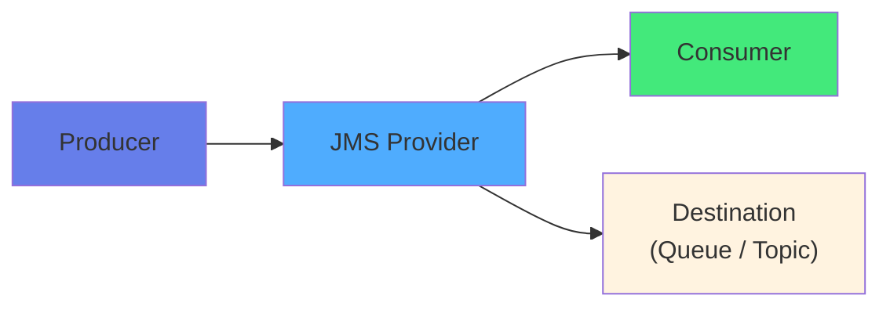

</details>

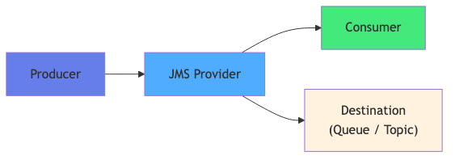


---

## JMS Components

**1. JMS Provider (Message Broker)**
   - Implements JMS specification
   - Manages destinations
   - Routes messages
   - Examples: Open Liberty, ActiveMQ, IBM MQ

**2. JMS Client**
   - Application that sends/receives messages
   - Uses JMS API

**3. Messages**
   - Data exchanged between clients
   - Header + Properties + Body

---

## JMS Components (continued)

**4. Destinations**
   - **Queue**: Point-to-Point
   - **Topic**: Publish-Subscribe

**5. Connection Factory**
   - Creates connections to JMS provider
   - Configured via JNDI

**6. Connection**
   - Active connection to JMS provider
   - Created from ConnectionFactory

**7. Session**
   - Single-threaded context for sending/receiving
   - Created from Connection

---

## JMS API Hierarchy

<details>
<summary>📝 Original Mermaid Code (click to expand)</summary>

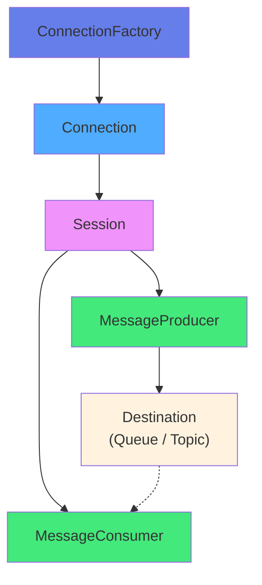

</details>

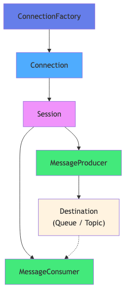


---

## JMS 2.0+ Simplified API

**Traditional API (JMS 1.1):**
```java
ConnectionFactory cf = ...;
Connection connection = cf.createConnection();
Session session = connection.createSession(false, Session.AUTO_ACKNOWLEDGE);
MessageProducer producer = session.createProducer(queue);
TextMessage message = session.createTextMessage("Hello");
producer.send(message);
connection.close();
```

**Simplified API (JMS 2.0+):**
```java
@Inject
@JMSConnectionFactory("jms/connectionFactory")
private JMSContext context;

context.createProducer().send(queue, "Hello");
```

---

## JMS in Jakarta EE

**Integration Points:**

1. **Resource Injection**
   - `@Inject JMSContext`
   - `@Resource Queue`
   - `@Resource Topic`

2. **Message-Driven Beans (MDB)**
   - Automatic message consumption
   - Container-managed lifecycle
   - Transaction support

3. **CDI Integration**
   - Dependency injection
   - Interceptors and decorators

---

# Part 3: Point-to-Point vs Publish-Subscribe

## Messaging Models

---

## Point-to-Point (Queue)

**Characteristics:**
- One message → One consumer
- Message removed after consumption
- Load balancing across consumers
- Guaranteed delivery

<details>
<summary>📝 Original Mermaid Code (click to expand)</summary>

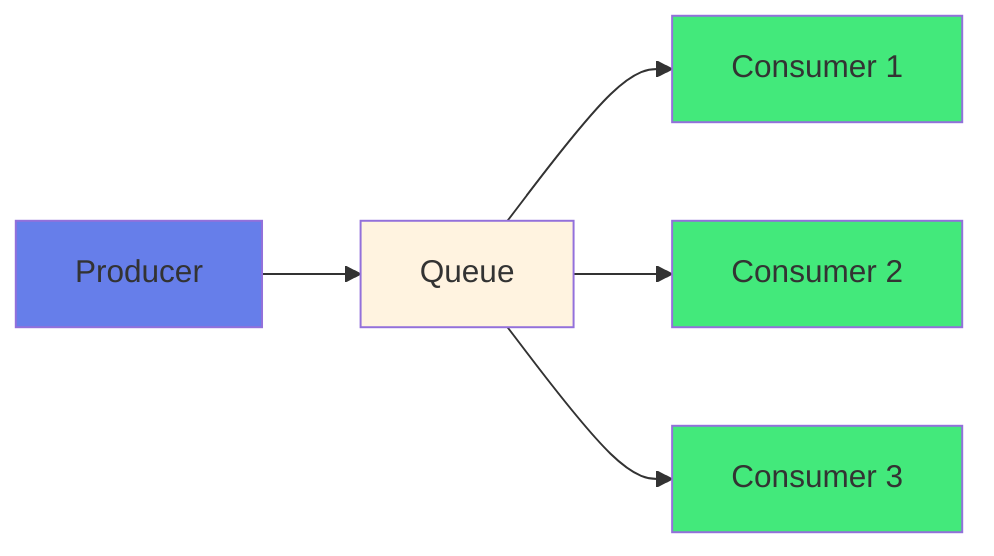

</details>

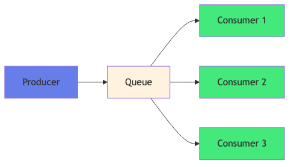


**Use Cases:**
- Task distribution
- Work queues
- Command processing

---

## Point-to-Point Example

```java
// Producer
@Inject
@JMSConnectionFactory("jms/connectionFactory")
private JMSContext context;

@Resource(lookup = "jms/orderQueue")
private Queue orderQueue;

public void sendOrder(Order order) {
    context.createProducer().send(orderQueue, order);
}

// Consumer (MDB)
@MessageDriven(activationConfig = {
    @ActivationConfigProperty(propertyName = "destinationType",
                             propertyValue = "jakarta.jms.Queue"),
    @ActivationConfigProperty(propertyName = "destination",
                             propertyValue = "jms/orderQueue")
})
public class OrderProcessorMDB implements MessageListener {
    public void onMessage(Message message) {
        // Process order
    }
}
```

---

## Publish-Subscribe (Topic)

**Characteristics:**
- One message → Multiple subscribers
- Message copied to all subscribers
- Broadcast pattern
- Optional durable subscriptions

<details>
<summary>📝 Original Mermaid Code (click to expand)</summary>

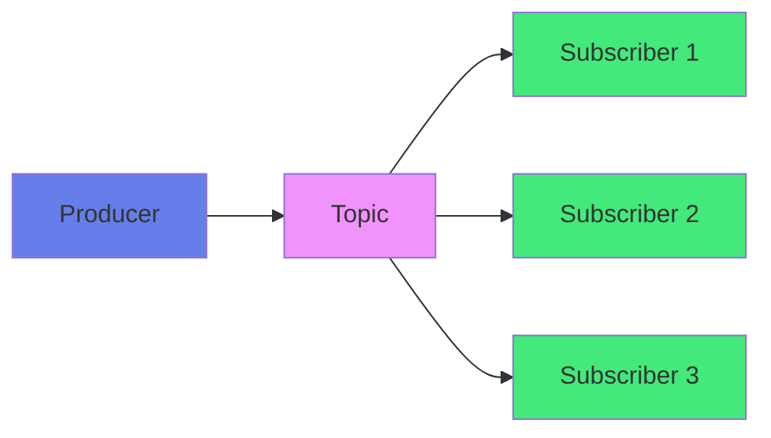

</details>

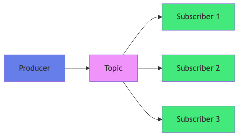


**Use Cases:**
- Event notifications
- News feeds
- System monitoring

---

## Queue vs Topic Comparison

| Feature | Queue (P2P) | Topic (Pub/Sub) |
|---------|-------------|-----------------|
| **Consumers** | One per message | Multiple per message |
| **Message Lifetime** | Until consumed | Until all subscribers receive |
| **Load Balancing** | Yes | No |
| **Guaranteed Delivery** | Yes | Yes (with durable subscription) |
| **Use Case** | Task distribution | Event broadcasting |

---

# Part 4: Message Types and Properties

## JMS Messages

---

## Message Structure

<details>
<summary>📝 Original Mermaid Code (click to expand)</summary>

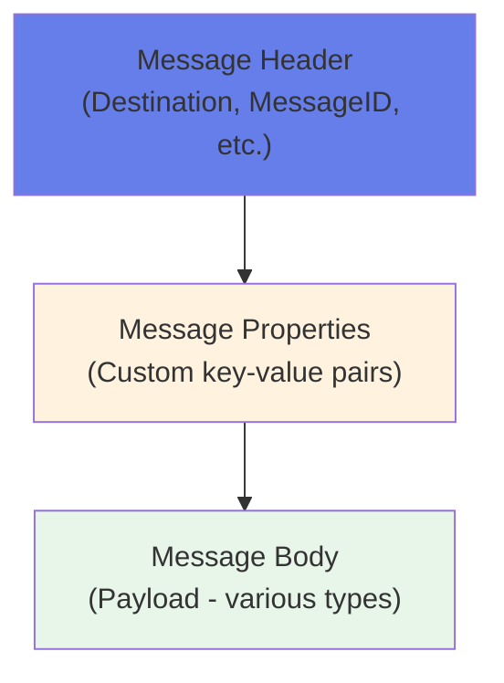

</details>

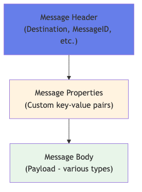


---

## Message Types

**JMS Defines 6 Message Types:**

1. **TextMessage** - String content (JSON, XML)
2. **BytesMessage** - Binary data
3. **ObjectMessage** - Serializable Java object
4. **MapMessage** - Key-value pairs
5. **StreamMessage** - Stream of primitive types
6. **Message** - Header and properties only

---

## TextMessage Example

```java
// Sending
TextMessage message = session.createTextMessage("Order #12345 shipped");
producer.send(message);

// Receiving
public void onMessage(Message msg) {
    if (msg instanceof TextMessage) {
        TextMessage textMsg = (TextMessage) msg;
        String text = textMsg.getText();
        System.out.println("Received: " + text);
    }
}
```

---

## Message Properties

```java
// Setting properties
Message message = session.createTextMessage("Hello");
message.setStringProperty("orderType", "PREMIUM");
message.setIntProperty("priority", 5);
message.setBooleanProperty("urgent", true);

// Reading properties
String orderType = message.getStringProperty("orderType");
int priority = message.getIntProperty("priority");
boolean urgent = message.getBooleanProperty("urgent");
```

---

## Message Selectors

**Filter Messages at Broker:**

```java
@MessageDriven(activationConfig = {
    @ActivationConfigProperty(propertyName = "destinationType",
                             propertyValue = "jakarta.jms.Queue"),
    @ActivationConfigProperty(propertyName = "destination",
                             propertyValue = "jms/orderQueue"),
    @ActivationConfigProperty(propertyName = "messageSelector",
                             propertyValue = "orderType = 'PREMIUM' AND amount > 1000")
})
public class PremiumOrderMDB implements MessageListener {
    // Only receives premium orders over $1000
}
```

**Selector Syntax:**
- SQL-92 conditional expression
- Operates on message properties
- Evaluated at broker (efficient)

---

# Part 5: Message Producers and Consumers

## Sending and Receiving Messages

---

## Message Producer

```java
@ApplicationScoped
public class OrderProducer {
    
    @Inject
    @JMSConnectionFactory("jms/connectionFactory")
    private JMSContext context;
    
    @Resource(lookup = "jms/orderQueue")
    private Queue orderQueue;
    
    public void sendOrder(Order order) {
        ObjectMessage message = context.createObjectMessage(order);
        message.setStringProperty("orderType", order.getType());
        
        context.createProducer()
               .setPriority(order.getPriority())
               .send(orderQueue, message);
    }
}
```

---

## Producer Configuration

**Delivery Mode:**

```java
// Persistent (default) - survives broker restart
context.createProducer()
       .setDeliveryMode(DeliveryMode.PERSISTENT)
       .send(queue, message);

// Non-persistent - faster but may be lost
context.createProducer()
       .setDeliveryMode(DeliveryMode.NON_PERSISTENT)
       .send(queue, message);
```

---

## Message Consumer (Asynchronous)

```java
public class OrderListener implements MessageListener {
    
    @Override
    public void onMessage(Message message) {
        try {
            if (message instanceof ObjectMessage) {
                Order order = (Order) ((ObjectMessage) message).getObject();
                processOrder(order);
            }
        } catch (JMSException e) {
            logger.error("Error processing message", e);
        }
    }
}
```

---

## Request-Reply Pattern

```java
// Requester
public String sendRequest(String request) {
    TemporaryQueue replyQueue = context.createTemporaryQueue();
    
    TextMessage requestMsg = context.createTextMessage(request);
    requestMsg.setJMSReplyTo(replyQueue);
    requestMsg.setJMSCorrelationID(UUID.randomUUID().toString());
    
    context.createProducer().send(requestQueue, requestMsg);
    
    JMSConsumer consumer = context.createConsumer(replyQueue);
    TextMessage replyMsg = (TextMessage) consumer.receive(5000);
    
    return replyMsg != null ? replyMsg.getText() : null;
}
```

---

# Part 6: Message-Driven Beans (MDB)

## Asynchronous Message Processing

---

## What is a Message-Driven Bean?

**MDB Characteristics:**
- Enterprise bean that processes JMS messages asynchronously
- Container-managed lifecycle
- Automatic message consumption
- Transaction support
- Concurrency management
- No client interface (invoked by container)

**Benefits:**
- Simplified asynchronous processing
- Automatic scaling
- Built-in error handling
- Transaction integration

---

## Basic MDB Structure

```java
@MessageDriven(
    activationConfig = {
        @ActivationConfigProperty(propertyName = "destinationType",
                                 propertyValue = "jakarta.jms.Queue"),
        @ActivationConfigProperty(propertyName = "destination",
                                 propertyValue = "jms/orderQueue")
    }
)
public class OrderProcessorMDB implements MessageListener {
    
    @Inject
    private Logger logger;
    
    @PersistenceContext
    private EntityManager em;
    
    @Override
    public void onMessage(Message message) {
        try {
            if (message instanceof ObjectMessage) {
                Order order = (Order) ((ObjectMessage) message).getObject();
                processOrder(order);
            }
        } catch (JMSException e) {
            logger.error("Error processing message", e);
        }
    }
    
    private void processOrder(Order order) {
        logger.info("Processing order: " + order.getId());
        em.persist(order);
    }
}
```

---

## MDB Activation Configuration

```java
@MessageDriven(
    activationConfig = {
        @ActivationConfigProperty(propertyName = "destinationType",
                                 propertyValue = "jakarta.jms.Queue"),
        @ActivationConfigProperty(propertyName = "destination",
                                 propertyValue = "jms/orderQueue"),
        @ActivationConfigProperty(propertyName = "messageSelector",
                                 propertyValue = "orderType = 'PREMIUM'"),
        @ActivationConfigProperty(propertyName = "acknowledgeMode",
                                 propertyValue = "Auto-acknowledge"),
        @ActivationConfigProperty(propertyName = "maxConcurrency",
                                 propertyValue = "10")
    }
)
```

---

## MDB Lifecycle

<details>
<summary>📝 Original Mermaid Code (click to expand)</summary>

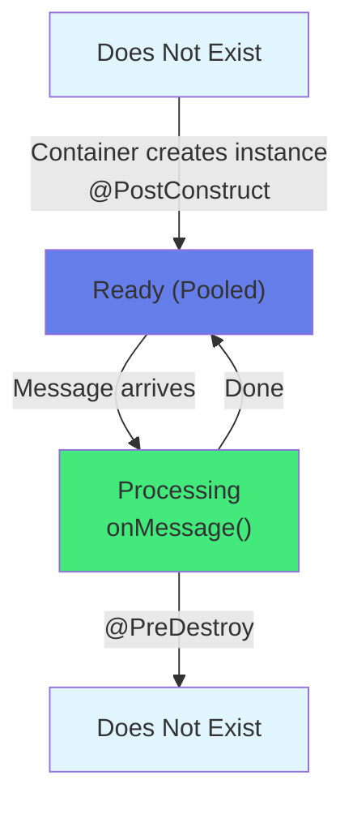

</details>

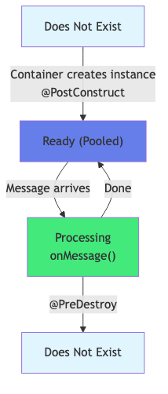


---

## MDB with Dependency Injection

```java
@MessageDriven(...)
public class OrderProcessorMDB implements MessageListener {
    
    @Inject
    private Logger logger;
    
    @Inject
    private OrderService orderService;
    
    @Inject
    private EmailService emailService;
    
    @PersistenceContext
    private EntityManager em;
    
    @Override
    public void onMessage(Message message) {
        try {
            Order order = extractOrder(message);
            orderService.validate(order);
            em.persist(order);
            emailService.sendConfirmation(order);
            logger.info("Order processed: " + order.getId());
        } catch (Exception e) {
            logger.error("Error processing order", e);
        }
    }
}
```

---

## MDB for Topic (Pub/Sub)

```java
@MessageDriven(
    activationConfig = {
        @ActivationConfigProperty(propertyName = "destinationType",
                                 propertyValue = "jakarta.jms.Topic"),
        @ActivationConfigProperty(propertyName = "destination",
                                 propertyValue = "jms/orderTopic"),
        @ActivationConfigProperty(propertyName = "subscriptionDurability",
                                 propertyValue = "Durable"),
        @ActivationConfigProperty(propertyName = "clientId",
                                 propertyValue = "EmailNotificationClient"),
        @ActivationConfigProperty(propertyName = "subscriptionName",
                                 propertyValue = "EmailSubscription")
    }
)
public class EmailNotificationMDB implements MessageListener {
    @Inject
    private EmailService emailService;
    
    @Override
    public void onMessage(Message message) {
        emailService.sendOrderNotification(extractOrder(message));
    }
}
```

---

# Part 7: Transaction Management with JMS

## Reliable Message Processing

---

## Why Transactions with JMS?

**Scenarios Requiring Transactions:**

1. **Atomic Operations**
   - Receive message + Update database
   - All or nothing

2. **Exactly-Once Processing**
   - Prevent duplicate processing
   - Ensure message not lost

3. **Consistency**
   - Maintain data integrity

---

## CMT with MDB (Default)

```java
@MessageDriven(...)
@TransactionAttribute(TransactionAttributeType.REQUIRED) // Default
public class OrderProcessorMDB implements MessageListener {
    
    @PersistenceContext
    private EntityManager em;
    
    @Override
    public void onMessage(Message message) {
        try {
            Order order = extractOrder(message);
            
            // All in same transaction:
            // 1. Message consumption
            // 2. Database update
            em.persist(order);
            
        } catch (Exception e) {
            logger.error("Error processing order", e);
            // Exception causes transaction rollback
            // Message will be redelivered
            throw new EJBException(e);
        }
    }
}
```

---

## Transaction Rollback Behavior

**What Happens on Rollback:**

```java
@MessageDriven(...)
public class OrderMDB implements MessageListener {
    
    @PersistenceContext
    private EntityManager em;
    
    public void onMessage(Message message) {
        Order order = extractOrder(message);
        em.persist(order);
        
        if (order.getAmount() > 10000) {
            throw new RuntimeException("Amount too high");
        }
        
        // On exception:
        // 1. Database changes rolled back
        // 2. Message consumption rolled back
        // 3. Message redelivered
    }
}
```

---

## Handling Redelivery

```java
@MessageDriven(...)
public class OrderMDB implements MessageListener {
    
    @Resource(lookup = "jms/deadLetterQueue")
    private Queue deadLetterQueue;
    
    @Inject
    @JMSConnectionFactory("jms/connectionFactory")
    private JMSContext context;
    
    public void onMessage(Message message) {
        try {
            int deliveryCount = message.getIntProperty("JMSXDeliveryCount");
            
            if (deliveryCount > 5) {
                logger.warn("Max redelivery exceeded, sending to DLQ");
                context.createProducer().send(deadLetterQueue, message);
                return;
            }
            
            processOrder(extractOrder(message));
            
        } catch (Exception e) {
            throw new EJBException(e); // Trigger redelivery
        }
    }
}
```

---

## Transactional Message Sending

```java
@Stateless
public class OrderService {
    
    @PersistenceContext
    private EntityManager em;
    
    @Inject
    @JMSConnectionFactory("jms/connectionFactory")
    private JMSContext context;
    
    @Resource(lookup = "jms/orderQueue")
    private Queue orderQueue;
    
    @TransactionAttribute(TransactionAttributeType.REQUIRED)
    public void createOrder(Order order) {
        // Both operations in same transaction
        em.persist(order);
        
        // Message only sent if transaction commits
        context.createProducer().send(orderQueue, order);
    }
}
```

---

# Part 8: Error Handling and Dead Letter Queues

## Handling Failed Messages

---

## Dead Letter Queue (DLQ)

**Purpose:**
- Store messages that cannot be processed
- Prevent infinite redelivery loops
- Allow manual inspection and reprocessing

**Configuration:**
```xml
<!-- server.xml -->
<jmsQueue id="orderQueue" jndiName="jms/orderQueue">
    <properties.wasJms 
        deliveryMode="Persistent"
        maxRedeliveryCount="5"
        redeliveryDelay="5000"/>
</jmsQueue>

<jmsQueue id="deadLetterQueue" jndiName="jms/deadLetterQueue"/>
```

---

## DLQ Handler MDB

```java
@MessageDriven(
    activationConfig = {
        @ActivationConfigProperty(propertyName = "destinationType",
                                 propertyValue = "jakarta.jms.Queue"),
        @ActivationConfigProperty(propertyName = "destination",
                                 propertyValue = "jms/deadLetterQueue")
    }
)
public class DeadLetterQueueMDB implements MessageListener {
    
    @Inject
    private Logger logger;
    
    @PersistenceContext
    private EntityManager em;
    
    @Override
    public void onMessage(Message message) {
        try {
            // Log failed message details
            String messageId = message.getJMSMessageID();
            int deliveryCount = message.getIntProperty("JMSXDeliveryCount");
            
            logger.error("Message failed after {} attempts: {}", 
                        deliveryCount, messageId);
            
            // Store in database for manual review
            FailedMessage failed = new FailedMessage();
            failed.setMessageId(messageId);
            failed.setDeliveryCount(deliveryCount);
            failed.setContent(extractContent(message));
            failed.setFailureTime(LocalDateTime.now());
            
            em.persist(failed);
            
            // Optionally send alert
            sendAlert("Message failed: " + messageId);
            
        } catch (Exception e) {
            logger.error("Error processing DLQ message", e);
        }
    }
}
```

---

## Error Handling Strategies

**1. Retry with Exponential Backoff**
```java
public void onMessage(Message message) {
    int deliveryCount = message.getIntProperty("JMSXDeliveryCount");
    
    if (deliveryCount > 1) {
        // Wait before reprocessing
        long delay = (long) Math.pow(2, deliveryCount) * 1000;
        Thread.sleep(delay);
    }
    
    processMessage(message);
}
```

**2. Selective Retry**
```java
public void onMessage(Message message) {
    try {
        processMessage(message);
    } catch (TransientException e) {
        // Retry transient errors
        throw new EJBException(e);
    } catch (PermanentException e) {
        // Don't retry permanent errors
        logger.error("Permanent error", e);
        sendToDLQ(message);
    }
}
```

---

## Poison Message Detection

```java
@MessageDriven(...)
public class OrderMDB implements MessageListener {
    
    private static final int MAX_RETRIES = 3;
    
    public void onMessage(Message message) {
        try {
            int deliveryCount = message.getIntProperty("JMSXDeliveryCount");
            
            if (deliveryCount > MAX_RETRIES) {
                // Poison message detected
                logger.error("Poison message detected: {}", 
                           message.getJMSMessageID());
                
                // Send to DLQ without retry
                context.createProducer().send(deadLetterQueue, message);
                return;
            }
            
            processMessage(message);
            
        } catch (Exception e) {
            logger.error("Error processing message", e);
            throw new EJBException(e);
        }
    }
}
```

---

# Part 9: Best Practices and Performance

## Optimizing JMS Applications

---

## Best Practices

**DO:**
- ✅ Use MDB for asynchronous consumption
- ✅ Keep onMessage() fast
- ✅ Use message selectors to filter at broker
- ✅ Handle all message types
- ✅ Use transactions appropriately
- ✅ Implement proper error handling
- ✅ Monitor queue depths
- ✅ Use persistent delivery for critical messages

**DON'T:**
- ❌ Block in onMessage for too long
- ❌ Create new consumers repeatedly
- ❌ Ignore message acknowledgment
- ❌ Store state in MDB
- ❌ Create threads manually

---

## Performance Optimization

**1. Message Batching**
```java
public void sendBatch(List<Order> orders) {
    for (Order order : orders) {
        context.createProducer()
               .setDeliveryMode(DeliveryMode.NON_PERSISTENT) // Faster
               .send(queue, order);
    }
}
```

**2. Concurrent Processing**
```java
@MessageDriven(
    activationConfig = {
        @ActivationConfigProperty(propertyName = "maxConcurrency",
                                 propertyValue = "20")
    }
)
// Container creates up to 20 instances
```

**3. Message Compression**
```java
public void sendCompressed(String data) {
    byte[] compressed = compress(data);
    BytesMessage message = context.createBytesMessage();
    message.writeBytes(compressed);
    message.setBooleanProperty("compressed", true);
    context.createProducer().send(queue, message);
}
```

---

## Monitoring and Troubleshooting

**Key Metrics to Monitor:**
- Queue depth
- Message throughput
- Processing time
- Error rate
- DLQ size

**Tools:**
- JMX MBeans
- MicroProfile Metrics
- Application logs
- JMS provider console

---

## Liberty JMS Configuration

**server.xml:**
```xml
<server>
    <featureManager>
        <feature>messaging-3.1</feature>
        <feature>mdb-4.0</feature>
    </featureManager>
    
    <jmsConnectionFactory jndiName="jms/connectionFactory">
        <properties.wasJms/>
    </jmsConnectionFactory>
    
    <jmsQueue id="orderQueue" jndiName="jms/orderQueue">
        <properties.wasJms 
            deliveryMode="Persistent"
            maxRedeliveryCount="5"/>
    </jmsQueue>
    
    <jmsTopic id="orderTopic" jndiName="jms/orderTopic">
        <properties.wasJms/>
    </jmsTopic>
</server>
```

---

## 📝 Summary

**What We Learned Today:**

| Topic | Key Concepts |
|-------|-------------|
| **JMS Fundamentals** | Asynchronous messaging, reliable delivery |
| **Messaging Models** | Point-to-Point (Queue), Publish-Subscribe (Topic) |
| **Message-Driven Beans** | Container-managed, automatic consumption |
| **Transactions** | CMT, reliable processing, rollback handling |
| **Error Handling** | Dead Letter Queue, retry strategies |
| **Performance** | Batching, concurrency, monitoring |

---

## 🎯 Key Takeaways

**Remember These Points:**

1. ✅ **JMS enables asynchronous, reliable messaging** between components
2. ✅ **Use Queues for point-to-point**, Topics for publish-subscribe
3. ✅ **MDBs simplify message consumption** with container management
4. ✅ **Transactions ensure exactly-once processing** and data consistency
5. ✅ **DLQ prevents message loss** and enables failure analysis
6. ✅ **Monitor and optimize** for production performance

---

## 📚 Additional Resources

**Official Documentation:**
- [Jakarta Messaging 3.1 Specification](https://jakarta.ee/specifications/messaging/3.1/)
- [Open Liberty Messaging Feature](https://openliberty.io/docs/latest/reference/feature/messaging-3.1.html)
- [Message-Driven Beans Guide](https://openliberty.io/docs/latest/reference/feature/mdb-4.0.html)

**Books & Patterns:**
- [Enterprise Integration Patterns](https://www.enterpriseintegrationpatterns.com/)
- [Java Message Service, 2nd Edition](https://www.oreilly.com/library/view/java-message-service/9781449394110/)

**Community:**
- [Jakarta EE Community](https://jakarta.ee/community/)
- [Open Liberty Guides](https://openliberty.io/guides/)

---

## 💡 Common Pitfalls to Avoid

**❌ Don't:**
- Block for too long in `onMessage()`
- Ignore message acknowledgment
- Create consumers repeatedly
- Store state in MDB instances
- Forget to handle exceptions

**✅ Do:**
- Keep message processing fast
- Use message selectors for filtering
- Implement proper error handling
- Monitor queue depths
- Test failure scenarios

---

## 📝 Homework

**Before Next Lecture:**

| | |
|---|---|
| ✅ | Complete Lab 5B: JMS Enterprise Messaging |
| ✅ | Implement all MDBs (Email, Audit, DLQ) |
| ✅ | Test error handling scenarios |
| ✅ | Practice with both Queues and Topics |

**Optional:**
- Explore MicroProfile Reactive Messaging
- Try implementing request-reply pattern
- Experiment with message selectors
- Read about AMQP and Kafka

---

## 🙋 Questions & Discussion

**Discussion Topics:**
- When to use JMS vs REST APIs?
- How does JMS compare to Kafka?
- What are the trade-offs of asynchronous messaging?

**Office Hours:**
- **When:** Monday & Wednesday 14:00-16:00
- **Where:** Room B203 or Online (Teams)
- **Contact:** olivier.planson@esipe.fr

**Course Repository:**
- https://github.com/oplanson/esipe-javaee

---

## 📅 Next Lecture

### Lecture 6: Domain-Driven Design (DDD)
**Date:** [Next session date]
**Duration:** 3 hours
**Topics:**
- DDD principles and patterns
- Bounded contexts and aggregates
- Value objects and entities
- Domain events
- Hexagonal architecture introduction

**Preparation:** Complete Lab 5B and review DDD concepts

---

# 🚀 Ready for Lab 5B!

**Lab Objectives:**
1. Configure JMS resources (Queues, Topics, DLQ)
2. Implement transaction event producer
3. Create Email Notification MDB
4. Create Audit Logging MDB
5. Implement DLQ handler
6. Test complete messaging flow

**Estimated Time:** 2 hours 20 minutes

**See you in the lab!**

---

**End of Lecture 5B**

© 2026 - Jakarta EE & MicroProfile Course
