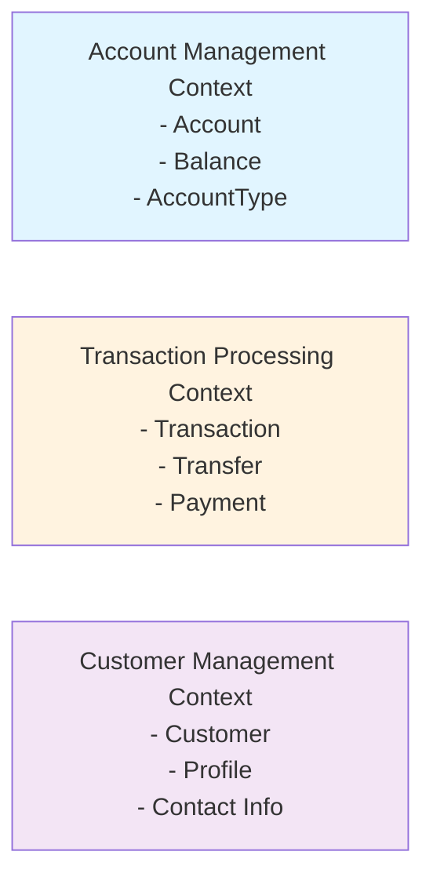
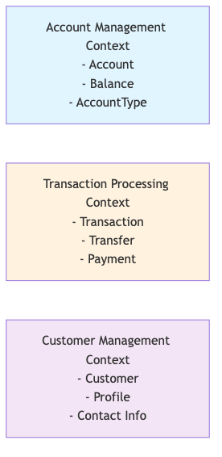
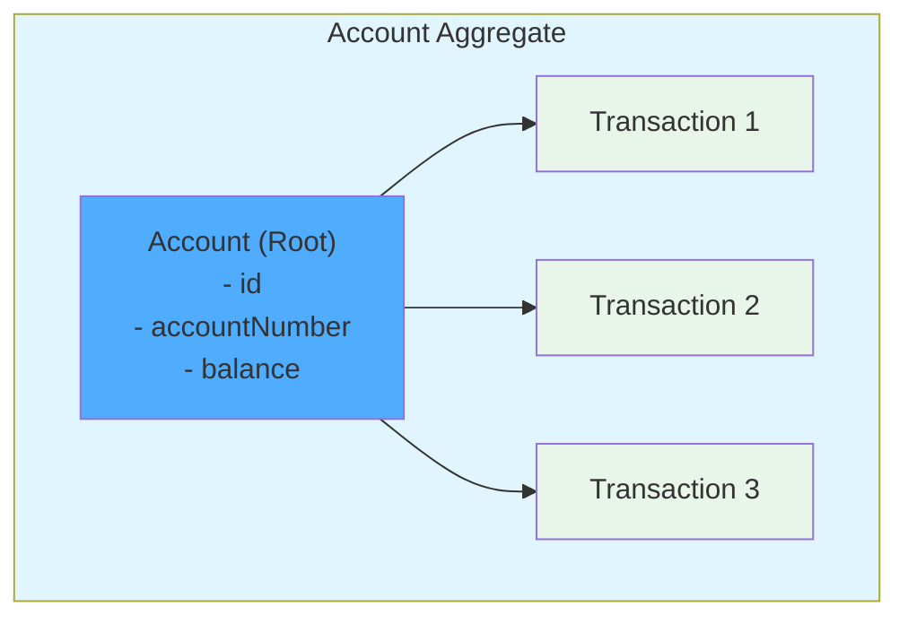
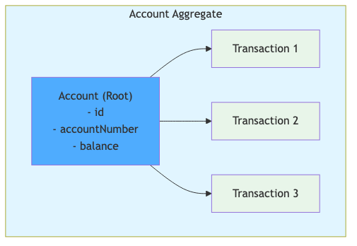
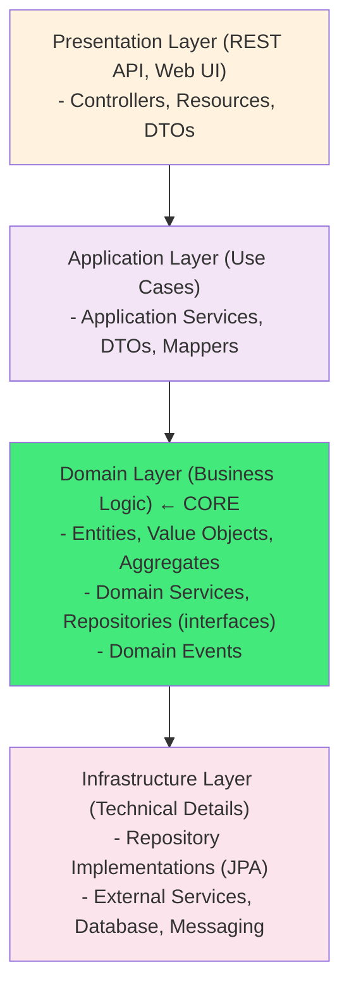
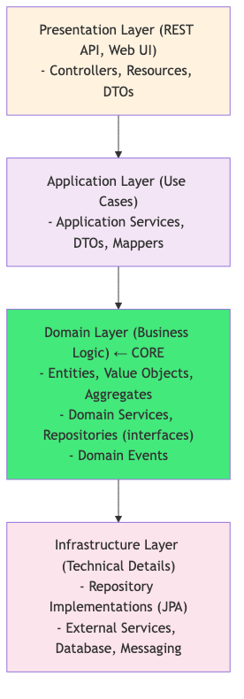
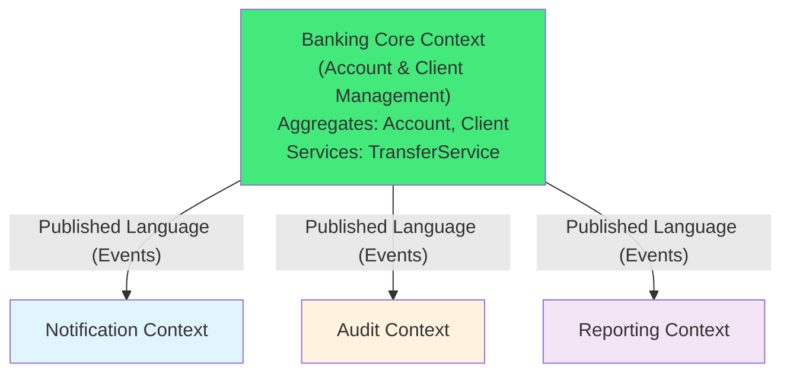
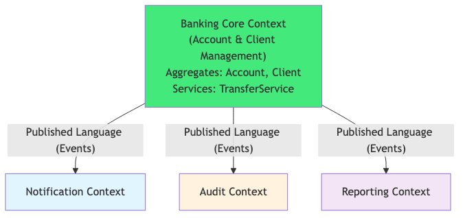

<!-- © Copyright 2026 Olivier Planson. All rights reserved. Reproduction prohibited. Made with IBM Bob. -->


# Lecture 6: Domain-Driven Design (DDD)
## Strategic and Tactical Patterns for Enterprise Applications

**Duration:** 3 hours  
**Instructor:** Olivier Planson  
**Date:** January 2026  
**Course:** Jakarta EE, MicroProfile and Microservices

---

## 📋 Learning Objectives

By the end of this lecture, you will be able to:

| | |
| --- | --- |
| ✅ | Understand Domain-Driven Design philosophy and benefits |
| ✅ | Apply strategic DDD patterns (Bounded Contexts, Context Maps) |
| ✅ | Implement tactical DDD patterns (Entities, Value Objects, Aggregates) |
| ✅ | Design domain models using ubiquitous language |
| ✅ | Refactor existing code to DDD architecture |
| ✅ | Apply DDD to the banking application |

---

## 🎯 What is Domain-Driven Design?

**Domain-Driven Design (DDD)** is an approach to software development that emphasizes collaboration between technical and domain experts to create a model that reflects the business domain.

### Core Philosophy:
- **Focus on the domain and domain logic**
- **Base complex designs on a model of the domain**
- **Collaborate with domain experts to improve the model**
- **Use a ubiquitous language within a bounded context**

### Key Benefits:
- Better alignment between business and code
- More maintainable and flexible software
- Clearer communication between teams
- Reduced complexity through proper boundaries

---

## 📚 DDD: Strategic vs Tactical Patterns

### Strategic Patterns (Big Picture)
Focus on **high-level organization** and **boundaries**:
- Bounded Contexts
- Context Mapping
- Ubiquitous Language
- Subdomains (Core, Supporting, Generic)

### Tactical Patterns (Implementation)
Focus on **code-level design** within a bounded context:
- Entities
- Value Objects
- Aggregates
- Repositories
- Domain Services
- Domain Events

---

## 🗺️ Strategic Pattern: Bounded Context

A **Bounded Context** is an explicit boundary within which a domain model is defined and applicable.

### Key Characteristics:
- **Clear boundaries:** Each context has its own model
- **Ubiquitous language:** Terms have specific meaning within context
- **Independence:** Contexts can evolve separately
- **Integration points:** Explicit interfaces between contexts

### Banking Example:
<details>
<summary>📝 Original Mermaid Code (click to expand)</summary>



</details>




---

## 🌐 Ubiquitous Language

**Ubiquitous Language** is a common, rigorous language between developers and domain experts.

### Principles:
- Use the **same terms** in conversations, code, and documentation
- **Avoid technical jargon** when talking to domain experts
- **Refine the language** as understanding deepens
- **Model the language** in code (class names, method names)

### Banking Example:

| Domain Term | Code Representation | Meaning |
|------------|---------------------|---------|
| Account | `Account` entity | Customer's bank account |
| Deposit | `deposit()` method | Add money to account |
| Withdrawal | `withdraw()` method | Remove money from account |
| Transfer | `transfer()` method | Move money between accounts |
| Balance | `balance` field | Current account balance |

---

## 🎯 Tactical Pattern: Entity

An **Entity** is an object defined by its **identity** rather than its attributes.

### Characteristics:
- Has a **unique identifier** (ID)
- **Mutable:** Attributes can change over time
- **Identity persists** through lifecycle
- **Equality based on ID**, not attributes

### Entity Example:
```java
@Entity
public class Account {
    @Id
    @GeneratedValue(strategy = GenerationType.IDENTITY)
    private Long id;  // Identity
    
    private String accountNumber;
    private BigDecimal balance;  // Can change
    private AccountType type;
    
    // Equality based on ID
    @Override
    public boolean equals(Object o) {
        if (this == o) return true;
        if (!(o instanceof Account)) return false;
        Account account = (Account) o;
        return Objects.equals(id, account.id);
    }
}
```

---

## 💎 Tactical Pattern: Value Object

A **Value Object** is an object defined by its **attributes** rather than identity.

### Characteristics:
- **No unique identifier**
- **Immutable:** Cannot change after creation
- **Equality based on attributes**
- **Replaceable:** Create new instance instead of modifying

### Value Object Example:
```java
public class Money {
    private final BigDecimal amount;
    private final Currency currency;
    
    public Money(BigDecimal amount, Currency currency) {
        this.amount = Objects.requireNonNull(amount);
        this.currency = Objects.requireNonNull(currency);
    }
    
    // Immutable - returns new instance
    public Money add(Money other) {
        if (!this.currency.equals(other.currency)) {
            throw new IllegalArgumentException("Currency mismatch");
        }
        return new Money(this.amount.add(other.amount), this.currency);
    }
    
    // Equality based on attributes
    @Override
    public boolean equals(Object o) {
        if (this == o) return true;
        if (!(o instanceof Money)) return false;
        Money money = (Money) o;
        return amount.equals(money.amount) && currency.equals(money.currency);
    }
}
```

---

## 🔗 Entity vs Value Object

### When to Use Each:

<div class="columns">
<div>

### Entity
- Needs to be **tracked over time**
- Has a **lifecycle**
- **Identity matters**
- Examples:
  - Customer
  - Account
  - Order
  - Invoice

</div>
<div>

### Value Object
- Describes or measures something
- **No lifecycle**
- **Attributes matter**, not identity
- Examples:
  - Money
  - Address
  - DateRange
  - Email

</div>
</div>

### Rule of Thumb:
**If you can replace it without anyone noticing, it's a Value Object.**

---

## 🔄 API Versioning and Breaking Changes

### The Challenge of Refactoring

When refactoring to DDD, we often need to change our data model significantly. This raises an important question: **How do we evolve our API without breaking existing clients?**

### Example: Money Value Object Migration

In our banking application, we're refactoring from a simple `balance` field to a `Money` Value Object with `amount` and `currency`:

**Before (Lab 5):**
```java
@Entity
public class Account {
    private BigDecimal balance;  // Simple field
}
```

**After (Lab 6):**
```java
@Entity
public class Account {
    @Embedded
    private Money balance;  // Value Object with amount + currency
}
```

### Migration Strategies

#### ❌ Option 1: Breaking Change (Not Recommended)
```sql
-- Drop old column, add new ones
ALTER TABLE accounts DROP COLUMN balance;
ALTER TABLE accounts ADD COLUMN balance_amount DECIMAL(19,2);
ALTER TABLE accounts ADD COLUMN balance_currency VARCHAR(3);
```

**Problems:**
- ❌ Breaks all existing clients immediately
- ❌ Requires coordinated deployment
- ❌ No rollback possible
- ❌ High risk in production

#### ❌ Option 2: Big Bang Migration
```sql
-- Rename and add in one step
ALTER TABLE accounts RENAME COLUMN balance TO balance_amount;
ALTER TABLE accounts ADD COLUMN balance_currency VARCHAR(3);
```

**Problems:**
- ❌ Still breaks existing code
- ❌ Difficult to test incrementally
- ❌ All or nothing approach

#### ❌ Option 3: Dual Write (Complex)
Keep both old and new fields, write to both:

```java
public void setBalance(Money money) {
    this.balance = money.getAmount();  // Old field
    this.balanceAmount = money.getAmount();  // New field
    this.balanceCurrency = money.getCurrency();  // New field
}
```

**Problems:**
- ❌ Code duplication
- ❌ Risk of inconsistency
- ❌ Maintenance burden

#### ✅ Option 4: Backward Compatible Migration (Recommended)

This is the approach we use in Lab 6:

```sql
-- Step 1: Add new columns (non-breaking)
ALTER TABLE accounts ADD COLUMN balance_amount DECIMAL(19,2);
ALTER TABLE accounts ADD COLUMN balance_currency VARCHAR(3) DEFAULT 'EUR';

-- Step 2: Migrate existing data
UPDATE accounts SET balance_amount = balance WHERE balance_amount IS NULL;

-- Step 3: Keep old column in sync with trigger
CREATE OR REPLACE FUNCTION sync_account_balance()
RETURNS TRIGGER AS $$
BEGIN
    NEW.balance = NEW.balance_amount;  -- Sync old column
    RETURN NEW;
END;
$$ LANGUAGE plpgsql;

CREATE TRIGGER trigger_sync_account_balance
    BEFORE INSERT OR UPDATE ON accounts
    FOR EACH ROW
    EXECUTE FUNCTION sync_account_balance();
```

**Advantages:**
- ✅ No breaking changes
- ✅ Gradual migration possible
- ✅ Easy rollback
- ✅ Old and new code can coexist
- ✅ Low risk

### API Versioning Strategies

#### 1. URL Versioning
```
GET /api/v1/accounts/{id}  → Returns { "balance": 1000.00 }
GET /api/v2/accounts/{id}  → Returns { "balance": { "amount": 1000.00, "currency": "EUR" } }
```

**Pros:** Clear, easy to understand
**Cons:** URL proliferation, maintenance burden

#### 2. Header Versioning
```
GET /api/accounts/{id}
Accept: application/vnd.bank.v1+json  → Old format
Accept: application/vnd.bank.v2+json  → New format
```

**Pros:** Clean URLs, flexible
**Cons:** Less visible, harder to test

#### 3. Content Negotiation
```
GET /api/accounts/{id}
Accept: application/json  → Default (latest)
Accept: application/vnd.bank.legacy+json  → Old format
```

**Pros:** Backward compatible by default
**Cons:** Complex to implement

#### 4. Deprecation Strategy (Our Approach)

We use a **deprecation period** approach:

```java
@GET
@Path("/{id}")
public Response getAccount(@PathParam("id") Long id) {
    Account account = accountService.findById(id);
    
    // Return new format with Money Value Object
    AccountDTO dto = new AccountDTO();
    dto.setId(account.getId());
    dto.setBalance(account.getBalance());  // Money object
    
    // Add deprecation warning header
    return Response.ok(dto)
        .header("X-API-Deprecation", "balance field will change format in v2.0")
        .header("X-API-Sunset", "2026-06-01")
        .build();
}
```

#### 5. JAX-RS Resource Registration Best Practices

When implementing API versioning with JAX-RS, **explicit resource registration** is crucial to prevent version mixing.

##### ⚠️ Common Pitfall: Auto-Discovery Conflicts

By default, JAX-RS applications use auto-discovery to find all `@Path` annotated classes:

```java
@ApplicationPath("/api")
public class RestApplication extends Application {
    // Auto-discovers ALL @Path classes in the application
}

@ApplicationPath("/api/v2")
public class RestApplicationV2 extends Application {
    // Also auto-discovers ALL @Path classes!
}
```

**Problem:** Both applications discover and register ALL resources, causing:
- V2 resources appear in V1 API with V1 deprecation headers ❌
- V1 resources appear in V2 API ❌
- Inconsistent behavior and confusing API contracts

##### ✅ Solution: Explicit Resource Registration

Override `getClasses()` to explicitly register only the resources for each version:

```java
@ApplicationPath("/api")
public class RestApplication extends Application {
    
    @Override
    public Set<Class<?>> getClasses() {
        Set<Class<?>> classes = new HashSet<>();
        // Only register V1 resources
        classes.add(AccountResource.class);
        classes.add(ClientResource.class);
        return classes;
    }
}

@ApplicationPath("/api/v2")
public class RestApplicationV2 extends Application {
    
    @Override
    public Set<Class<?>> getClasses() {
        Set<Class<?>> classes = new HashSet<>();
        // Only register V2 resources
        classes.add(AccountResourceV2.class);
        return classes;
    }
}
```

##### 📋 Benefits of Explicit Registration

1. **Clear API Contract** - You know exactly what's exposed in each version
2. **No Surprises** - Prevents accidental resource exposure
3. **Easy to Audit** - Simple to verify what's in each API version
4. **Version Isolation** - Complete separation between API versions
5. **Maintainable** - Easy to add/remove resources per version

##### 🎯 Best Practice Checklist

- ✅ Override `getClasses()` in each `Application` class
- ✅ Explicitly register resources for each version
- ✅ Document why explicit registration is used
- ✅ Keep V1 and V2 resources in separate packages (optional but recommended)
- ✅ Test that resources don't leak between versions

##### 📚 Alternative Approaches

**Package-Based Scanning:**
```java
@Override
public Set<Class<?>> getClasses() {
    // Scan only specific package
    return scanPackage("com.bank.api.v1");
}
```
**Pros:** Automatic within package  
**Cons:** Requires package restructuring, more complex

**Annotation-Based Filtering:**
```java
@ApiVersion("v1")
public class AccountResource { }

// Filter by annotation in Application
```
**Pros:** Flexible  
**Cons:** Custom implementation, non-standard

##### 🔍 Real-World Example

**Stripe API** uses explicit versioning with date-based versions:
- Each API version is explicitly defined
- Resources are carefully curated per version
- Clear migration guides between versions

**GitHub API** uses URL versioning with explicit resource sets:
- `/api/v3/` and `/api/v4/` are completely separate
- No resource leakage between versions
- Deprecation headers on old versions

##### 💡 Key Takeaway

> **"Explicit is better than implicit"** - Python Zen, applicable to API design
> 
> When versioning APIs, always prefer explicit resource registration over auto-discovery to maintain clear boundaries and prevent unexpected behavior.


### Breaking Change Checklist

Before introducing a breaking change, ask:

1. ✅ **Can we make it backward compatible?**
   - Add new fields instead of changing existing ones
   - Use database triggers for synchronization
   - Support both old and new formats

2. ✅ **Do we need versioning?**
   - Major changes → New API version
   - Minor changes → Deprecation period
   - Bug fixes → No version change

3. ✅ **Have we communicated the change?**
   - Documentation updated
   - Deprecation warnings in responses
   - Migration guide provided
   - Sunset date announced

4. ✅ **Is there a migration path?**
   - Step-by-step guide
   - Code examples
   - Testing tools
   - Rollback plan

### Lab 6 Migration Strategy

In Lab 6, we implement **Option 4** with these steps:

**Phase 1: Preparation (Non-breaking)**
```sql
-- Add new columns
ALTER TABLE accounts ADD COLUMN balance_amount DECIMAL(19,2);
ALTER TABLE accounts ADD COLUMN balance_currency VARCHAR(3);
-- Old 'balance' column still exists
```

**Phase 2: Dual Operation (Transition)**
```java
// Code works with both old and new columns
// Trigger keeps them in sync
```

**Phase 3: Deprecation (Future)**
```sql
-- In V6 migration (future):
-- ALTER TABLE accounts DROP COLUMN balance;
```

### Key Lessons

1. **Backward Compatibility is King**
   - Never break existing clients without warning
   - Provide migration period (3-6 months minimum)
   - Support old format during transition

2. **Database Changes are Permanent**
   - Plan migrations carefully
   - Test rollback procedures
   - Use feature flags for code changes

3. **Communication is Critical**
   - Document all breaking changes
   - Provide migration guides
   - Set clear sunset dates

4. **Incremental is Better**
   - Small, frequent changes > Big bang
   - Each step should be deployable
   - Validate at each stage

### Real-World Example: Stripe API

Stripe handles API versioning excellently:

```
# Each account has an API version
GET /v1/charges
Stripe-Version: 2023-10-16

# Old versions supported for years
# Breaking changes only in new versions
# Automatic upgrades with warnings
```

**Lessons from Stripe:**
- Version per account, not globally
- Long deprecation periods (1-2 years)
- Extensive documentation
- Migration tools provided

### Discussion Questions

1. When is it acceptable to introduce a breaking change?
2. How long should a deprecation period be?
3. What's the cost of maintaining multiple API versions?
4. How do you test backward compatibility?

---

## 📦 Tactical Pattern: Aggregate

An **Aggregate** is a cluster of domain objects treated as a single unit for data changes.

### Key Concepts:
- **Aggregate Root:** Entry point for all operations
- **Consistency Boundary:** Ensures invariants are maintained
- **Transaction Boundary:** Changes are atomic
- **Reference by ID:** External objects reference root by ID only

### Aggregate Structure:
<details>
<summary>📝 Original Mermaid Code (click to expand)</summary>



</details>




---

## 🏦 Banking Aggregate Example

```java
@Entity
public class Account {  // Aggregate Root
    @Id
    @GeneratedValue(strategy = GenerationType.IDENTITY)
    private Long id;
    
    private String accountNumber;
    private BigDecimal balance;
    
    @OneToMany(cascade = CascadeType.ALL, orphanRemoval = true)
    private List<Transaction> transactions = new ArrayList<>();
    
    // Business logic in aggregate root
    public void deposit(BigDecimal amount) {
        if (amount.compareTo(BigDecimal.ZERO) <= 0) {
            throw new IllegalArgumentException("Amount must be positive");
        }
        this.balance = this.balance.add(amount);
        this.transactions.add(new Transaction(TransactionType.DEPOSIT, amount));
    }
    
    public void withdraw(BigDecimal amount) {
        if (amount.compareTo(balance) > 0) {
            throw new InsufficientFundsException("Insufficient funds");
        }
        this.balance = this.balance.subtract(amount);
        this.transactions.add(new Transaction(TransactionType.WITHDRAWAL, amount));
    }
}
```

---

## 🎯 Aggregate Design Rules

### Rule 1: Reference Other Aggregates by ID Only
```java
@Entity
public class Account {
    @Id
    private Long id;
    
    // ❌ BAD: Direct reference to another aggregate
    // @ManyToOne
    // private Client client;
    
    // ✅ GOOD: Reference by ID
    private Long clientId;
}
```

### Rule 2: Keep Aggregates Small
- Include only what needs to be **consistent together**
- Larger aggregates = more contention and complexity
- Prefer **multiple small aggregates** over one large one

### Rule 3: Enforce Invariants
- All business rules enforced **within the aggregate**
- **No external code** can violate invariants
- Use **private setters** and **public methods** for operations

---

## 📚 Tactical Pattern: Repository

A **Repository** provides collection-like access to aggregates.

### Characteristics:
- **One repository per aggregate root**
- Abstracts data access details
- Returns fully-formed aggregates
- Supports querying by business criteria

### Repository Interface:
```java
public interface AccountRepository {
    // Basic CRUD
    Account findById(Long id);
    List<Account> findAll();
    void save(Account account);
    void delete(Account account);
    
    // Business queries
    List<Account> findByClientId(Long clientId);
    Account findByAccountNumber(String accountNumber);
    List<Account> findByBalanceGreaterThan(BigDecimal amount);
    
    // No methods that return partial aggregates!
    // ❌ List<Transaction> findTransactionsByAccountId(Long accountId);
}
```

---

## 🔧 Repository Implementation with JPA

```java
@ApplicationScoped
public class JpaAccountRepository implements AccountRepository {
    
    @Inject
    private EntityManager em;
    
    @Override
    public Account findById(Long id) {
        return em.find(Account.class, id);
    }
    
    @Override
    public List<Account> findAll() {
        return em.createQuery("SELECT a FROM Account a", Account.class)
                 .getResultList();
    }
    
    @Override
    @Transactional
    public void save(Account account) {
        if (account.getId() == null) {
            em.persist(account);
        } else {
            em.merge(account);
        }
    }
    
    @Override
    public Account findByAccountNumber(String accountNumber) {
        return em.createQuery(
            "SELECT a FROM Account a WHERE a.accountNumber = :number", 
            Account.class)
            .setParameter("number", accountNumber)
            .getSingleResult();
    }
}
```

---

## ⚙️ Tactical Pattern: Domain Service

A **Domain Service** contains domain logic that doesn't naturally fit in an entity or value object.

### When to Use:
- Operation involves **multiple aggregates**
- Logic is **stateless**
- Represents a **domain concept** (not technical)

### Domain Service Example:
```java
@ApplicationScoped
public class TransferService {  // Domain Service
    
    @Inject
    private AccountRepository accountRepository;
    
    @Transactional
    public void transfer(Long fromAccountId, Long toAccountId, BigDecimal amount) {
        // Load both aggregates
        Account fromAccount = accountRepository.findById(fromAccountId);
        Account toAccount = accountRepository.findById(toAccountId);
        
        // Validate
        if (fromAccount == null || toAccount == null) {
            throw new AccountNotFoundException();
        }
        
        // Execute domain logic
        fromAccount.withdraw(amount);  // Aggregate enforces rules
        toAccount.deposit(amount);     // Aggregate enforces rules
        
        // Save both aggregates
        accountRepository.save(fromAccount);
        accountRepository.save(toAccount);
    }
}
```

---

## 🎭 Domain Service vs Application Service

### Domain Service
- Contains **domain logic**
- Uses **ubiquitous language**
- Coordinates **multiple aggregates**
- Example: `TransferService.transfer()`

### Application Service
- **Orchestrates** use cases
- Handles **transactions**
- Manages **infrastructure concerns**
- Example: `AccountApplicationService.createAccount()`

```java
@ApplicationScoped
public class AccountApplicationService {  // Application Service
    
    @Inject
    private AccountRepository accountRepository;
    
    @Inject
    private TransferService transferService;  // Uses domain service
    
    @Transactional
    public AccountDTO createAccount(CreateAccountRequest request) {
        // Orchestration logic
        Account account = new Account(request.getAccountNumber(), 
                                     request.getInitialBalance());
        accountRepository.save(account);
        return AccountDTO.from(account);
    }
}
```

---

## 📢 Tactical Pattern: Domain Events

**Domain Events** represent something significant that happened in the domain.

### Characteristics:
- **Immutable:** Cannot be changed after creation
- **Past tense:** Describes what happened
- **Contains relevant data**
- **Triggers side effects**

### Domain Event Example:
```java
public class AccountCreatedEvent {
    private final Long accountId;
    private final String accountNumber;
    private final Long clientId;
    private final LocalDateTime occurredOn;
    
    public AccountCreatedEvent(Long accountId, String accountNumber, Long clientId) {
        this.accountId = accountId;
        this.accountNumber = accountNumber;
        this.clientId = clientId;
        this.occurredOn = LocalDateTime.now();
    }
    
    // Getters only - immutable
}
```

---

## 🔔 Publishing Domain Events with CDI

```java
@Entity
public class Account {
    @Id
    private Long id;
    
    @Transient  // Not persisted
    @Inject
    private Event<AccountCreatedEvent> accountCreatedEvent;
    
    public static Account create(String accountNumber, Long clientId) {
        Account account = new Account();
        account.accountNumber = accountNumber;
        account.clientId = clientId;
        
        // Publish domain event
        if (account.accountCreatedEvent != null) {
            account.accountCreatedEvent.fire(
                new AccountCreatedEvent(account.id, accountNumber, clientId)
            );
        }
        
        return account;
    }
}

// Event Observer
@ApplicationScoped
public class AccountEventHandler {
    
    public void onAccountCreated(@Observes AccountCreatedEvent event) {
        // Send welcome email, create audit log, etc.
        System.out.println("Account created: " + event.getAccountNumber());
    }
}
```

---

## 🏗️ DDD Layered Architecture

<details>
<summary>📝 Original Mermaid Code (click to expand)</summary>



</details>




**Key Principle:** Domain layer has **no dependencies** on other layers!

---

## 📦 DDD Package Structure

```
com.bank/
├── domain/                    # Domain Layer
│   ├── model/
│   │   ├── account/
│   │   │   ├── Account.java           # Aggregate Root
│   │   │   ├── AccountNumber.java     # Value Object
│   │   │   ├── Transaction.java       # Entity
│   │   │   └── AccountRepository.java # Repository Interface
│   │   └── client/
│   │       ├── Client.java
│   │       ├── Email.java             # Value Object
│   │       └── ClientRepository.java
│   ├── service/
│   │   └── TransferService.java       # Domain Service
│   └── event/
│       └── AccountCreatedEvent.java   # Domain Event
├── application/               # Application Layer
│   ├── service/
│   │   └── AccountApplicationService.java
│   └── dto/
│       └── AccountDTO.java
├── infrastructure/            # Infrastructure Layer
│   ├── persistence/
│   │   └── JpaAccountRepository.java  # Repository Implementation
│   └── messaging/
└── presentation/              # Presentation Layer
    └── rest/
        └── AccountResource.java       # REST API
```

---

## 🔄 Refactoring to DDD: Before and After

### Before (Anemic Domain Model):
```java
// Just data, no behavior
@Entity
public class Account {
    private Long id;
    private BigDecimal balance;
    // Getters and setters only
}

// All logic in service
@ApplicationScoped
public class AccountService {
    public void deposit(Account account, BigDecimal amount) {
        account.setBalance(account.getBalance().add(amount));
        accountRepository.save(account);
    }
}
```

### After (Rich Domain Model):
```java
// Behavior in domain
@Entity
public class Account {
    private Long id;
    private BigDecimal balance;
    
    // Business logic in entity
    public void deposit(BigDecimal amount) {
        if (amount.compareTo(BigDecimal.ZERO) <= 0) {
            throw new IllegalArgumentException("Amount must be positive");
        }
        this.balance = this.balance.add(amount);
    }
}

// Service just coordinates
@ApplicationScoped
public class AccountService {
    public void deposit(Long accountId, BigDecimal amount) {
        Account account = accountRepository.findById(accountId);
        account.deposit(amount);  // Domain logic in entity
        accountRepository.save(account);
    }
}
```

---

## ✅ DDD Best Practices

### 1. Start with the Domain
- Understand the business **before** coding
- Collaborate with domain experts
- Use **ubiquitous language** everywhere

### 2. Keep Aggregates Small
- Only include what must be **consistent together**
- Reference other aggregates by ID
- Avoid deep object graphs

### 3. Protect Invariants
- Enforce business rules in **aggregate roots**
- Use **private setters**, public methods
- Validate in constructors

### 4. Use Value Objects
- Make them **immutable**
- Use for concepts without identity
- Reduces complexity

---

## ⚠️ Common DDD Pitfalls

### 1. Anemic Domain Model
**Problem:** Entities with only getters/setters, all logic in services
**Solution:** Move business logic into entities and value objects

### 2. Large Aggregates
**Problem:** Including too much in one aggregate
**Solution:** Keep aggregates small, reference by ID

### 3. Ignoring Ubiquitous Language
**Problem:** Technical terms in domain code
**Solution:** Use business terms consistently

### 4. Over-Engineering
**Problem:** Applying all DDD patterns everywhere
**Solution:** Use DDD where complexity justifies it

---

## 🏦 Banking Application: DDD Refactoring

### Current Structure (Lab 5):
- Entities: `Client`, `Account`
- Services: `ClientService`, `AccountService`
- REST: `ClientResource`, `AccountResource`

### DDD Refactoring (Lab 6):
1. **Identify Aggregates:**
   - `Client` aggregate (root: Client)
   - `Account` aggregate (root: Account, children: Transactions)

2. **Extract Value Objects:**
   - `Money` (amount + currency)
   - `AccountNumber`
   - `Email`

3. **Define Domain Services:**
   - `TransferService` (coordinates two accounts)

4. **Add Domain Events:**
   - `AccountCreatedEvent`
   - `MoneyDepositedEvent`
   - `MoneyWithdrawnEvent`

---

## 💰 Value Object: Money

```java
@Embeddable
public class Money {
    private BigDecimal amount;
    private String currency;
    
    protected Money() {} // Required by JPA
    
    public Money(BigDecimal amount, String currency) {
        if (amount == null) {
            throw new IllegalArgumentException("Amount cannot be null");
        }
        if (currency == null || currency.trim().isEmpty()) {
            throw new IllegalArgumentException("Currency cannot be null or empty");
        }
        Currency.getInstance(currency.toUpperCase()); // Validate ISO 4217
        this.amount = amount.setScale(2, RoundingMode.HALF_UP);
        this.currency = currency.toUpperCase();
    }
    
    public static Money of(BigDecimal amount, String currency) {
        return new Money(amount, currency);
    }
    
    public static Money euros(BigDecimal amount) {
        return new Money(amount, "EUR");
    }
    
    public Money add(Money other) {
        if (!this.currency.equals(other.currency)) {
            throw new IllegalArgumentException("Cannot add different currencies");
        }
        return new Money(this.amount.add(other.amount), this.currency);
    }
    
    public Money subtract(Money other) {
        if (!this.currency.equals(other.currency)) {
            throw new IllegalArgumentException("Cannot subtract different currencies");
        }
        return new Money(this.amount.subtract(other.amount), this.currency);
    }
    
    public boolean isGreaterThan(Money other) {
        if (!this.currency.equals(other.currency)) {
            throw new IllegalArgumentException("Cannot compare different currencies");
        }
        return this.amount.compareTo(other.amount) > 0;
    }
    
    // Getters, equals, hashCode
}
```

---

## 🔢 Value Object: AccountNumber

```java
@Embeddable
public class AccountNumber {
    private static final String IBAN_PATTERN = "^[A-Z]{2}[0-9]{2}[A-Z0-9]{1,30}$";
    
    private String value;
    
    protected AccountNumber() {} // Required by JPA
    
    public AccountNumber(String value) {
        if (value == null || value.trim().isEmpty()) {
            throw new IllegalArgumentException("Account number cannot be null or empty");
        }
        String normalized = value.trim().toUpperCase().replaceAll("\\s", "");
        if (!normalized.matches(IBAN_PATTERN)) {
            throw new IllegalArgumentException("Invalid IBAN format: " + value);
        }
        this.value = normalized;
    }
    
    public static AccountNumber generate() {
        // Generate a random IBAN: FR76 + 23 digits
        String digits = UUID.randomUUID().toString().replaceAll("[^0-9]", "");
        digits = (digits + "00000000000000000000000").substring(0, 23);
        return new AccountNumber("FR76" + digits);
    }
    
    public String getValue() {
        return value;
    }
    
    @Override
    public boolean equals(Object o) {
        if (this == o) return true;
        if (o == null || getClass() != o.getClass()) return false;
        AccountNumber that = (AccountNumber) o;
        return Objects.equals(value, that.value);
    }
    
    @Override
    public int hashCode() {
        return Objects.hash(value);
    }
    
    @Override
    public String toString() {
        return value;
    }
}
```

---

## 🏦 Refactored Account Aggregate

```java
@Entity
public class Account {
    @Id
    @GeneratedValue(strategy = GenerationType.IDENTITY)
    private Long id;
    
    @Embedded
    private AccountNumber accountNumber;
    
    @Embedded
    private Money balance;
    
    @Enumerated(EnumType.STRING)
    private AccountType type;
    
    private Long clientId;  // Reference by ID
    
    @OneToMany(cascade = CascadeType.ALL, orphanRemoval = true)
    private List<Transaction> transactions = new ArrayList<>();
    
    // Factory method
    public static Account open(AccountNumber accountNumber, Money initialBalance, 
                              AccountType type, Long clientId) {
        Account account = new Account();
        account.accountNumber = accountNumber;
        account.balance = initialBalance;
        account.type = type;
        account.clientId = clientId;
        return account;
    }
    
    // Business methods
    public void deposit(Money amount) {
        if (amount == null || !amount.isPositive()) {
            throw new IllegalArgumentException("Deposit amount must be positive");
        }
        this.balance = this.balance.add(amount);
        this.transactions.add(Transaction.deposit(amount));
    }
    
    public void withdraw(Money amount) {
        if (amount == null || !amount.isPositive()) {
            throw new IllegalArgumentException("Withdrawal amount must be positive");
        }
        if (amount.isGreaterThan(this.balance)) {
            throw new InsufficientFundsException("Insufficient funds");
        }
        this.balance = this.balance.subtract(amount);
        this.transactions.add(Transaction.withdrawal(amount));
    }
    
    // Getters only - no setters!
}
```

---

## 🔄 Domain Service: Transfer

```java
@ApplicationScoped
public class TransferService {
    
    @Inject
    private AccountRepository accountRepository;
    
    @Inject
    private Event<MoneyTransferredEvent> transferEvent;
    
    @Transactional
    public void transfer(Long fromAccountId, Long toAccountId, Money amount) {
        // Load aggregates
        Account fromAccount = accountRepository.findById(fromAccountId)
            .orElseThrow(() -> new AccountNotFoundException(fromAccountId));
        Account toAccount = accountRepository.findById(toAccountId)
            .orElseThrow(() -> new AccountNotFoundException(toAccountId));
        
        // Validate
        if (fromAccount.equals(toAccount)) {
            throw new IllegalArgumentException("Cannot transfer to same account");
        }
        
        // Execute transfer (domain logic in aggregates)
        fromAccount.withdraw(amount);
        toAccount.deposit(amount);
        
        // Save both aggregates
        accountRepository.save(fromAccount);
        accountRepository.save(toAccount);
        
        // Publish domain event
        transferEvent.fire(new MoneyTransferredEvent(
            fromAccountId, toAccountId, amount, LocalDateTime.now()
        ));
    }
}
```

---

## 📊 DDD Benefits in Banking App

### Before DDD:
- Business logic scattered across services
- Entities are just data containers
- Difficult to understand business rules
- Hard to maintain consistency

### After DDD:
- Business logic in domain entities
- Clear aggregate boundaries
- Ubiquitous language in code
- Invariants protected by aggregates
- Domain events for side effects

### Concrete Improvements:
1. **Money** value object prevents currency errors
2. **AccountNumber** value object enforces format
3. **Account** aggregate protects balance invariants
4. **TransferService** coordinates complex operations
5. **Domain events** enable audit trail and notifications

---

## 🎯 Lab 6 Preview: DDD Refactoring

### Objectives:
1. Refactor Lab 5 code to DDD architecture
2. Create value objects (Money, AccountNumber, Email)
3. Define clear aggregate boundaries
4. Implement domain services
5. Add domain events
6. Reorganize package structure

### What You'll Build:
- Rich domain model with business logic
- Value objects for key concepts
- Domain services for complex operations
- Event-driven architecture
- Clean separation of concerns

**Duration:** 3 hours  
**Difficulty:** Intermediate to Advanced

---

## 📚 Key Takeaways

### Strategic DDD:
- **Bounded Contexts** define clear boundaries
- **Ubiquitous Language** aligns business and code
- **Context Mapping** manages integration

### Tactical DDD:
- **Entities** have identity and lifecycle
- **Value Objects** are immutable and replaceable
- **Aggregates** maintain consistency
- **Repositories** provide collection-like access
- **Domain Services** coordinate multiple aggregates
- **Domain Events** enable loose coupling

### Remember:
**DDD is about understanding the domain and modeling it in code using a shared language.**

## 🎯 Modern Java: Records in DDD (JDK 17+)

Java Records provide a concise way to create immutable data carriers, making them ideal for certain DDD patterns.

### What are Records?

Records are a special kind of class introduced in JDK 17 that:
- Are **immutable by default**
- Provide **automatic** `equals()`, `hashCode()`, and `toString()`
- Have **compact syntax** (no boilerplate)
- Are **final** (cannot be extended)

```java
// Traditional class (50+ lines)
public class ClientDTO {
    private final Long id;
    private final String name;
    private final String email;
    
    public ClientDTO(Long id, String name, String email) {
        this.id = id;
        this.name = name;
        this.email = email;
    }
    
    public Long getId() { return id; }
    public String getName() { return name; }
    public String getEmail() { return email; }
    
    @Override
    public boolean equals(Object o) { /* ... */ }
    @Override
    public int hashCode() { /* ... */ }
    @Override
    public String toString() { /* ... */ }
}

// Record (1 line!)
public record ClientDTO(Long id, String name, String email) {}
```

---

## 📊 Records in DDD: Compatibility Matrix

Not all DDD patterns are compatible with Records due to Jakarta EE constraints.

| DDD Pattern | Record Compatible? | Reason |
|-------------|-------------------|---------|
| **DTOs** | ✅ Yes | Perfect fit - immutable data transfer |
| **Events** | ✅ Yes | Immutable by nature |
| **Commands** | ✅ Yes | Immutable intent objects |
| **Value Objects** | ❌ No* | Cannot be `@Embeddable` in JPA |
| **Entities** | ❌ No | Need mutable state, JPA requires no-arg constructor |
| **Aggregates** | ❌ No | Complex lifecycle, mutable state |

**\*Value Objects:** While philosophically compatible, JPA's `@Embeddable` requires a no-arg constructor that Records don't have.

---

## ✅ Best Practices: When to Use Records

### 1. Data Transfer Objects (DTOs)

**Perfect use case** - DTOs are immutable data carriers between layers.

```java
// Application Layer DTO
public record AccountDTO(
    Long id,
    String accountNumber,
    BigDecimal balance,
    String currency,
    String accountType,
    Long clientId,
    String clientName
) {
    // Factory method for domain-to-DTO conversion
    public static AccountDTO fromEntity(Account account) {
        if (account == null) {
            return null;
        }
        return new AccountDTO(
            account.getId(),
            account.getAccountNumber().getValue(),
            account.getBalance().getAmount(),
            account.getBalance().getCurrency(),
            account.getAccountType().name(),
            account.getClientId(),
            account.getClient() != null ? account.getClient().getName() : null
        );
    }
}
```

**Benefits:**
- ~90 lines of code eliminated
- Automatic immutability
- Clear intent: "this is just data"

---

### 2. Domain Events

**Excellent use case** - Events should never be modified after creation.

```java
public record AccountCreatedEvent(
    Account account,
    long timestamp
) {
    // Compact constructor for validation
    public AccountCreatedEvent {
        if (account == null) {
            throw new IllegalArgumentException("Account cannot be null");
        }
        if (timestamp <= 0) {
            timestamp = System.currentTimeMillis();
        }
    }
    
    // Convenience constructor
    public AccountCreatedEvent(Account account) {
        this(account, System.currentTimeMillis());
    }
}
```

**Benefits:**
- Thread-safe by design
- Cannot be accidentally modified
- Clear event semantics

---

### 3. Complex Events with Nested Data

Records can contain other Records and enums for rich event structures.

```java
public record TransactionEvent(
    Account account,
    TransactionType type,
    double amount,
    Long targetAccountId,
    String performedBy,
    long timestamp
) {
    public enum TransactionType {
        DEPOSIT, WITHDRAWAL, TRANSFER
    }
    
    // Multiple constructors for different scenarios
    public TransactionEvent(Account account, TransactionType type, double amount) {
        this(account, type, amount, null, "system", System.currentTimeMillis());
    }
    
    public TransactionEvent(Account account, TransactionType type, 
                           double amount, Long targetAccountId) {
        this(account, type, amount, targetAccountId, "system", System.currentTimeMillis());
    }
}
```

---

## ⚠️ Records Limitations in Jakarta EE

### 1. Cannot Use as @Embeddable Value Objects

**Problem:** JPA requires a no-arg constructor for `@Embeddable` types.

```java
// ❌ This DOES NOT work
@Embeddable
public record Money(BigDecimal amount, String currency) {}

// Error: NoSuchMethodException: Money.<init>()
```

**Solution:** Keep Value Objects as regular classes.

```java
// ✅ This works
@Embeddable
public class Money {
    private BigDecimal amount;
    private String currency;
    
    protected Money() {} // Required by JPA
    
    private Money(BigDecimal amount, String currency) {
        this.amount = amount;
        this.currency = currency;
    }
    
    // Factory method (Record-like API)
    public static Money of(BigDecimal amount, String currency) {
        return new Money(amount, currency);
    }
    
    // Getters, equals, hashCode...
}
```

---

### 2. Immutable Collections Pattern

Records return immutable views to protect internal state.

```java
@Entity
public class Client {
    @OneToMany(mappedBy = "client")
    private List<Account> accounts = new ArrayList<>();
    
    // Return immutable view (DDD best practice)
    public List<Account> getAccounts() {
        return Collections.unmodifiableList(accounts);
    }
    
    // Separate method for internal modifications
    public void removeAccountFromCollection(Account account) {
        accounts.remove(account);
    }
}
```

**Why this matters:**
- Prevents external code from modifying internal collections
- Maintains aggregate consistency
- Requires careful handling in delete operations

---

## 🎓 Records Migration Strategy

### Step 1: Identify Candidates

Analyze your codebase for immutable data carriers:

```bash
# Good candidates:
- DTOs in application layer
- Domain events
- Command objects
- Query result objects

# Bad candidates:
- JPA entities
- Value objects with @Embeddable
- Classes with mutable state
- Classes requiring inheritance
```

### Step 2: Convert Incrementally

Start with DTOs and Events, which have the highest benefit-to-risk ratio.

```java
// Before: 90 lines
public class AccountDTO {
    private final Long id;
    private final String accountNumber;
    // ... 15 fields
    // ... constructor
    // ... 15 getters
    // ... equals, hashCode, toString
}

// After: 8 lines
public record AccountDTO(
    Long id,
    String accountNumber,
    // ... 15 fields
) {
    // Optional: factory methods
}
```

---

### Step 3: Handle Edge Cases

**Formatting Issues:**

```java
// Problem: Cannot format Money object directly
String.format("%.2f", account.getBalance()) // ❌ Error!

// Solution: Add conversion method
public class Money {
    public double getAmountAsDouble() {
        return amount.doubleValue();
    }
}

String.format("%.2f", account.getBalanceAsDouble()) // ✅ Works!
```

**Collection Modifications:**

```java
// Problem: Trying to modify immutable collection
client.getAccounts().remove(account); // ❌ UnsupportedOperationException!

// Solution: Use dedicated method
client.removeAccountFromCollection(account); // ✅ Works!
```

---

## 📈 Records Benefits in DDD

### Code Reduction

Real-world example from Lab06-DDD:

| Class | Before | After | Reduction |
|-------|--------|-------|-----------|
| AccountDTO | 95 lines | 8 lines | **-92%** |
| ClientDTO | 78 lines | 6 lines | **-92%** |
| AccountCreatedEvent | 45 lines | 12 lines | **-73%** |
| TransactionEvent | 68 lines | 22 lines | **-68%** |
| **Total** | **286 lines** | **48 lines** | **-83%** |

### Maintainability Improvements

- **Less boilerplate** = fewer bugs
- **Immutability** = thread-safe by default
- **Clear intent** = easier to understand
- **Automatic methods** = consistent behavior

---

## 🔍 Records vs Traditional Classes

### When to Use Records

✅ **Use Records when:**
- Data is immutable
- No complex business logic
- Simple data transfer
- Event objects
- Query results

❌ **Don't Use Records when:**
- Need mutable state
- JPA entity or @Embeddable
- Complex inheritance hierarchy
- Need custom serialization
- Framework requires no-arg constructor

### Hybrid Approach

**Best practice:** Combine Records and traditional classes based on constraints.

```java
// DTOs: Use Records
public record ClientDTO(Long id, String name, String email) {}

// Value Objects: Use Classes (JPA constraint)
@Embeddable
public class Email {
    private String value;
    protected Email() {}
    public static Email of(String value) { /* ... */ }
}

// Entities: Use Classes (mutable, JPA)
@Entity
public class Client {
    @Id private Long id;
    @Embedded private Email email;
    // ...
}
```

---

## 💡 Key Takeaways: Records in DDD

1. **Records are perfect for DTOs and Events** - immutable data carriers
2. **Cannot use Records for JPA @Embeddable** - EclipseLink limitation
3. **Hybrid approach works best** - Records where possible, classes where required
4. **Significant code reduction** - 80-90% less boilerplate
5. **Immutability by default** - thread-safe, predictable behavior
6. **Modern Java feature** - requires JDK 17+

### Remember:
**Records are a tool, not a silver bullet. Use them where they fit naturally in your DDD design.**

---
## 📝 Documenting Your DDD Implementation

Proper documentation is crucial for maintaining a DDD implementation and ensuring team alignment.

### Essential Documentation Artifacts

#### 1. Bounded Context Document

A comprehensive document that defines your bounded context:

```markdown
# Banking Bounded Context

## Context Definition
- **Name:** Banking Core Context
- **Purpose:** Manage core banking operations
- **Scope:** Client accounts, transactions, transfers
- **Out of Scope:** Loans, investments, credit cards

## Ubiquitous Language
| Term | Definition | Type |
|------|------------|------|
| Client | Person/entity with accounts | Aggregate Root |
| Account | Financial account holding money | Aggregate Root |
| Money | Amount with currency | Value Object |
| Deposit | Adding money to account | Domain Operation |
| Transfer | Moving money between accounts | Domain Service |

## Domain Model
### Aggregates
- **Account Aggregate**
  - Root: Account
  - Value Objects: Money, AccountNumber, AccountType
  - Invariants: Balance limits, currency consistency
  
### Domain Services
- **TransferService:** Coordinates money transfers

### Domain Events
- MoneyDepositedEvent
- MoneyWithdrawnEvent
- MoneyTransferredEvent

## Business Rules
1. Minimum initial deposit: 10 EUR
2. CHECKING accounts: overdraft up to -500 EUR
3. SAVINGS accounts: no negative balance
4. All operations must use same currency

## Context Boundaries
### Inside Context
✅ Account management
✅ Money transfers
✅ Balance tracking

### Outside Context
❌ Loan processing
❌ Investment products
❌ External payments

## Integration Points
- Identity Context (authentication)
- Notification Context (emails/SMS)
- Audit Context (compliance)
```

#### 2. Repository Interfaces

Document repository contracts in the domain layer:

```java
/**
 * Repository interface for Account aggregate.
 * 
 * DDD Pattern: Repository
 * - Provides collection-like interface
 * - Abstracts persistence mechanism
 * - Uses domain language and types
 * - Part of domain layer (interface)
 * - Implementation in infrastructure layer
 */
public interface AccountRepository {
    
    // Save/Update
    Account save(Account account);
    
    // Queries using domain types
    Optional<Account> findById(Long id);
    Optional<Account> findByAccountNumber(AccountNumber accountNumber);
    List<Account> findByClientId(Long clientId);
    List<Account> findByType(AccountType accountType);
    
    // Business queries
    long countByClientId(Long clientId);
    boolean existsByAccountNumber(AccountNumber accountNumber);
    
    // Deletion
    void delete(Account account);
}
```

**Key Points:**
- Interface in `domain.repository` package
- Uses Value Objects (AccountNumber, AccountType)
- Domain language (findByAccountNumber, not findByNumber)
- No infrastructure concerns (no SQL, no JPA annotations)

#### 3. Context Map

Visual representation of context relationships:

<details>
<summary>📝 Original Mermaid Code (click to expand)</summary>



</details>




**Relationship: Customer/Supplier**
- Banking Core is Supplier (upstream)
- Others are Customers (downstream)
- Integration via Domain Events

### Documentation Best Practices

#### 1. Keep Documentation Close to Code

```
project/
├── BOUNDED-CONTEXT.md          # Context definition
├── src/
│   └── main/
│       └── java/
│           └── com/
│               └── bank/
│                   ├── domain/
│                   │   ├── repository/
│                   │   │   ├── AccountRepository.java
│                   │   │   └── ClientRepository.java
│                   │   ├── README.md    # Domain layer guide
│                   │   └── ...
│                   └── ...
```

#### 2. Document Business Rules in Code

```java
public class Account {
    
    /**
     * Deposit money into account.
     * 
     * Business Rules:
     * - Amount must be positive
     * - Currency must match account currency
     * - All accounts can accept deposits
     * 
     * Domain Event: MoneyDepositedEvent
     */
    public void deposit(Money amount) {
        validateDeposit(amount);
        this.balance = this.balance.add(amount);
        publishEvent(new MoneyDepositedEvent(this, amount));
    }
}
```

#### 3. Maintain Ubiquitous Language Glossary

Create a living document that evolves with the domain:

```markdown
## Ubiquitous Language - Banking Context

### Core Concepts
- **Account:** A financial account that holds money
- **Client:** A person or entity that owns accounts
- **Money:** An amount with a specific currency
- **Balance:** Current amount of money in an account

### Operations
- **Deposit:** Add money to an account
- **Withdraw:** Remove money from an account
- **Transfer:** Move money from one account to another

### Business Terms
- **Overdraft:** Negative balance allowed for checking accounts
- **Premium Client:** Client with enhanced privileges
- **Account Type:** Classification (CHECKING, SAVINGS)
```

#### 4. Document Aggregate Boundaries

```markdown
## Aggregate Design Decisions

### Account Aggregate
**Included:**
- Account (root)
- Money (value object)
- AccountNumber (value object)
- AccountType (value object)

**Excluded:**
- Client (separate aggregate, referenced by ID)
- Transactions (could be separate aggregate if needed)

**Rationale:**
- Account is the consistency boundary
- Client can exist without accounts
- Transactions are historical, don't need strong consistency
```

### Documentation Maintenance

#### When to Update Documentation

1. **New Features:** Document new aggregates, services, or events
2. **Business Rule Changes:** Update rules and invariants
3. **Context Evolution:** Adjust boundaries and scope
4. **Integration Changes:** Update context map
5. **Refactoring:** Keep structure diagrams current

#### Documentation Review Checklist

- [ ] Bounded Context definition is current
- [ ] Ubiquitous Language reflects actual code
- [ ] All aggregates are documented
- [ ] Business rules are explicit
- [ ] Context boundaries are clear
- [ ] Integration points are defined
- [ ] Repository interfaces are documented

### Lab 6 Documentation Example

In Lab 6, you'll find complete documentation:

1. **BOUNDED-CONTEXT.md** - Full context definition
2. **Repository Interfaces** - Explicit domain contracts
3. **Code Comments** - Business rules in code
4. **README** - Quick reference guide

This documentation serves as:
- **Team Reference:** Shared understanding
- **Onboarding Tool:** New developers learn quickly
- **Design Record:** Decisions and rationale
- **Evolution Guide:** How to extend the system

---


## 📖 Recommended Reading

### Essential Books:
- **"Domain-Driven Design"** by Eric Evans (The Blue Book)
- **"Implementing Domain-Driven Design"** by Vaughn Vernon (The Red Book)
- **"Domain-Driven Design Distilled"** by Vaughn Vernon (Quick intro)

### Online Resources:
- DDD Community: https://www.domainlanguage.com/
- Martin Fowler's DDD articles: https://martinfowler.com/tags/domain%20driven%20design.html
- DDD Reference: https://www.domainlanguage.com/ddd/reference/

### Patterns:
- Aggregate Design: https://vaughnvernon.com/
- Event Storming: https://www.eventstorming.com/

---

## ❓ Common Questions

**Q: When should I use DDD?**
A: Use DDD for complex domains with significant business logic. Not needed for simple CRUD applications.

**Q: Do I need to use all DDD patterns?**
A: No! Use what makes sense for your domain. Start with aggregates and value objects.

**Q: How do I identify aggregates?**
A: Look for consistency boundaries. What must change together atomically?

**Q: Should everything be a value object?**
A: No. Use value objects for concepts without identity that are immutable.

**Q: How do I handle relationships between aggregates?**

---

## Next Steps

### Lecture 7: Hexagonal Architecture
- Ports and Adapters pattern
- Dependency Inversion Principle
- Clean Architecture principles
- Separating domain from infrastructure

### Lab 7: Hexagonal Architecture Implementation
- Restructure application with hexagonal architecture
- Define ports (interfaces) for external systems
- Implement adapters for database, REST, etc.
- Achieve true independence of domain logic

---
A: Reference by ID only. Use domain services to coordinate operations.

---

## 🔍 Lab 6 Preview: What to Expect

### Part 1: Value Objects (45 min)
- Create `Money` value object
- Create `AccountNumber` value object
- Create `Email` value object
- Update entities to use value objects

### Part 2: Aggregates (45 min)
- Define `Account` aggregate with transactions
- Define `Client` aggregate
- Implement business logic in aggregates
- Protect invariants

### Part 3: Domain Services (45 min)
- Implement `TransferService`
- Add domain events
- Refactor application services

### Part 4: Testing (45 min)
- Test value objects
- Test aggregate business rules
- Test domain services
- Deploy and verify

---

## 🎉 Ready for Lab 6!

### What You've Learned:
- ✅ DDD philosophy and benefits
- ✅ Strategic patterns (Bounded Contexts, Ubiquitous Language)
- ✅ Tactical patterns (Entities, Value Objects, Aggregates)
- ✅ Domain services and events
- ✅ DDD layered architecture

### Next Steps:
1. Review lecture slides
2. Read DDD reference materials
3. Start Lab 6: DDD Refactoring
4. Apply patterns to banking application

**Let's build a rich domain model! 🚀**

---

## 📞 Questions & Discussion

### Discussion Topics:
- How does DDD improve code maintainability?
- When is DDD overkill?
- How do you identify bounded contexts?
- What are the challenges of implementing DDD?

### Office Hours:
- **When:** [Your schedule]
- **Where:** [Your location/online]
- **Contact:** [Your email]

---

# Thank You!

## Domain-Driven Design: Aligning Code with Business 🎯

**Remember:**
- Focus on the domain and domain logic
- Use ubiquitous language consistently
- Keep aggregates small and focused
- Protect invariants in aggregate roots
- Use value objects for immutable concepts

**See you in Lab 6!**