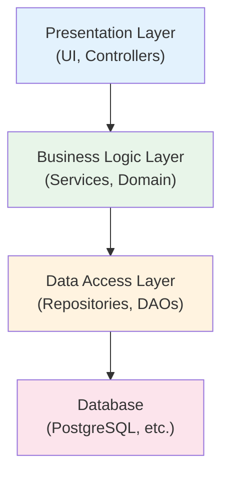
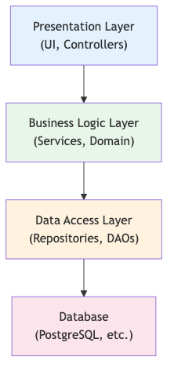
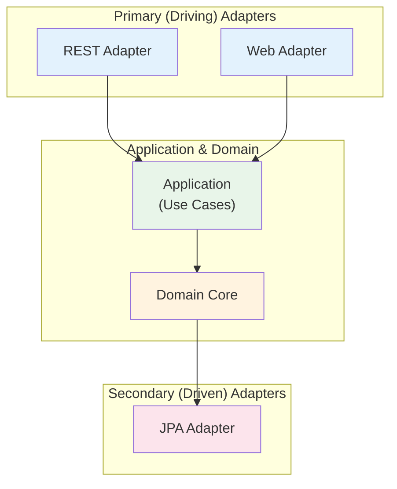
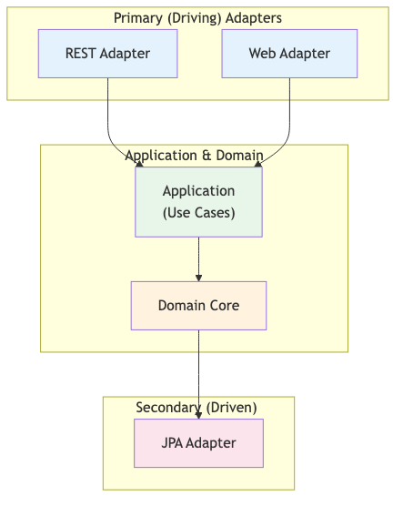
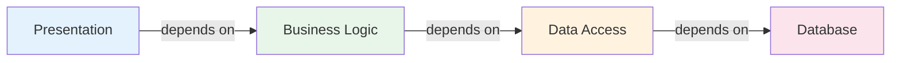
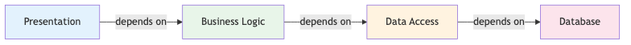
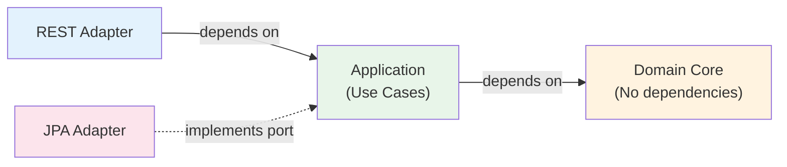
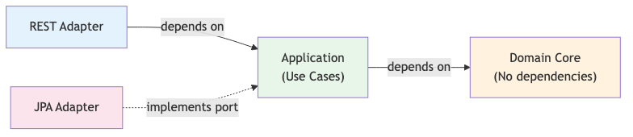
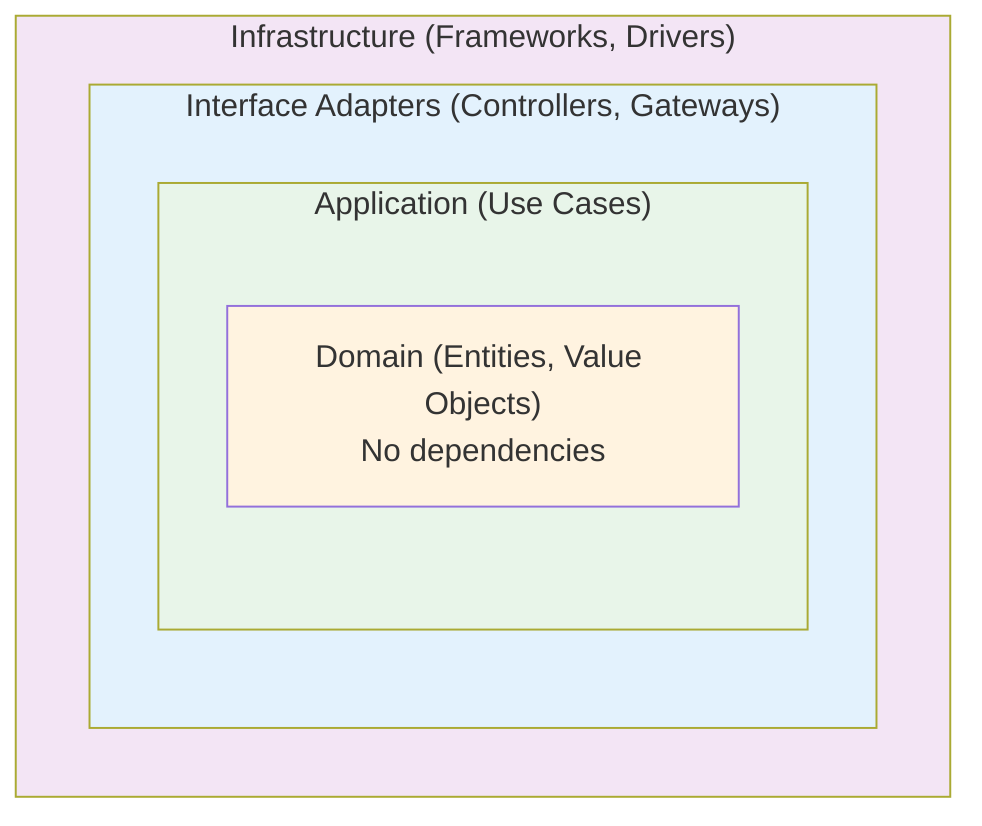
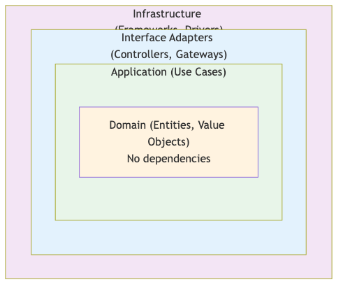

<!-- © Copyright 2026 Olivier Planson. All rights reserved. Reproduction prohibited. Made with IBM Bob. -->


# Lecture 7: Hexagonal Architecture
## Ports and Adapters for Clean, Testable Applications

**Duration:** 3 hours  
**Instructor:** Olivier Planson  
**Date:** January 2026  
**Course:** Jakarta EE, MicroProfile and Microservices

---

## 📋 Learning Objectives

By the end of this lecture, you will be able to:

| | |
| --- | --- |
| ✅ | Understand hexagonal architecture principles and benefits |
| ✅ | Apply the Ports and Adapters pattern |
| ✅ | Implement Dependency Inversion Principle (DIP) |
| ✅ | Design clean architecture with proper layer separation |
| ✅ | Create testable applications with mock adapters |
| ✅ | Refactor DDD code to hexagonal architecture |

---

## 🎯 What is Hexagonal Architecture?

**Hexagonal Architecture** (also known as **Ports and Adapters**) is an architectural pattern that aims to create loosely coupled application components that can be easily connected to their software environment through ports and adapters.

### Core Philosophy:
- **Domain logic is independent** of external concerns
- **Technology decisions are deferred** to the edges
- **Business rules don't depend** on frameworks or databases
- **Testing is easier** with mock adapters

### Key Benefits:
- **Testability:** Easy to test business logic in isolation
- **Flexibility:** Swap implementations without changing core logic
- **Maintainability:** Clear separation of concerns
- **Technology independence:** Not tied to specific frameworks

---

## 🏛️ Architecture Evolution

### Traditional Layered Architecture
<details>
<summary>📝 Original Mermaid Code (click to expand)</summary>



</details>




**Problem:** Dependencies flow downward, making business logic depend on infrastructure.

---

## 🔄 Dependency Inversion Principle (DIP)

**Traditional Dependency:**
```java
// Business logic depends on infrastructure
public class AccountService {
    private AccountRepository repository;  // Concrete class
    
    public void transfer(Long from, Long to, BigDecimal amount) {
        Account source = repository.findById(from);  // Depends on DB
        Account target = repository.findById(to);
        // Business logic...
    }
}
```

**Problem:** Business logic is tightly coupled to database implementation.

---

## 🔄 Dependency Inversion Principle (DIP)

**Inverted Dependency:**
```java
// Business logic defines interface (port)
public interface AccountPort {
    Account findById(Long id);
    void save(Account account);
}

// Business logic depends on abstraction
public class TransferUseCase {
    private AccountPort accountPort;  // Interface, not implementation
    
    public void execute(Long from, Long to, BigDecimal amount) {
        Account source = accountPort.findById(from);  // No DB dependency
        Account target = accountPort.findById(to);
        // Business logic...
    }
}
```

**Solution:** Infrastructure implements business-defined interfaces.

---

## 🏗️ Hexagonal Architecture Structure

<details>
<summary>📝 Original Mermaid Code (click to expand)</summary>



</details>




---

## 🔌 Ports and Adapters Explained

### Ports (Interfaces)
**Ports** are the application's boundary - they define how the outside world can interact with the application.

**Two types:**
1. **Primary (Driving) Ports:** How external actors use the application
   - Example: `AccountManagementUseCase` interface
   
2. **Secondary (Driven) Ports:** How the application uses external services
   - Example: `AccountRepository` interface

---

## 🔌 Ports and Adapters Explained

### Adapters (Implementations)
**Adapters** are concrete implementations that connect ports to the real world.

**Two types:**
1. **Primary (Driving) Adapters:** Receive requests from outside
   - REST API adapter
   - Web UI adapter
   - CLI adapter
   
2. **Secondary (Driven) Adapters:** Implement infrastructure concerns
   - JPA database adapter
   - File system adapter
   - External API adapter

---

## 📦 Hexagonal Architecture Layers

### 1. Domain Layer (Center)
**Pure business logic, no dependencies:**
```java
// Domain entities and value objects
public class Account {
    private AccountNumber accountNumber;
    private Money balance;
    
    public void deposit(Money amount) {
        // Pure business logic
        if (amount.isNegative()) {
            throw new IllegalArgumentException("Amount must be positive");
        }
        this.balance = this.balance.add(amount);
    }
}
```

**No imports from:** Jakarta EE, JPA, JAX-RS, or any framework

---

## 📦 Hexagonal Architecture Layers

### 2. Application Layer (Use Cases)
**Orchestrates domain objects, defines ports:**
```java
// Use case with port dependencies
public class DepositMoneyUseCase {
    private final AccountPort accountPort;  // Secondary port
    
    public void execute(DepositCommand command) {
        Account account = accountPort.findByNumber(command.accountNumber());
        account.deposit(command.amount());
        accountPort.save(account);
    }
}

// Secondary port (defined by application)
public interface AccountPort {
    Account findByNumber(AccountNumber number);
    void save(Account account);
}
```

---

## 📦 Hexagonal Architecture Layers

### 3. Infrastructure Layer (Adapters)
**Implements ports, handles technical concerns:**
```java
// Secondary adapter (implements port)
@ApplicationScoped
public class JpaAccountAdapter implements AccountPort {
    @PersistenceContext
    private EntityManager em;
    
    @Override
    public Account findByNumber(AccountNumber number) {
        AccountEntity entity = em.createQuery(
            "SELECT a FROM AccountEntity a WHERE a.number = :number",
            AccountEntity.class)
            .setParameter("number", number.getValue())
            .getSingleResult();
        return AccountMapper.toDomain(entity);
    }
}
```

---

## 🎯 Primary vs Secondary Ports

### Primary Ports (Driving)
**Application exposes functionality:**
```java
// Primary port - defines what application can do
public interface AccountManagementUseCase {
    void openAccount(OpenAccountCommand command);
    void closeAccount(CloseAccountCommand command);
    AccountDTO getAccountDetails(AccountNumber number);
}

// Primary adapter - REST API
@Path("/api/accounts")
public class AccountResource {
    @Inject
    private AccountManagementUseCase useCase;  // Uses primary port
    
    @POST
    public Response openAccount(OpenAccountRequest request) {
        useCase.openAccount(toCommand(request));
        return Response.ok().build();
    }
}
```

---

## 🎯 Primary vs Secondary Ports

### Secondary Ports (Driven)
**Application needs external services:**
```java
// Secondary port - defines what application needs
public interface AccountRepository {
    Account findById(Long id);
    void save(Account account);
    List<Account> findByClientId(Long clientId);
}

// Secondary adapter - JPA implementation
@ApplicationScoped
public class JpaAccountRepository implements AccountRepository {
    @PersistenceContext
    private EntityManager em;
    
    @Override
    public Account findById(Long id) {
        AccountEntity entity = em.find(AccountEntity.class, id);
        return AccountMapper.toDomain(entity);
    }
}
```

---

## 🏗️ Package Structure

### Hexagonal Architecture Packages
```
com.bank/
├── domain/                          # Domain Layer (no dependencies)
│   ├── model/
│   │   ├── Account.java            # Aggregate root
│   │   └── Client.java             # Aggregate root
│   ├── valueobject/
│   │   ├── Money.java              # Value object
│   │   ├── AccountNumber.java      # Value object
│   │   └── Email.java              # Value object
│   └── service/
│       └── TransferService.java    # Domain service
│
├── application/                     # Application Layer (use cases)
│   ├── port/
│   │   ├── in/                     # Primary ports (driving)
│   │   │   ├── AccountManagementUseCase.java
│   │   │   └── ClientManagementUseCase.java
│   │   └── out/                    # Secondary ports (driven)
│   │       ├── AccountRepository.java
│   │       └── ClientRepository.java
│   ├── usecase/
│   │   ├── OpenAccountUseCase.java
│   │   ├── DepositMoneyUseCase.java
│   │   └── TransferMoneyUseCase.java
│   └── dto/
│       ├── AccountDTO.java
│       └── ClientDTO.java
│
└── infrastructure/                  # Infrastructure Layer (adapters)
    ├── adapter/
    │   ├── in/                     # Primary adapters (driving)
    │   │   ├── rest/
    │   │   │   ├── AccountResource.java
    │   │   │   └── ClientResource.java
    │   │   └── web/
    │   │       ├── AccountController.java
    │   │       └── ClientController.java
    │   └── out/                    # Secondary adapters (driven)
    │       ├── persistence/
    │       │   ├── JpaAccountRepository.java
    │       │   ├── JpaClientRepository.java
    │       │   ├── entity/
    │       │   │   ├── AccountEntity.java
    │       │   │   └── ClientEntity.java
    │       │   └── mapper/
    │       │       ├── AccountMapper.java
    │       │       └── ClientMapper.java
    │       └── event/
    │           └── EventPublisherAdapter.java
    └── config/
        └── CDIConfiguration.java
```

---

## 🔄 Dependency Flow

### Traditional Layered Architecture
<details>
<summary>📝 Original Mermaid Code (click to expand)</summary>



</details>




**Problem:** Business logic depends on infrastructure

---

## 🔄 Dependency Flow

### Hexagonal Architecture
<details>
<summary>📝 Original Mermaid Code (click to expand)</summary>



</details>




**Solution:** All dependencies point inward toward domain

---

## 💡 Dependency Inversion in Practice

### Before (Traditional)
```java
// Service depends on concrete repository
public class AccountService {
    private JpaAccountRepository repository;  // Concrete class
    
    public AccountService() {
        this.repository = new JpaAccountRepository();  // Tight coupling
    }
    
    public Account getAccount(Long id) {
        return repository.findById(id);  // Depends on JPA
    }
}
```

**Problems:**
- Cannot test without database
- Cannot swap implementations
- Business logic tied to JPA

---

## 💡 Dependency Inversion in Practice

### After (Hexagonal)
```java
// Use case depends on port (interface)
public class GetAccountUseCase {
    private final AccountRepository repository;  // Interface (port)
    
    @Inject
    public GetAccountUseCase(AccountRepository repository) {
        this.repository = repository;  // Injected
    }
    
    public AccountDTO execute(Long id) {
        Account account = repository.findById(id);  // No JPA dependency
        return AccountMapper.toDTO(account);
    }
}

// Port defined by application
public interface AccountRepository {
    Account findById(Long id);
}

// Adapter implements port
@ApplicationScoped
public class JpaAccountRepository implements AccountRepository {
    @PersistenceContext
    private EntityManager em;
    
    @Override
    public Account findById(Long id) {
        // JPA implementation details
    }
}
```

---

## 🧪 Testing Benefits

### Testing with Traditional Architecture
```java
@Test
public void testTransfer() {
    // Need real database
    EntityManager em = createEntityManager();
    AccountService service = new AccountService(em);
    
    // Complex setup
    setupDatabase();
    Account source = createTestAccount();
    Account target = createTestAccount();
    
    // Test
    service.transfer(source.getId(), target.getId(), 100.0);
    
    // Cleanup
    cleanupDatabase();
}
```

**Problems:** Slow, complex, requires database

---

## 🧪 Testing Benefits

### Testing with Hexagonal Architecture
```java
@Test
public void testTransfer() {
    // Mock adapter (no database needed)
    AccountRepository mockRepo = new InMemoryAccountRepository();
    TransferMoneyUseCase useCase = new TransferMoneyUseCase(mockRepo);
    
    // Simple setup
    Account source = new Account(new Money(1000));
    Account target = new Account(new Money(500));
    mockRepo.save(source);
    mockRepo.save(target);
    
    // Test
    useCase.execute(new TransferCommand(source.getId(), target.getId(), 100));
    
    // Verify
    assertEquals(900, source.getBalance().getAmount());
    assertEquals(600, target.getBalance().getAmount());
}
```

**Benefits:** Fast, simple, no infrastructure needed

---

## 🔧 Implementing Primary Ports

### Step 1: Define Use Case Interface (Primary Port)
```java
// Primary port - what application can do
public interface AccountManagementUseCase {
    AccountDTO openAccount(OpenAccountCommand command);
    void closeAccount(Long accountId);
    AccountDTO getAccount(Long accountId);
    List<AccountDTO> getClientAccounts(Long clientId);
}

// Command object
public record OpenAccountCommand(
    Long clientId,
    String accountNumber,
    String accountType,
    BigDecimal initialDeposit
) {}
```

---

## 🔧 Implementing Primary Ports

### Step 2: Implement Use Case
```java
@ApplicationScoped
public class AccountManagementService implements AccountManagementUseCase {
    private final AccountRepository accountRepository;  // Secondary port
    private final ClientRepository clientRepository;    // Secondary port
    
    @Inject
    public AccountManagementService(
        AccountRepository accountRepository,
        ClientRepository clientRepository
    ) {
        this.accountRepository = accountRepository;
        this.clientRepository = clientRepository;
    }
    
    @Override
    @Transactional
    public AccountDTO openAccount(OpenAccountCommand command) {
        Client client = clientRepository.findById(command.clientId())
            .orElseThrow(() -> new ClientNotFoundException(command.clientId()));
        
        Account account = Account.open(
            AccountNumber.of(command.accountNumber()),
            Money.of(command.initialDeposit(), "EUR"),
            AccountType.valueOf(command.accountType()),
            client
        );
        
        accountRepository.save(account);
        return AccountMapper.toDTO(account);
    }
}
```

---

## 🔧 Implementing Primary Adapters

### Step 3: Create REST Adapter (Primary Adapter)
```java
@Path("/api/v2/accounts")
@ApplicationScoped
public class AccountResource {
    private final AccountManagementUseCase useCase;  // Primary port
    
    @Inject
    public AccountResource(AccountManagementUseCase useCase) {
        this.useCase = useCase;
    }
    
    @POST
    @Consumes(MediaType.APPLICATION_JSON)
    @Produces(MediaType.APPLICATION_JSON)
    public Response openAccount(OpenAccountRequest request) {
        OpenAccountCommand command = new OpenAccountCommand(
            request.clientId(),
            request.accountNumber(),
            request.accountType(),
            request.initialDeposit()
        );
        
        AccountDTO account = useCase.openAccount(command);
        return Response.status(Response.Status.CREATED)
            .entity(account)
            .build();
    }
}
```

---

## 🔧 Implementing Secondary Ports

### Step 1: Define Repository Interface (Secondary Port)
```java
// Secondary port - what application needs
public interface AccountRepository {
    Optional<Account> findById(Long id);
    Optional<Account> findByNumber(AccountNumber number);
    List<Account> findByClientId(Long clientId);
    void save(Account account);
    void delete(Account account);
}
```

**Key Points:**
- Defined in **application layer**
- Uses **domain objects** (Account, AccountNumber)
- No infrastructure concerns (no JPA, no SQL)

---

## 🔧 Implementing Secondary Adapters

### Step 2: Create JPA Adapter (Secondary Adapter)
```java
@ApplicationScoped
public class JpaAccountRepository implements AccountRepository {
    @PersistenceContext
    private EntityManager em;
    
    @Override
    public Optional<Account> findById(Long id) {
        AccountEntity entity = em.find(AccountEntity.class, id);
        return Optional.ofNullable(entity)
            .map(AccountMapper::toDomain);
    }
    
    @Override
    public void save(Account account) {
        AccountEntity entity = AccountMapper.toEntity(account);
        if (entity.getId() == null) {
            em.persist(entity);
        } else {
            em.merge(entity);
        }
    }
}
```

---

## 🗺️ Domain-Infrastructure Mapping

### Domain Model (Pure Business Logic)
```java
// Domain entity - no JPA annotations
public class Account {
    private Long id;
    private AccountNumber accountNumber;
    private Money balance;
    private AccountType type;
    private Client client;
    
    public void deposit(Money amount) {
        if (amount.isNegative()) {
            throw new IllegalArgumentException("Amount must be positive");
        }
        this.balance = this.balance.add(amount);
    }
}
```

---

## 🗺️ Domain-Infrastructure Mapping

### Infrastructure Entity (JPA Mapping)
```java
// Infrastructure entity - JPA annotations
@Entity
@Table(name = "accounts")
public class AccountEntity {
    @Id
    @GeneratedValue(strategy = GenerationType.IDENTITY)
    private Long id;
    
    @Column(name = "account_number", unique = true)
    private String accountNumber;
    
    @Column(name = "balance")
    private BigDecimal balance;
    
    @Column(name = "currency")
    private String currency;
    
    @Enumerated(EnumType.STRING)
    @Column(name = "type")
    private AccountTypeEnum type;
    
    @ManyToOne(fetch = FetchType.LAZY)
    @JoinColumn(name = "client_id")
    private ClientEntity client;
    
    // Getters and setters
}
```

---

## 🗺️ Domain-Infrastructure Mapping

### Mapper (Bidirectional Conversion)
```java
public class AccountMapper {
    public static Account toDomain(AccountEntity entity) {
        if (entity == null) return null;
        
        return new Account(
            entity.getId(),
            AccountNumber.of(entity.getAccountNumber()),
            Money.of(entity.getBalance(), entity.getCurrency()),
            AccountType.valueOf(entity.getType().name()),
            ClientMapper.toDomain(entity.getClient())
        );
    }
    
    public static AccountEntity toEntity(Account domain) {
        if (domain == null) return null;
        
        AccountEntity entity = new AccountEntity();
        entity.setId(domain.getId());
        entity.setAccountNumber(domain.getAccountNumber().getValue());
        entity.setBalance(domain.getBalance().getAmount());
        entity.setCurrency(domain.getBalance().getCurrency());
        entity.setType(AccountTypeEnum.valueOf(domain.getType().name()));
        entity.setClient(ClientMapper.toEntity(domain.getClient()));
        return entity;
    }
}
```

---

## 🎭 Multiple Adapters for Same Port

### Same Use Case, Different Adapters
```java
// Primary port (use case interface)
public interface AccountManagementUseCase {
    AccountDTO getAccount(Long id);
}

// REST Adapter
@Path("/api/accounts")
public class AccountRestAdapter {
    @Inject
    private AccountManagementUseCase useCase;
    
    @GET
    @Path("/{id}")
    public Response getAccount(@PathParam("id") Long id) {
        return Response.ok(useCase.getAccount(id)).build();
    }
}

// Web Adapter
@WebServlet("/accounts")
public class AccountWebAdapter extends HttpServlet {
    @Inject
    private AccountManagementUseCase useCase;
    
    protected void doGet(HttpServletRequest req, HttpServletResponse resp) {
        Long id = Long.parseLong(req.getParameter("id"));
        AccountDTO account = useCase.getAccount(id);
        req.setAttribute("account", account);
        req.getRequestDispatcher("/WEB-INF/views/account.jsp").forward(req, resp);
    }
}
```

---

## 🎭 Multiple Adapters for Same Port

### Same Port, Different Implementations
```java
// Secondary port
public interface AccountRepository {
    Account findById(Long id);
}

// JPA Adapter (Production)
@ApplicationScoped
@Default
public class JpaAccountRepository implements AccountRepository {
    @PersistenceContext
    private EntityManager em;
    
    public Account findById(Long id) {
        // JPA implementation
    }
}

// In-Memory Adapter (Testing)
@ApplicationScoped
@Alternative
public class InMemoryAccountRepository implements AccountRepository {
    private Map<Long, Account> accounts = new HashMap<>();
    
    public Account findById(Long id) {
        return accounts.get(id);
    }
}
```

---

## 🧩 Clean Architecture Principles

### The Dependency Rule
**Dependencies must point inward:**

<details>
<summary>📝 Original Mermaid Code (click to expand)</summary>



</details>




**Rule:** Inner layers know nothing about outer layers

---

## 🧩 Clean Architecture Principles

### Layer Responsibilities

| Layer | Responsibility | Dependencies |
|-------|---------------|--------------|
| **Domain** | Business rules, entities, value objects | None |
| **Application** | Use cases, orchestration, ports | Domain only |
| **Infrastructure** | Adapters, frameworks, databases | Application + Domain |

### Key Principles:
1. **Independent of frameworks:** Business logic doesn't depend on Spring, Jakarta EE, etc.
2. **Testable:** Business rules can be tested without UI, database, or external services
3. **Independent of UI:** UI can change without changing business rules
4. **Independent of database:** Can swap Oracle for PostgreSQL without changing business rules
5. **Independent of external agencies:** Business rules don't know about external services

---

## 🔄 Refactoring from DDD to Hexagonal

### Lab 06 (DDD) Structure
```
com.bank/
├── domain/
│   ├── model/              # Entities with JPA annotations
│   ├── valueobject/        # Value objects
│   ├── service/            # Domain services
│   └── event/              # Domain events
├── application/
│   └── dto/                # DTOs
├── service/                # Application services (mixed concerns)
├── api/                    # REST resources
└── web/                    # Web controllers
```

**Issues:**
- Domain entities have JPA annotations
- Services mix use cases with infrastructure
- No clear ports/adapters separation

---

## 🔄 Refactoring from DDD to Hexagonal

### Lab 07 (Hexagonal) Structure
```
com.bank/
├── domain/                 # Pure domain (no annotations)
│   ├── model/
│   ├── valueobject/
│   └── service/
├── application/            # Use cases and ports
│   ├── port/
│   │   ├── in/            # Primary ports
│   │   └── out/           # Secondary ports
│   ├── usecase/           # Use case implementations
│   └── dto/
└── infrastructure/         # All technical concerns
    └── adapter/
        ├── in/            # Primary adapters (REST, Web)
        └── out/           # Secondary adapters (JPA, Events)
```

**Benefits:**
- Clean domain model
- Explicit ports and adapters
- Easy to test and swap implementations

---

## 🔄 Refactoring Steps

### Step 1: Extract Ports from Services
**Before (Lab 06):**
```java
@ApplicationScoped
public class AccountService {
    @PersistenceContext
    private EntityManager em;
    
    @Transactional
    public void deposit(Long accountId, BigDecimal amount) {
        Account account = em.find(Account.class, accountId);
        account.deposit(new Money(amount));
        em.merge(account);
    }
}
```

---

## 🔄 Refactoring Steps

### Step 1: Extract Ports from Services
**After (Lab 07):**
```java
// Primary port
public interface DepositMoneyUseCase {
    void execute(DepositCommand command);
}

// Use case implementation
@ApplicationScoped
public class DepositMoneyService implements DepositMoneyUseCase {
    private final AccountRepository accountRepository;  // Secondary port
    
    @Inject
    public DepositMoneyService(AccountRepository accountRepository) {
        this.accountRepository = accountRepository;
    }
    
    @Override
    @Transactional
    public void execute(DepositCommand command) {
        Account account = accountRepository.findById(command.accountId())
            .orElseThrow(() -> new AccountNotFoundException(command.accountId()));
        account.deposit(command.amount());
        accountRepository.save(account);
    }
}
```

---

## 🔄 Refactoring Steps

### Step 2: Separate Domain from Infrastructure
**Before (Lab 06):**
```java
@Entity
@Table(name = "accounts")
public class Account {  // Domain entity with JPA
    @Id
    @GeneratedValue(strategy = GenerationType.IDENTITY)
    private Long id;
    
    @Column(name = "balance")
    private BigDecimal balance;
    
    public void deposit(Money amount) {
        this.balance = this.balance.add(amount.getAmount());
    }
}
```

---

## 🔄 Refactoring Steps

### Step 2: Separate Domain from Infrastructure
**After (Lab 07):**
```java
// Pure domain entity (no JPA)
public class Account {
    private Long id;
    private Money balance;
    
    public void deposit(Money amount) {
        this.balance = this.balance.add(amount);
    }
}

// Infrastructure entity (JPA)
@Entity
@Table(name = "accounts")
public class AccountEntity {
    @Id
    @GeneratedValue(strategy = GenerationType.IDENTITY)
    private Long id;
    
    @Column(name = "balance")
    private BigDecimal balance;
    
    @Column(name = "currency")
    private String currency;
}

// Mapper
public class AccountMapper {
    public static Account toDomain(AccountEntity entity) { /* ... */ }
    public static AccountEntity toEntity(Account domain) { /* ... */ }
}
```

---

## 🔄 Refactoring Steps

### Step 3: Create Adapters
**Before (Lab 06):**
```java
@Path("/api/accounts")
public class AccountResource {
    @Inject
    private AccountService service;  // Direct service dependency
    
    @POST
    @Path("/{id}/deposit")
    public Response deposit(@PathParam("id") Long id, DepositRequest request) {
        service.deposit(id, request.amount());
        return Response.ok().build();
    }
}
```

---

## 🔄 Refactoring Steps

### Step 3: Create Adapters
**After (Lab 07):**
```java
// Primary adapter (REST)
@Path("/api/v2/accounts")
@ApplicationScoped
public class AccountRestAdapter {
    private final DepositMoneyUseCase depositUseCase;  // Port dependency
    
    @Inject
    public AccountRestAdapter(DepositMoneyUseCase depositUseCase) {
        this.depositUseCase = depositUseCase;
    }
    
    @POST
    @Path("/{id}/deposit")
    public Response deposit(@PathParam("id") Long id, DepositRequest request) {
        DepositCommand command = new DepositCommand(id, new Money(request.amount()));
        depositUseCase.execute(command);
        return Response.ok().build();
    }
}

// Secondary adapter (JPA)
@ApplicationScoped
public class JpaAccountAdapter implements AccountRepository {
    @PersistenceContext
    private EntityManager em;
    
    @Override
    public Optional<Account> findById(Long id) {
        AccountEntity entity = em.find(AccountEntity.class, id);
        return Optional.ofNullable(entity).map(AccountMapper::toDomain);
    }
}
```

---

## 🧪 Testing Strategies

### Unit Testing Domain Logic
```java
@Test
public void testAccountDeposit() {
    // No mocks needed - pure domain logic
    Account account = Account.open(
        AccountNumber.generate(),
        Money.of(BigDecimal.valueOf(1000), "EUR"),
        AccountType.CHECKING,
        client
    );
    
    account.deposit(Money.of(BigDecimal.valueOf(500), "EUR"));
    
    assertEquals(BigDecimal.valueOf(1500), account.getBalance().getAmount());
}

@Test
public void testAccountDepositNegativeAmount() {
    Account account = Account.open(
        AccountNumber.generate(),
        Money.of(BigDecimal.valueOf(1000), "EUR"),
        AccountType.CHECKING,
        client
    );
    
    // Money.of rejects negative amounts at construction
    assertThrows(IllegalArgumentException.class, () -> {
        account.deposit(Money.of(BigDecimal.valueOf(-100), "EUR"));
    });
}
```

---

## 🧪 Testing Strategies

### Integration Testing Use Cases
```java
@Test
public void testDepositMoneyUseCase() {
    // Mock secondary port
    AccountRepository mockRepo = mock(AccountRepository.class);
    Account account = new Account(new Money(1000));
    when(mockRepo.findById(1L)).thenReturn(Optional.of(account));
    
    // Test use case
    DepositMoneyUseCase useCase = new DepositMoneyService(mockRepo);
    useCase.execute(new DepositCommand(1L, new Money(500)));
    
    // Verify
    verify(mockRepo).save(account);
    assertEquals(1500, account.getBalance().getAmount().intValue());
}
```

---

## 🧪 Testing Strategies

### Testing with In-Memory Adapter
```java
// In-memory adapter for testing
public class InMemoryAccountRepository implements AccountRepository {
    private Map<Long, Account> accounts = new HashMap<>();
    private AtomicLong idGenerator = new AtomicLong(1);
    
    @Override
    public Optional<Account> findById(Long id) {
        return Optional.ofNullable(accounts.get(id));
    }
    
    @Override
    public void save(Account account) {
        if (account.getId() == null) {
            account.setId(idGenerator.getAndIncrement());
        }
        accounts.put(account.getId(), account);
    }
}

@Test
public void testTransferWithInMemoryRepo() {
    AccountRepository repo = new InMemoryAccountRepository();
    TransferMoneyUseCase useCase = new TransferMoneyService(repo);
    
    // Create test accounts
    Account source = new Account(new Money(1000));
    Account target = new Account(new Money(500));
    repo.save(source);
    repo.save(target);
    
    // Execute transfer
    useCase.execute(new TransferCommand(source.getId(), target.getId(), 200));
    
    // Verify
    assertEquals(800, repo.findById(source.getId()).get().getBalance().getAmount().intValue());
    assertEquals(700, repo.findById(target.getId()).get().getBalance().getAmount().intValue());
}
```

---

## 🎯 Benefits of Hexagonal Architecture

### 1. Testability
- **Unit tests:** Test domain logic without any infrastructure
- **Integration tests:** Test use cases with mock adapters
- **Fast tests:** No database, no server, no external services

### 2. Flexibility
- **Swap implementations:** Change database without changing business logic
- **Multiple interfaces:** REST API, Web UI, CLI - all use same use cases
- **Technology independence:** Not tied to specific frameworks

### 3. Maintainability
- **Clear boundaries:** Each layer has specific responsibility
- **Separation of concerns:** Business logic separate from technical details
- **Easy to understand:** Dependencies flow in one direction

---

## 🎯 Benefits of Hexagonal Architecture

### 4. Evolvability
- **Add new features:** Create new use cases without changing existing code
- **Change technology:** Swap JPA for MongoDB without touching domain
- **Refactor safely:** Changes in one layer don't affect others

### 5. Team Collaboration
- **Parallel development:** Teams can work on different adapters simultaneously
- **Clear contracts:** Ports define explicit interfaces
- **Reduced conflicts:** Changes in infrastructure don't affect domain

---

## ⚠️ Common Pitfalls

### 1. Leaking Infrastructure into Domain
**❌ Wrong:**
```java
// Domain entity with JPA annotations
@Entity
public class Account {
    @Id
    private Long id;
    
    @Column(name = "balance")
    private BigDecimal balance;
}
```

**✅ Correct:**
```java
// Pure domain entity
public class Account {
    private Long id;
    private Money balance;
}

// Separate infrastructure entity
@Entity
public class AccountEntity {
    @Id
    private Long id;
    
    @Column(name = "balance")
    private BigDecimal balance;
}
```

---

## ⚠️ Common Pitfalls

### 2. Use Cases Depending on Concrete Adapters
**❌ Wrong:**
```java
public class DepositMoneyUseCase {
    private JpaAccountRepository repository;  // Concrete adapter
}
```

**✅ Correct:**
```java
public class DepositMoneyUseCase {
    private AccountRepository repository;  // Port (interface)
}
```

---

## ⚠️ Common Pitfalls

### 3. Anemic Domain Model
**❌ Wrong:**
```java
public class Account {
    private Money balance;
    
    // Only getters and setters
    public Money getBalance() { return balance; }
    public void setBalance(Money balance) { this.balance = balance; }
}

// Business logic in use case
public class DepositMoneyUseCase {
    public void execute(DepositCommand command) {
        Account account = repository.findById(command.accountId());
        Money newBalance = account.getBalance().add(command.amount());
        account.setBalance(newBalance);  // Logic outside domain
        repository.save(account);
    }
}
```

---

## ⚠️ Common Pitfalls

### 3. Anemic Domain Model
**✅ Correct:**
```java
public class Account {
    private Money balance;
    
    // Business logic in domain
    public void deposit(Money amount) {
        if (amount.isNegative()) {
            throw new IllegalArgumentException("Amount must be positive");
        }
        this.balance = this.balance.add(amount);
    }
}

// Use case orchestrates
public class DepositMoneyUseCase {
    public void execute(DepositCommand command) {
        Account account = repository.findById(command.accountId());
        account.deposit(command.amount());  // Domain handles logic
        repository.save(account);
    }
}
```

---

## ⚠️ Common Pitfalls

### 4. Over-Engineering
**❌ Wrong:**
```java
// Too many layers for simple CRUD
public interface GetAccountPort { }
public interface GetAccountInputPort { }
public interface GetAccountOutputPort { }
public class GetAccountInputAdapter { }
public class GetAccountOutputAdapter { }
public class GetAccountUseCase { }
```

**✅ Correct:**
```java
// Appropriate abstraction
public interface AccountManagementUseCase {
    AccountDTO getAccount(Long id);
}

public interface AccountRepository {
    Optional<Account> findById(Long id);
}
```

**Rule:** Use hexagonal architecture when you need flexibility, not for every simple CRUD operation.

---

## 🏦 Banking Application Example

### Use Case: Transfer Money

**Domain Layer:**
```java
// Pure business logic
public class Account {
    private Money balance;
    
    public void withdraw(Money amount) {
        if (balance.isLessThan(amount)) {
            throw new InsufficientFundsException();
        }
        this.balance = this.balance.subtract(amount);
    }
    
    public void deposit(Money amount) {
        this.balance = this.balance.add(amount);
    }
}
```

---

## 🏦 Banking Application Example

### Use Case: Transfer Money

**Application Layer:**
```java
// Primary port
public interface TransferMoneyUseCase {
    void execute(TransferCommand command);
}

// Use case implementation
@ApplicationScoped
public class TransferMoneyService implements TransferMoneyUseCase {
    private final AccountRepository accountRepository;  // Secondary port
    private final EventPublisher eventPublisher;        // Secondary port
    
    @Inject
    public TransferMoneyService(
        AccountRepository accountRepository,
        EventPublisher eventPublisher
    ) {
        this.accountRepository = accountRepository;
        this.eventPublisher = eventPublisher;
    }
    
    @Override
    @Transactional
    public void execute(TransferCommand command) {
        Account source = accountRepository.findById(command.sourceId())
            .orElseThrow(() -> new AccountNotFoundException(command.sourceId()));
        Account target = accountRepository.findById(command.targetId())
            .orElseThrow(() -> new AccountNotFoundException(command.targetId()));
        
        source.withdraw(command.amount());
        target.deposit(command.amount());
        
        accountRepository.save(source);
        accountRepository.save(target);
        
        eventPublisher.publish(new MoneyTransferredEvent(
            command.sourceId(), command.targetId(), command.amount()
        ));
    }
}
```

---

## 🏦 Banking Application Example

### Use Case: Transfer Money

**Infrastructure Layer - REST Adapter:**
```java
@Path("/api/v2/transfers")
@ApplicationScoped
public class TransferRestAdapter {
    private final TransferMoneyUseCase transferUseCase;
    
    @Inject
    public TransferRestAdapter(TransferMoneyUseCase transferUseCase) {
        this.transferUseCase = transferUseCase;
    }
    
    @POST
    @Consumes(MediaType.APPLICATION_JSON)
    public Response transfer(TransferRequest request) {
        TransferCommand command = new TransferCommand(
            request.sourceAccountId(),
            request.targetAccountId(),
            new Money(request.amount(), request.currency())
        );
        
        transferUseCase.execute(command);
        
        return Response.ok().build();
    }
}
```

---

## 🏦 Banking Application Example

### Use Case: Transfer Money

**Infrastructure Layer - JPA Adapter:**
```java
@ApplicationScoped
public class JpaAccountAdapter implements AccountRepository {
    @PersistenceContext
    private EntityManager em;
    
    @Override
    public Optional<Account> findById(Long id) {
        AccountEntity entity = em.find(AccountEntity.class, id);
        return Optional.ofNullable(entity)
            .map(AccountMapper::toDomain);
    }
    
    @Override
    public void save(Account account) {
        AccountEntity entity = AccountMapper.toEntity(account);
        if (entity.getId() == null) {
            em.persist(entity);
        } else {
            em.merge(entity);
        }
    }
}
```

---

## 🏦 Banking Application Example

### Use Case: Transfer Money

**Infrastructure Layer - Event Publisher Adapter:**
```java
@ApplicationScoped
public class CDIEventPublisherAdapter implements EventPublisher {
    @Inject
    private Event<DomainEvent> event;
    
    @Override
    public void publish(DomainEvent domainEvent) {
        event.fire(domainEvent);
    }
}

// Event observer
@ApplicationScoped
public class TransferEventObserver {
    public void onMoneyTransferred(@Observes MoneyTransferredEvent event) {
        System.out.println("Money transferred: " + event.amount() + 
            " from " + event.sourceId() + " to " + event.targetId());
    }
}
```

---

## 📊 Comparison: Traditional vs Hexagonal

| Aspect | Traditional Layered | Hexagonal Architecture |
|--------|-------------------|----------------------|
| **Dependencies** | Downward (UI → Business → Data) | Inward (All → Domain) |
| **Domain Purity** | Mixed with infrastructure | Pure, no dependencies |
| **Testability** | Requires infrastructure | Easy with mocks |
| **Flexibility** | Hard to change technology | Easy to swap adapters |
| **Complexity** | Simpler for small apps | More structure needed |
| **Team Work** | Sequential development | Parallel development |
| **Learning Curve** | Easier to start | Steeper initially |

---

## 🎓 When to Use Hexagonal Architecture

### ✅ Good Fit:
- **Complex business logic** that needs to be tested independently
- **Multiple interfaces** (REST API, Web UI, CLI, etc.)
- **Long-lived applications** that will evolve over time
- **Team collaboration** with multiple developers
- **Technology uncertainty** - might change database or framework
- **Domain-driven design** - rich domain model

### ❌ Not Necessary:
- **Simple CRUD applications** with minimal business logic
- **Prototypes** or short-lived projects
- **Single interface** that won't change
- **Small team** with simple requirements
- **Tight deadlines** where simplicity is priority

---

## 🔄 Migration Strategy

### Incremental Refactoring
**Don't rewrite everything at once!**

1. **Start with new features:** Implement new use cases with hexagonal architecture
2. **Extract ports:** Identify interfaces in existing code
3. **Create adapters:** Wrap existing infrastructure code
4. **Move business logic:** Gradually move logic from services to domain
5. **Remove dependencies:** Clean up infrastructure dependencies from domain
6. **Add tests:** Write tests for each refactored component

### Parallel Development
- Keep old code working while refactoring
- Use feature flags to switch between old and new implementations
- Migrate one bounded context at a time

---

## 🛠️ Tools and Frameworks

### Jakarta EE Support
- **CDI:** Dependency injection for ports and adapters
- **JAX-RS:** REST adapters
- **JPA:** Database adapters
- **Bean Validation:** Input validation in adapters

### Testing Tools
- **JUnit 5:** Unit and integration tests
- **Mockito:** Mocking secondary ports
- **Arquillian:** Integration testing with Jakarta EE
- **TestContainers:** Database testing with Docker

### Architecture Validation
- **ArchUnit:** Enforce architectural rules
- **JDepend:** Analyze dependencies
- **SonarQube:** Code quality and architecture metrics

---

## 📚 Best Practices

### 1. Keep Domain Pure
```java
// ✅ Good - Pure domain
public class Account {
    private Money balance;
    
    public void deposit(Money amount) {
        this.balance = this.balance.add(amount);
    }
}

// ❌ Bad - Infrastructure in domain
@Entity
public class Account {
    @Column(name = "balance")
    private BigDecimal balance;
    
    @Transactional
    public void deposit(BigDecimal amount) {
        this.balance = this.balance.add(amount);
    }
}
```

---

## 📚 Best Practices

### 2. Use Value Objects
```java
// ✅ Good - Type-safe value object
public class Money {
    private final BigDecimal amount;
    private final String currency;
    
    public Money add(Money other) {
        if (!this.currency.equals(other.currency)) {
            throw new IllegalArgumentException("Currency mismatch");
        }
        return new Money(this.amount.add(other.amount), this.currency);
    }
}

// ❌ Bad - Primitive obsession
public class Account {
    private BigDecimal balance;  // What currency? Can be negative?
}
```

---

## 📚 Best Practices

### 3. Define Clear Ports
```java
// ✅ Good - Clear, focused port
public interface AccountRepository {
    Optional<Account> findById(Long id);
    void save(Account account);
}

// ❌ Bad - Generic, unclear port
public interface Repository<T> {
    T find(Object id);
    void persist(T entity);
    void remove(T entity);
    List<T> findAll();
    // Too many methods, not domain-specific
}
```

---

## 📚 Best Practices

### 4. Use Commands and Queries
```java
// Commands (write operations)
public record OpenAccountCommand(
    Long clientId,
    String accountNumber,
    String accountType,
    BigDecimal initialDeposit
) {}

public record DepositCommand(
    Long accountId,
    Money amount
) {}

// Queries (read operations)
public record GetAccountQuery(Long accountId) {}
public record GetClientAccountsQuery(Long clientId) {}
```

---

## 📚 Best Practices

### 5. Separate DTOs from Domain
```java
// Domain model
public class Account {
    private AccountNumber accountNumber;
    private Money balance;
    private AccountType type;
}

// DTO for API
public record AccountDTO(
    Long id,
    String accountNumber,
    BigDecimal balance,
    String currency,
    String type
) {}

// Mapper
public class AccountMapper {
    public static AccountDTO toDTO(Account account) {
        return new AccountDTO(
            account.getId(),
            account.getAccountNumber().getValue(),
            account.getBalance().getAmount(),
            account.getBalance().getCurrency(),
            account.getType().name()
        );
    }
}
```

---

## 🎯 Lab 07 Preview

### What You'll Build
- **Refactor Lab 06** from DDD to hexagonal architecture
- **Create ports** for all use cases
- **Implement adapters** for REST, Web, and JPA
- **Separate domain** from infrastructure completely
- **Add comprehensive tests** with mock adapters
- **Maintain all features** from Lab 06

### New Package Structure
```
com.bank/
├── domain/                 # Pure domain (no dependencies)
├── application/            # Use cases and ports
│   ├── port/in/           # Primary ports
│   ├── port/out/          # Secondary ports
│   └── usecase/           # Use case implementations
└── infrastructure/         # All adapters
    └── adapter/
        ├── in/            # REST, Web adapters
        └── out/           # JPA, Event adapters
```

---

## 📖 Further Reading

### Books
- **"Hexagonal Architecture Explained"** by Juan Manuel Garrido de Paz
- **"Clean Architecture"** by Robert C. Martin
- **"Implementing Domain-Driven Design"** by Vaughn Vernon
- **"Get Your Hands Dirty on Clean Architecture"** by Tom Hombergs

### Articles
- Alistair Cockburn: "Hexagonal Architecture" (original article)
- Martin Fowler: "Ports and Adapters"
- Netflix Tech Blog: "Ready for changes with Hexagonal Architecture"

### Online Resources
- Jakarta EE Tutorial: Enterprise Application Architecture
- Baeldung: Hexagonal Architecture with Spring Boot
- DZone: Clean Architecture with Java

---

## 🎯 Key Takeaways

### Remember:
1. **Hexagonal Architecture** = Ports and Adapters pattern
2. **Ports** define interfaces, **Adapters** implement them
3. **Primary ports** = what application can do (use cases)
4. **Secondary ports** = what application needs (repositories, etc.)
5. **Domain** must be pure - no infrastructure dependencies
6. **Dependencies** always point inward toward domain
7. **Testing** is easier with mock adapters
8. **Flexibility** to swap implementations without changing business logic

---

## ❓ Questions & Discussion

### Discussion Topics:
1. When would you choose hexagonal architecture over traditional layered architecture?
2. How does hexagonal architecture relate to microservices?
3. What are the trade-offs between simplicity and flexibility?
4. How do you convince a team to adopt hexagonal architecture?
5. What challenges might you face when refactoring to hexagonal architecture?

### Next Steps:
- **Lab 07:** Refactor banking application to hexagonal architecture
- **Practice:** Identify ports and adapters in existing code
- **Experiment:** Try different adapter implementations

---

## 📝 Summary

### What We Learned:
- ✅ Hexagonal architecture principles and benefits
- ✅ Ports and Adapters pattern
- ✅ Dependency Inversion Principle
- ✅ Clean Architecture concepts
- ✅ Domain-infrastructure separation
- ✅ Testing strategies with hexagonal architecture
- ✅ Refactoring from DDD to hexagonal architecture

### Next Lecture:
**Lecture 8: Microservices Architecture**
- Service decomposition strategies
- Inter-service communication
- API Gateway pattern
- Distributed systems challenges

---

<!-- © Copyright 2026 Olivier Planson. All rights reserved. Reproduction prohibited. Made with IBM Bob. -->

# Thank You!

**Questions?**

**Next:** Lab 07 - Hexagonal Architecture Refactoring

**Contact:** [Your contact information]