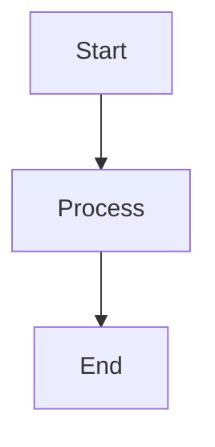

<!-- © Copyright 2026 Olivier Planson. All rights reserved. Reproduction prohibited. Made with IBM Bob. -->

# Mermaid Diagram to Image Conversion Guide

This guide explains how to convert Mermaid diagrams embedded in Markdown files to PNG/SVG images.

## Overview

The `convert-mermaid-to-images.sh` script automatically:
- Scans Markdown files for Mermaid diagram blocks
- Extracts each diagram
- Converts them to PNG/SVG images using mermaid-cli
- Organizes images in an `images/` directory next to each Markdown file
- Generates a conversion summary report

## Prerequisites

### 1. Node.js and npm
Ensure Node.js and npm are installed:
```bash
node --version
npm --version
```

### 2. Install mermaid-cli
Install the Mermaid CLI tool globally:
```bash
npm install -g @mermaid-js/mermaid-cli
```

Verify installation:
```bash
mmdc --version
```

## Usage

### Basic Usage

Convert all Markdown files in the current directory:
```bash
./convert-mermaid-to-images.sh
```

### Convert a Single File

```bash
./convert-mermaid-to-images.sh path/to/lecture.md
```

### Convert All Files in a Directory

```bash
./convert-mermaid-to-images.sh ./02-Lectures
```

### Recursive Directory Processing

The script automatically processes all `.md` files recursively in the specified directory.

## Output

### Directory Structure

For each Markdown file, images are created in an `images/` subdirectory:

```
02-Lectures/
├── 01-intro-jakartaee-microprofile.md
└── images/
    ├── 01-intro-jakartaee-microprofile-diagram-1.png
    └── 01-intro-jakartaee-microprofile-diagram-2.png
```

### Image Naming Convention

Images are named using the pattern:
```
{markdown-filename}-diagram-{number}.{format}
```

Example:
- `01-intro-jakartaee-microprofile-diagram-1.png`
- `01-intro-jakartaee-microprofile-diagram-2.png`

## Configuration

You can modify the script to change:

### Output Format
Edit the `OUTPUT_FORMAT` variable in the script:
```bash
OUTPUT_FORMAT="png"  # Options: png, svg, pdf
```

### Image Directory Name
Edit the `IMAGE_DIR` variable:
```bash
IMAGE_DIR="images"  # Change to your preferred directory name
```

## Example: Converting Course Lectures

Convert all lecture files:
```bash
cd esipe-javaee
./convert-mermaid-to-images.sh 02-Lectures/
```

This will:
1. Find all `.md` files in `02-Lectures/`
2. Extract Mermaid diagrams from each file
3. Create `images/` directories as needed
4. Generate PNG images for each diagram
5. Display a summary report

## Mermaid Diagram Format

The script recognizes Mermaid diagrams in this format:

````markdown

````

## Conversion Report

After conversion, you'll see a summary like:

```
==========================================
         CONVERSION SUMMARY
==========================================

Total diagrams converted: 2

Diagram mappings:
----------------
  • 01-intro-jakartaee-microprofile.md (line 83) → 01-intro-jakartaee-microprofile-diagram-1.png
  • 01-intro-jakartaee-microprofile.md (line 568) → 01-intro-jakartaee-microprofile-diagram-2.png

==========================================
```

## Troubleshooting

### mermaid-cli Not Found

If you see "mermaid-cli (mmdc) is not installed!", install it:
```bash
npm install -g @mermaid-js/mermaid-cli
```

### Permission Denied

Make the script executable:
```bash
chmod +x convert-mermaid-to-images.sh
```

### Puppeteer Issues

If mermaid-cli fails with Puppeteer errors, you may need to install additional dependencies:

**macOS:**
```bash
# Usually works out of the box
```

**Linux (Ubuntu/Debian):**
```bash
sudo apt-get install -y \
    libgbm-dev \
    libasound2 \
    libatk1.0-0 \
    libatk-bridge2.0-0 \
    libcups2 \
    libdrm2 \
    libxkbcommon0 \
    libxcomposite1 \
    libxdamage1 \
    libxrandr2
```

### No Diagrams Found

Ensure your Mermaid blocks use the correct syntax:
- Start with ` ```mermaid ` (with backticks)
- End with ` ``` ` (with backticks)
- No extra spaces or characters

## Advanced Usage

### Custom Background Color

Modify the `mmdc` command in the script to change background:
```bash
mmdc -i "$diagram_file" -o "$output_file" -b white
```

Options:
- `transparent` (default)
- `white`
- `#RRGGBB` (hex color)

### Custom Theme

Add theme configuration to the `mmdc` command:
```bash
mmdc -i "$diagram_file" -o "$output_file" -t dark
```

Themes:
- `default`
- `dark`
- `forest`
- `neutral`

### High-Resolution Images

Add scale parameter for higher resolution:
```bash
mmdc -i "$diagram_file" -o "$output_file" -s 2
```

Scale values:
- `1` - Normal (default)
- `2` - 2x resolution
- `3` - 3x resolution

## Integration with Markdown

After conversion, you can reference images in your Markdown:

```markdown
## Architecture Diagram


```

## Batch Processing

Process multiple directories:
```bash
for dir in 02-Lectures 03-Labs 04-BankingApp; do
    ./convert-mermaid-to-images.sh "$dir"
done
```

## Automation

Add to your build process or CI/CD pipeline:
```bash
# In your build script
./convert-mermaid-to-images.sh ./docs
```

## Best Practices

1. **Version Control**: Commit both `.md` files and generated images
2. **Naming**: Use descriptive Markdown filenames for better image names
3. **Organization**: Keep images in the `images/` subdirectory
4. **Updates**: Re-run the script when diagrams change
5. **Format**: Use PNG for presentations, SVG for web/print

## Support

For issues or questions:
- Check the [Mermaid documentation](https://mermaid.js.org/)
- Review [mermaid-cli GitHub](https://github.com/mermaid-js/mermaid-cli)
- Consult the script's inline comments

## License

This script is part of the Jakarta EE course materials.