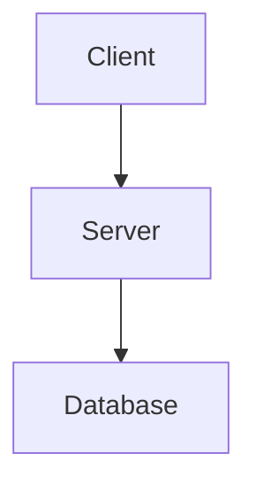

<!-- © Copyright 2026 Olivier Planson. All rights reserved. Reproduction prohibited. Made with IBM Bob. -->

# Guide de Conversion des Slides

Ce guide explique comment utiliser le script `convert-slides.sh` pour convertir automatiquement les fichiers Markdown en présentations PowerPoint avec gestion intelligente des mises à jour et conversion automatique des diagrammes Mermaid.

## Fonctionnalités

### 1. Conversion Intelligente
Le script compare les dates de modification des fichiers :
- ✅ **MD plus récent que PPTX** → Supprime l'ancien PPTX et reconvertit
- ✅ **PPTX plus récent que MD** → Ignore la conversion (économise du temps)
- ✅ **PPTX inexistant** → Crée le PPTX

### 2. Conversion Automatique des Diagrammes Mermaid
Avant chaque conversion de slide :
- Détecte automatiquement les blocs Mermaid dans le fichier MD
- Convertit les diagrammes en images PNG
- Place les images dans le dossier `images/` à côté du fichier MD
- Les images sont ensuite incluses dans le PPTX par Marp

### 3. Rapport Détaillé
Affiche un résumé avec :
- Nombre de fichiers convertis
- Nombre de fichiers ignorés (à jour)
- Nombre d'échecs éventuels

## Prérequis

### 1. Marp CLI
```bash
# Installation avec npm
npm install -g @marp-team/marp-cli

# Ou avec Homebrew (macOS)
brew install marp-cli

# Vérification
marp --version
```

### 2. Mermaid CLI (pour les diagrammes)
```bash
# Installation
npm install -g @mermaid-js/mermaid-cli

# Vérification
mmdc --version
```

### 3. Scripts Requis
- `convert-slides.sh` - Script principal de conversion
- `convert-mermaid-to-images.sh` - Script de conversion Mermaid (optionnel mais recommandé)

## Utilisation

### Conversion Standard

```bash
cd esipe-javaee
./convert-slides.sh
```

Le script va :
1. Vérifier que Marp CLI est installé
2. Détecter le script de conversion Mermaid
3. Parcourir tous les fichiers `.md` dans `02-Lectures/`
4. Pour chaque fichier :
   - Comparer les dates de modification
   - Convertir les diagrammes Mermaid si nécessaire
   - Générer le PPTX si le MD est plus récent
5. Afficher un résumé

### Exemple de Sortie

```
======================================
Jakarta EE Course - Slide Converter
======================================

✓ Marp CLI found
✓ Mermaid conversion script found
✓ Output directory created: slides/

Checking lecture files for conversion...
----------------------------
📝 01-intro-jakartaee-microprofile.md - MD is newer, removing old PPTX and reconverting...
  🔄 Converting Mermaid diagrams...
  ✓ Success: ../slides/01-intro-jakartaee-microprofile.pptx
⏭️  02-servlets-jsp.md - PPTX is up-to-date, skipping

======================================
Conversion Summary
======================================
✓ Converted: 1
⏭️  Skipped (up-to-date): 1

PowerPoint files saved in: slides/
```

## Structure des Fichiers

```
esipe-javaee/
├── convert-slides.sh              # Script principal
├── convert-mermaid-to-images.sh   # Script Mermaid
├── 02-Lectures/
│   ├── 01-intro-jakartaee-microprofile.md
│   ├── 02-servlets-jsp.md
│   └── images/                    # Images Mermaid générées
│       ├── 01-intro-jakartaee-microprofile-diagram-1.png
│       └── 01-intro-jakartaee-microprofile-diagram-2.png
└── slides/                        # PPTX générés
    ├── 01-intro-jakartaee-microprofile.pptx
    └── 02-servlets-jsp.pptx
```

## Workflow de Développement

### 1. Modifier un Fichier Markdown

```bash
# Éditer le fichier
vim 02-Lectures/01-intro-jakartaee-microprofile.md

# Ajouter ou modifier des diagrammes Mermaid
```

### 2. Convertir Automatiquement

```bash
./convert-slides.sh
```

Le script détectera automatiquement que le MD a été modifié et :
- Supprimera l'ancien PPTX
- Convertira les nouveaux diagrammes Mermaid
- Générera un nouveau PPTX

### 3. Vérifier le Résultat

```bash
# Ouvrir le PPTX généré
open slides/01-intro-jakartaee-microprofile.pptx
```

## Gestion des Diagrammes Mermaid

### Format dans le Markdown

```markdown
## Architecture Diagram


```

### Conversion Automatique

Le script `convert-slides.sh` appelle automatiquement `convert-mermaid-to-images.sh` qui :
1. Extrait tous les blocs Mermaid
2. Crée un fichier `.mmd` temporaire pour chaque diagramme
3. Convertit en PNG avec fond transparent
4. Nomme les images : `{filename}-diagram-{number}.png`

### Référencement dans Marp

Marp peut ensuite utiliser ces images :

```markdown
## Architecture


```

## Optimisation des Performances

### Éviter les Reconversions Inutiles

Le script compare les timestamps :
- Si vous n'avez pas modifié le MD, le PPTX n'est pas régénéré
- Économise du temps lors de conversions multiples

### Forcer la Reconversion

Si vous voulez forcer la reconversion :

```bash
# Toucher le fichier MD pour mettre à jour sa date
touch 02-Lectures/01-intro-jakartaee-microprofile.md

# Puis convertir
./convert-slides.sh
```

Ou supprimer le PPTX :

```bash
rm slides/01-intro-jakartaee-microprofile.pptx
./convert-slides.sh
```

## Personnalisation

### Modifier le Format de Sortie Mermaid

Éditez `convert-mermaid-to-images.sh` :

```bash
# Ligne 16
OUTPUT_FORMAT="svg"  # Changer de png à svg
```

### Modifier le Thème Marp

Ajoutez dans l'en-tête YAML de vos fichiers MD :

```yaml
---
marp: true
theme: default  # ou gaia, uncover, etc.
paginate: true
---
```

### Ajouter des Options Marp

Éditez `convert-slides.sh` pour ajouter des options à la commande `marp` :

```bash
marp "$file" -o "$output_file" \
    --allow-local-files \
    --no-stdin \
    --theme custom-theme.css \
    --pdf  # Pour générer aussi un PDF
```

## Dépannage

### Erreur : "marp-cli is not installed"

```bash
npm install -g @marp-team/marp-cli
```

### Erreur : "mermaid-cli (mmdc) is not installed"

```bash
npm install -g @mermaid-js/mermaid-cli
```

### Les Diagrammes Mermaid ne s'affichent pas

1. Vérifiez que `convert-mermaid-to-images.sh` est exécutable :
   ```bash
   chmod +x convert-mermaid-to-images.sh
   ```

2. Vérifiez que les images sont créées :
   ```bash
   ls -la 02-Lectures/images/
   ```

3. Vérifiez la syntaxe Mermaid :
   - Testez sur [Mermaid Live Editor](https://mermaid.live/)

### Le Script ne Détecte pas les Modifications

Vérifiez les timestamps :

```bash
# Date du MD
stat -f %m 02-Lectures/01-intro-jakartaee-microprofile.md

# Date du PPTX
stat -f %m slides/01-intro-jakartaee-microprofile.pptx
```

Le MD doit avoir un timestamp supérieur au PPTX pour déclencher la reconversion.

## Intégration CI/CD

### GitHub Actions

```yaml
name: Convert Slides

on:
  push:
    paths:
      - '02-Lectures/*.md'

jobs:
  convert:
    runs-on: ubuntu-latest
    steps:
      - uses: actions/checkout@v2
      
      - name: Setup Node.js
        uses: actions/setup-node@v2
        with:
          node-version: '18'
      
      - name: Install Marp CLI
        run: npm install -g @marp-team/marp-cli
      
      - name: Install Mermaid CLI
        run: npm install -g @mermaid-js/mermaid-cli
      
      - name: Convert Slides
        run: |
          cd esipe-javaee
          ./convert-slides.sh
      
      - name: Upload PPTX
        uses: actions/upload-artifact@v2
        with:
          name: slides
          path: esipe-javaee/slides/*.pptx
```

## Bonnes Pratiques

1. **Versionnez les MD, pas les PPTX** : Les PPTX sont générés automatiquement
2. **Testez les diagrammes Mermaid** : Utilisez Mermaid Live Editor avant de les intégrer
3. **Utilisez des noms descriptifs** : Les noms de fichiers MD deviennent les noms de PPTX
4. **Documentez vos slides** : Ajoutez des commentaires dans le Markdown
5. **Exécutez le script régulièrement** : Avant chaque cours ou présentation

## Ressources

- [Marp Documentation](https://marpit.marp.app/)
- [Mermaid Documentation](https://mermaid.js.org/)
- [Marp CLI GitHub](https://github.com/marp-team/marp-cli)
- [Mermaid CLI GitHub](https://github.com/mermaid-js/mermaid-cli)

## Support

Pour toute question ou problème :
1. Vérifiez ce guide
2. Consultez les logs du script
3. Testez les commandes individuellement
4. Vérifiez les versions des outils installés